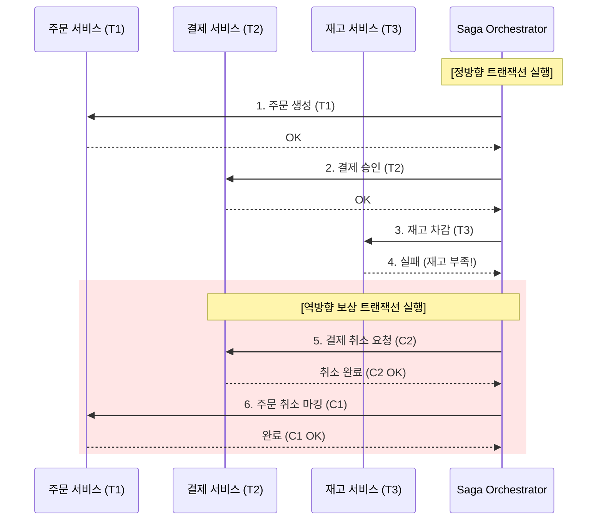

Parent: [[018.MSA_트랜잭션_관리]]

# 1. MSA 보상 트랜잭션(Compensating Transaction)의 개요 및 배경

### 가. 보상 트랜잭션의 정의
- 분산 시스템에서 이전에 성공적으로 완료된 트랜잭션의 작업 결과를 논리적으로 취소(Undo)하거나 무효화하기 위해 실행되는 별도의 비즈니스 트랜잭션임
- 물리적 롤백이 불가능한 MSA 환경에서 데이터의 **최종적 일관성(Eventual Consistency)**을 보장하는 핵심 메커니즘임

### 나. 등장 배경 및 필요성
- **분산 DB 환경의 한계**: 서비스별 독립 DB 사용으로 인해 단일 DB의 `ROLLBACK` 명령어를 통한 물리적 복구 불가능
- **글로벌 락(Global Lock) 문제 해결**: 2PC와 같은 강한 일관성 기법의 성능 병목을 피하고, 가용성을 높이면서 장애에 대응하기 위함
- **비즈니스 프로세스의 복잡성**: 주문-결제-배송 등 긴 호흡의 트랜잭션 중 중간 단계 실패 시 이전 단계의 커밋된 데이터를 원상 복구해야 하는 요구 증대

# 2. 보상 트랜잭션의 아키텍처 및 핵심 메커니즘

### 가. 보상 트랜잭션 실행 흐름도 (역방향 복구)

### 나. 물리적 롤백 vs 논리적 보상 트랜잭션 비교
| 구분 | 물리적 롤백 (RDBMS) | 보상 트랜잭션 (Saga) |
| :--- | :--- | :--- |
| **수행 레벨** | 데이터베이스 커널 레벨 | 애플리케이션/비즈니스 레벨 |
| **데이터 상태** | 변경 전 상태로 완벽 복구 (흔적 없음) | 변경 기록 + 취소 기록 존재 (논리적 취소) |
| **격리성** | 완벽히 보장됨 (Isolation) | 보장되지 않음 (중간 상태 노출 가능) |
| **구현 방식** | DBMS 자동 처리 (`ROLLBACK`) | 개발자가 직접 취소 로직(API) 구현 |

# 3. 상세 복구 전략 및 보완 기술 분석

### 가. 복구 방향에 따른 전략 분류
1) **Backward Recovery (역방향 복구)**: 실패 지점 이전의 모든 작업을 보상 트랜잭션으로 원복함 (가장 일반적)
2) **Forward Recovery (정방향 복구)**: 실패 시 보상하지 않고, 성공할 때까지 계속 재시도(Retry)하여 프로세스를 끝까지 완료함 (결제 완료 후 배송 요청 등)

### 나. 보상 트랜잭션의 한계점 극복 기술
- **시맨틱 락 (Semantic Lock)**: 트랜잭션 진행 중 데이터에 `PENDING` 등의 상태를 부여하여 타 트랜잭션의 간섭 차단
- **멱등성 (Idempotency)**: 네트워크 오류로 인한 중복 보상 요청 시에도 동일한 결과가 유지되도록 고유 키(Trace ID) 기반 설계
- **비정상 종료 대응**: 보상 트랜잭션 자체가 실패할 경우를 대비하여 **Dead Letter Queue(DLQ)** 및 관리자 수동 개입 프로세스 마련

# 4. 기술사적 제언 및 실무 적용 방안

### 가. 실무 도입 시 고려사항
- **개발 비용 가시화**: 모든 비즈니스 로직에 대해 "취소" 로직을 별도로 개발/테스트해야 하므로 초기 공수가 2배 이상 소요됨을 인지해야 함
- **가시성 확보**: 분산된 보상 트랜잭션의 성공 여부를 모니터링하기 위해 **Zipkin, Jaeger** 등 분산 추적 도구 연동 필수

### 나. 거버넌스 및 보안(Security) 통제 방안
- **데이터 감사(Audit)**: 보상 트랜잭션 실행 이력을 별도의 Audit Log로 남겨, 법적 증거력 확보 및 정산 불일치 시 근거 자료로 활용
- **권한 통제**: 보상 트랜잭션 API(취소/환불 등)는 민감한 작업이므로 내부 서비스 간에도 엄격한 인증(mTLS) 및 인가 적용

### 다. 최신 트렌드와 연계한 발전 방향
- **워크플로우 엔진 도입**: AWS Step Functions, Temporal 등 상태 저장형 오케스트레이터를 활용하여 복잡한 보상 로직을 선언적으로 관리
- **AI 기반 자동 복구**: 과거 장애 패턴을 학습한 AI가 실패 원인을 분석하여 역방향 또는 정방향 복구 여부를 스스로 결정하는 지능형 운영 체계로 진화

> [!tip] **기술사 인사이트**
> 보상 트랜잭션은 **"실패를 인정하는 철학"**의 결과물입니다. 100% 무결성을 보장하려다 시스템 전체를 멈추게 하는 대신, 일시적 불일치를 수용하고 사후에 보정하는 것이 현대 클라우드 네이티브 아키텍처의 생존 전략입니다.

## Related Notes
- [[015.사가_패턴(Saga_Pattern)]]
- [[018.MSA_트랜잭션_관리]]
- [[009.Microservices_Architecture]]
- [[022.MSA_보상_트랜잭션]]
