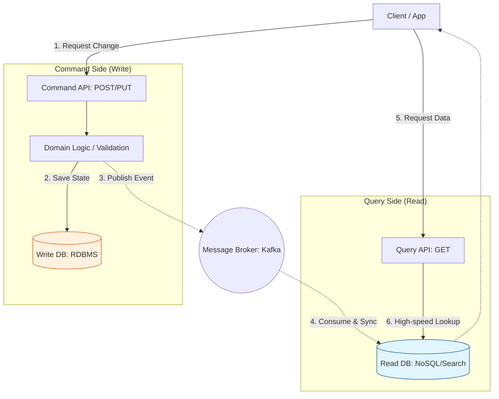

Parent: [[009.Microservices_Architecture]]

# 1. CQRS 패턴(Command and Query Responsibility Segregation)의 개요

### 가. CQRS 패턴의 정의
- 시스템의 상태를 변경하는 **명령(Command)** 작업과 데이터를 조회하는 **조회(Query)** 작업의 책임을 분리하는 아키텍처 패턴임
- 베르트랑 마이어의 CQS(Command Query Separation) 원칙을 아키텍처 수준으로 확장하여, 데이터 모델뿐만 아니라 DB까지 물리적으로 분리할 수 있는 기법임

### 나. 등장 배경 및 필요성
- **모델의 복잡성 해결**: 복잡한 도메인에서 읽기와 쓰기 로직이 섞여 모델이 비대해지는 **Fat Model** 현상 방지 필요
- **성능 최적화**: 웹 서비스 트래픽의 대다수(80~90%)가 조회인 특성을 고려하여, 조회 모델을 읽기에 최적화(NoSQL 등)하여 응답 속도 극대화
- **DB 락(Lock) 경합 해소**: 쓰기와 읽기가 같은 테이블을 공유할 때 발생하는 성능 저하를 방지하고 확장성(Scalability) 확보

# 2. CQRS의 아키텍처 및 핵심 메커니즘

### 가. 완전한 CQRS(DB 분리형) 아키텍처 개념도

### 나. 분리 수준에 따른 단계별 분류
| 단계 | 분리 범위 | 상세 내용 |
| :--- | :--- | :--- |
| **1단계** | **클래스 분리** | 하나의 애플리케이션 내에서 Command/Query 서비스 객체만 분리 (DB 공유) |
| **2단계** | **테이블 분리** | 쓰기용 테이블과 읽기 전용 뷰(View) 테이블로 분리 (DB 내 동기화) |
| **3단계** | **데이터베이스 분리** | RDBMS(Write)와 NoSQL/ES(Read) 등 물리적 저장소 완전 분리 (비동기 동기화) |

# 3. 상세 기술 요소 및 정합성 보장 기술

### 가. 쓰기-읽기 모델 간 데이터 동기화 기법
1) **애플리케이션 이벤트**: 비즈니스 로직 성공 후 이벤트를 발행하여 조회 모델을 갱신 (최종적 일관성)
2) **CDC (Change Data Capture)**: 소스 DB의 트랜잭션 로그를 가로채어 타겟 DB로 스트리밍 (Debezium 등 활용)
3) **Materialized View**: 복잡한 조인 결과를 미리 연산하여 저장해둠으로써 조회 시 연산 비용 제로화

### 나. CRUD vs CQRS 비교 분석
| 비교 항목 | 전통적 CRUD | CQRS 패턴 |
| :--- | :--- | :--- |
| **데이터 모델** | 단일 통합 모델 공유 | 쓰기 모델과 읽기 모델(DTO) 분리 |
| **데이터베이스** | 단일 DB 사용 | 다중 DB (Polyglot Persistence) 가능 |
| **복잡도** | 낮음 (개발 생산성 우수) | **매우 높음** (동기화 인프라 필요) |
| **일관성** | 강한 일관성 (ACID) | **최종적 일관성 (Eventual)** |
| **적합 분야** | 정형화된 중소형 시스템 | 대규모 트래픽, 복잡한 조회 요구 시스템 |

# 4. 기술사적 제언 및 실무 적용 방안

### 가. 실무 도입 시 고려사항
- **UX 대응 전략**: 데이터 동기화 지연(Latency)으로 인한 "방금 쓴 글이 안 보이는" 현상을 방지하기 위해 **Optimistic UI**나 저장 직후 쓰기 DB 임시 조회 패턴 적용
- **선택적 적용**: 모든 기능에 CQRS를 적용하는 것은 낭비이므로, 복잡한 검색이나 고성능이 필요한 핵심 서브도메인에만 부분 도입 권장

### 나. 거버넌스 및 보안(Security) 통제 방안
- **조회 전용 권한 관리**: 읽기 DB에 대한 접근 권한을 엄격히 분리하여 데이터 대량 탈취 리스크 방어
- **동기화 감사(Audit)**: Write DB와 Read DB의 정합성이 크게 깨지는지 주기적으로 체크하는 감시 체계 및 자동 보정 로직 구축

### 다. 최신 트렌드와 연계한 발전 방향
- **이벤트 소싱(Event Sourcing) 결합**: 상태가 아닌 '사건'을 저장하여 조회 모델(Projection)을 언제든 재생성할 수 있는 탄력적 아키텍처로 진화
- **데이터 레이크 통합**: CQRS의 읽기 모델을 실시간 분석용 데이터 레이크의 입력 소스로 활용하여 비즈니스 인텔리전스(BI)와 연계

> [!tip] **기술사 인사이트**
> CQRS는 **"읽기와 쓰기의 트레이드오프"**를 인정하는 패턴입니다. 무결성을 위한 쓰기의 희생과 성능을 위한 읽기의 정합성 타협 사이에서, 비즈니스 가치를 극대화할 수 있는 균형점을 찾는 것이 아키텍트의 핵심 역할입니다.

## Related Notes
- [[009.Microservices_Architecture]]
- [[020.폴리글랏_퍼시스턴스(Polyglot_Persistence)]]
- [[023.CQRS_패턴(CQRS_Pattern)]]
- [[018.MSA_트랜잭션_관리]]
