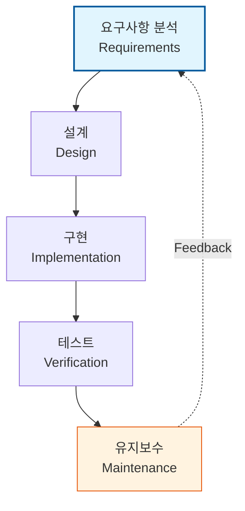

Parent: [[소프트웨어_공학_방법론]]

# 1. 폭포수 모델(Waterfall Model)의 개요 및 배경

### 가. 폭포수 모델의 정의
- 소프트웨어 개발 생명주기(SDLC)의 각 단계를 순차적으로 진행하며, 한 단계가 완전히 마무리되어야 다음 단계로 넘어가는 **선형 순차적(Linear Sequential) 소프트웨어 개발 모델**임
- 요구사항 분석부터 유지보수까지 마치 폭포수가 떨어지는 것처럼 하향식(Top-down)으로 진행되는 가장 전통적이고 고전적인 모델임

### 나. 등장 배경 및 필요성
- **프로세스 정형화**: 초기 소프트웨어 공학에서 체계적이고 구조화된 관리 방법론의 필요성 대두
- **예측 가능성 확보**: 대규모 프로젝트에서 각 단계의 산출물을 명확히 정의하여 프로젝트 가시성(Visibility) 확보
- **문서 중심 관리**: 단계별 검토(Review)와 승인을 통해 품질을 통제하고 책임 소재를 명확히 할 필요성 증대

# 2. 폭포수 모델의 아키텍처 및 핵심 메커니즘

### 가. 폭포수 모델의 단계별 프로세스 개념도

### 나. 단계별 주요 활동 및 산출물
| 단계 | 주요 활동 (Activity) | 주요 산출물 (Deliverables) |
| :--- | :--- | :--- |
| **요구분석** | 사용자 요구사항 수집, 제약사항 정의 | 요구사항 정의서(SRS), 유스케이스 |
| **설계** | 시스템 아키텍처, DB, UI/UX 설계 | 설계 사양서, ERD, 인터페이스 명세서 |
| **구현** | 설계 기반 코딩 및 단위 테스트 | 소스 코드, 빌드 결과물 |
| **테스트** | 통합 테스트, 시스템 테스트, 사용자 인수 | 테스트 결과 보고서, 결함 조치서 |
| **유지보수** | 운영, 결함 수정, 성능 개선 | 운영 매뉴얼, 유지보수 이력 |

# 3. 폭포수 모델의 상세 기술 및 비교 분석

### 가. 핵심 특징: Phase-Gate Review
- 각 단계가 끝나는 지점에 **Gate(이정표)**를 두어 산출물의 완성도를 검토하고 승인(Sign-off)을 득해야만 다음 단계 진입이 가능함
- 엄격한 기준선(Baseline) 관리를 통해 프로젝트의 정체성(Identity)을 유지함

### 나. 폭포수 모델 vs 애자일(Agile) 모델 비교
| 비교 항목 | 폭포수 모델 (Waterfall) | 애자일 모델 (Agile) |
| :--- | :--- | :--- |
| **철학/관점** | 계획 및 프로세스 중심 (Strict) | 사람 및 상호작용 중심 (Flexible) |
| **요구사항** | 프로젝트 초기 확정 (Change-frozen) | 개발 중 지속적 변화 수용 (Backlog) |
| **산출물** | 문서 중심 (Documentation) | 동작하는 소프트웨어 중심 (Working SW) |
| **적합성** | 요구사항이 명확한 대규모/공공 사업 | 불확실성 높은 스타트업/신규 서비스 |
| **리스크** | 후반 테스트 단계에서 위험 발견 | 반복(Iteration) 주기로 조기 리스크 발견 |

# 4. 기술사적 제언 및 실무 적용 방안

### 가. 실무 도입 시 고려사항 및 한계점
- **Back-tracking의 어려움**: 후반 단계에서 요구사항 변경 시 설계부터 다시 수행해야 하므로 막대한 비용과 시간 발생
- **가시적 결과물 지연**: 프로젝트 종료 시점에야 동작하는 시스템을 확인할 수 있어 사용자의 초기 기대치 불일치 가능성 상존

### 나. 거버넌스 및 품질(Security) 통제 방안
- **단계별 보안 내재화**: 분석(위협 모델링), 설계(보안 설계), 구현(정적 분석), 테스트(취약점 진단)를 게이트 심사에 포함 (DevSecOps 연계)
- **V-모델 연계**: 각 개발 단계에 대응하는 테스트 단계를 매핑하여 검증(Verification)과 확인(Validation) 체계 강화

### 다. 향후 발전 방향: 하이브리드(Water-Agile-fall)
- **Water-Agile-fall**: 전체 일정과 예산은 폭포수 모델로 관리(Governance)하되, 실제 구현 단계는 애자일의 반복 주기(Sprint)를 적용하여 유연성을 확보하는 하이브리드 방식이 실무적 대안으로 확산 중

> [!tip] **기술사 인사이트**
> 폭포수 모델은 "낡은 기술"이 아니라 **"안정적인 관리 프레임워크"**입니다. 요구사항의 변경이 적고 안전성이 최우선인 **Mission-Critical** 시스템(항공, 국방, 금융 기간계)에서는 여전히 가장 강력한 거버넌스 도구임을 답안에서 강조해야 합니다.

## Related Notes
- [[007.형상관리(Configuration Management)]]
- [[002.DevOps]]
- [[005.CI_CD]]
- [[025.애자일_방법론(Agile)]]
