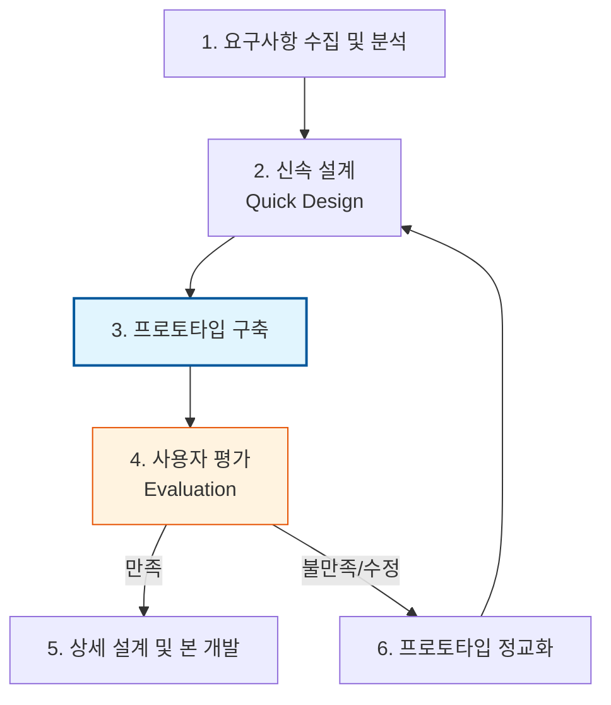

Parent: [[024.폭포수_모델(Waterfall_Model)]]

# 1. 프로토타이핑 모델(Prototyping Model)의 개요 및 배경

### 가. 프로토타이핑 모델의 정의
- 시스템의 주요 기능을 한눈에 확인할 수 있도록 개발 초기 단계에서 **시제품(Prototype)**을 제작하여, 사용자의 요구사항을 정확히 파악하고 검증하는 **점진적 소프트웨어 개발 모델**임
- "백문이 불여일견"의 원리를 SDLC에 적용하여, 개발자와 사용자 간의 의사소통을 극대화하고 개발 리스크를 조기에 식별하는 방법론임

### 나. 등장 배경 및 필요성
- **요구사항의 불명확성**: 프로젝트 초기에 사용자가 자신의 요구사항을 구체적으로 설명하지 못하는 문제 해결 필요
- **폭포수 모델의 보완**: 개발 후반부(테스트 단계)에서야 시스템을 확인할 수 있는 폭포수 모델의 낮은 가시성과 피드백 지연 개선
- **리스크 조기 발견**: 인터페이스(UI/UX)나 핵심 로직의 오류를 개발 초기 단계에서 수정하여 전체 개발 비용 절감

# 2. 프로토타이핑 모델의 프로세스 및 핵심 메커니즘

### 가. 프로토타이핑 개발 프로세스 개념도

### 나. 프로토타이핑 수행의 핵심 단계
| 단계 | 주요 활동 | 상세 내용 |
| :--- | :--- | :--- |
| **요구수집** | 핵심 기능 도출 | 전체 시스템이 아닌 프로토타입의 목적이 되는 핵심 요구사항 정의 |
| **신속 설계** | 가시적 요소 중심 설계 | 사용자 인터페이스(UI), 데이터 흐름 등 가시적인 부분 위주로 설계 |
| **시제품 구축** | 빠른 구현 | 완벽한 성능보다 동작 확인을 목적으로 도구(Mock-up 툴 등)를 활용해 구현 |
| **사용자 평가** | 피드백 수렴 | 사용자가 직접 조작하며 수정 사항 및 추가 요구사항 도출 |
| **정교화/반복** | 모델 수정 | 평가 결과를 반영하여 만족할 때까지 프로토타입을 반복 수정 |

# 3. 상세 기술 및 유형별 비교 분석

### 가. 프로토타이핑의 유형별 분류
1) **실험적 프로토타이핑 (Throw-away)**: 사용자의 요구사항을 파악한 후 제작된 프로토타입을 폐기하고 처음부터 다시 개발하는 방식
2) **진화적 프로토타이핑 (Evolutionary)**: 제작된 프로토타입을 지속적으로 보완, 확장하여 최종 시스템으로 발전시키는 방식 (Agile의 모태)

### 나. 주요 개발 모델과의 비교
| 비교 항목 | 폭포수 모델 | 프로토타이핑 모델 | 나선형 모델 |
| :--- | :--- | :--- | :--- |
| **중점 사항** | 계획 및 문서 | **요구사항 정립** | 위험 분석 및 관리 |
| **사용자 참여** | 초기/후기에 한정 | **전 과정에 적극 참여** | 반복 주기마다 참여 |
| **가시성** | 낮음 (끝에 확인) | **매우 높음 (초기 확인)** | 높음 |
| **적합성** | 대규모, 명확한 요건 | **불투명한 요구사항** | 고위험, 대규모 프로젝트 |
| **비용** | 안정적 | 추가 비용 발생 가능성 | 관리 비용 높음 |

# 4. 기술사적 제언 및 실무 적용 방안

### 가. 실무 도입 시 고려사항 (한계점 및 대책)
- **사용자의 과도한 기대**: 프로토타입이 실제 성능을 보장하는 완성품으로 오해하여 조기 릴리스를 압박할 수 있으므로, 목적(시제품)을 명확히 고지해야 함
- **자원 낭비 우려**: 반복 횟수가 늘어날수록 비용과 시간이 초과될 수 있으므로, **Time-boxing** 기법을 적용하여 반복 횟수를 제한해야 함

### 나. 거버넌스 및 보안(Security) 통제 방안
- **폐기 프로세스 수립**: Throw-away 방식의 경우, 프로토타입 제작 시 사용된 더미 데이터(Dummy Data)나 임시 보안 설정이 실제 운영계에 유출되지 않도록 철저히 격리 및 폐기
- **보안 프로토타이핑**: 핵심 보안 기능(인증, 암호화)을 프로토타입 단계에서 미리 구현하여 보안 아키텍처의 타당성을 선제적으로 검증

### 다. 최신 트렌드와 연계한 발전 방향
- **Low-code/No-code 활용**: 전문 개발자 없이도 현업이 직접 프로토타입을 제작하여 개발자와 소통하는 **Citizen Developer** 문화와 결합
- **UX/UI 중심 설계(Design Thinking)**: 사용자 경험을 최우선으로 하는 현대적 설계 기조에서 프로토타이핑은 필수적인 공정으로 고도화됨

> [!tip] **기술사 인사이트**
> 프로토타이핑의 본질은 **"심리적 거리 좁히기"**입니다. 개발자와 사용자 간의 지식 격차를 시각적 실체를 통해 극복함으로써, 프로젝트 후반부에 발생하는 '요구사항 불일치'라는 가장 큰 위험 요소를 원천 차단하는 전략적 수단입니다.

## Related Notes
- [[024.폭포수_모델(Waterfall_Model)]]
- [[026.나선형_모델(Spiral_Model)]]
- [[010.도메인_주도_설계(DDD)]]
- [[016.이벤트_스토밍(Event_Storming)]]
