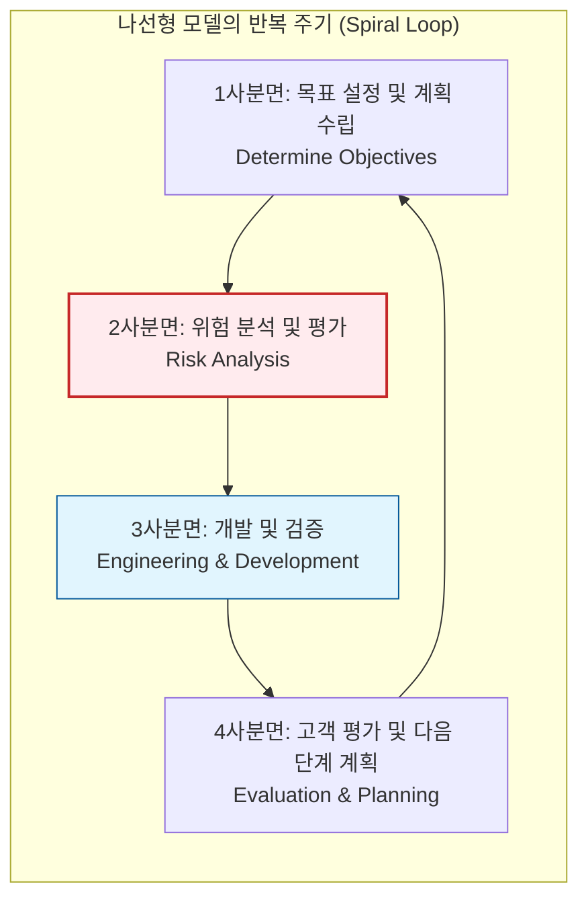

Parent: [[024.폭포수_모델(Waterfall_Model)]]

# 1. 나선형 모델(Spiral Model)의 개요 및 배경

### 가. 나선형 모델의 정의
- 보엠(Barry Boehm)이 제안한 모델로, 폭포수 모델의 체계적인 측면과 프로토타이핑 모델의 반복적인 측면을 결합하고 **위험 분석(Risk Analysis)** 단계를 추가한 점진적 소프트웨어 개발 모델임
- 계획 수립, 위험 분석, 개발, 평가의 4가지 주요 활동을 나선형으로 반복하며 시스템을 완성해가는 방법론임

### 나. 등장 배경 및 필요성
- **대규모 프로젝트의 위험 관리**: 프로젝트 규모가 커짐에 따라 초기에 식별하지 못한 위험이 후반에 치명적인 실패로 이어지는 것을 방지함
- **유연한 요구사항 수용**: 개발 과정 중 발생하는 변경 사항을 반복 주기를 통해 유연하게 반영할 필요성 대두
- **품질 및 성숙도 향상**: 반복적인 시제품(Prototype) 제작과 평가를 통해 점진적으로 완벽한 시스템을 구축함

# 2. 나선형 모델의 아키텍처 및 핵심 메커니즘

### 가. 나선형 모델의 4사분면 프로세스 개념도

### 나. 사분면별 핵심 활동 및 수행 내용
| 사분면 | 주요 활동 | 상세 수행 내용 |
| :--- | :--- | :--- |
| **1. 계획 수립** | 목표 설정 및 제약사항 파악 | 프로젝트 목표 정의, 대안 식별, 기능/성능 제약조건 분석 |
| **2. 위험 분석** | 위험 식별 및 해결안 수립 | **가장 핵심적인 단계**, 기술적/관리적 위험 요소 식별 및 시제품을 통한 위험 제거 |
| **3. 공학적 개발** | 실제 구축 및 검증 | 개발 단계(설계, 구현, 테스트) 수행, 폭포수 또는 프로토타입 모델 적용 가능 |
| **4. 고객 평가** | 결과물 검토 및 승인 | 고객의 검토 및 평가 수행, 만족 시 다음 주기 계획 수립 또는 프로젝트 종료 |

# 3. 나선형 모델의 상세 기술 및 비교 분석

### 가. 나선형 모델의 주요 특징
1) **위험 관리 중심**: 모든 반복 주기마다 위험 분석을 수행하여 프로젝트 실패 가능성을 조기에 차단함
2) **점진적 구축**: 반복이 진행될수록 시스템의 완성도가 높아지며, 나선형의 반경이 커질수록 비용과 시간이 누적됨
3) **반복적 사이클**: 고정된 단계가 아닌, 프로젝트 성격에 따라 반복 횟수를 조정할 수 있음

### 나. 주요 SDLC 모델 간 비교 분석
| 비교 항목 | 폭포수 모델 | 프로토타이핑 모델 | 나선형 모델 (Spiral) |
| :--- | :--- | :--- | :--- |
| **핵심 키워드** | 선형 순차, 문서 중심 | 시제품, 요구사항 명확화 | **위험 분석**, 반복적 개발 |
| **리스크 대응** | 후반에 발견 (위험함) | 초기 UI/UX 리스크 대응 | **전 과정 체계적 위험 관리** |
| **프로젝트 규모** | 소규모, 정형화된 사업 | 불명확한 요건의 사업 | **대규모, 고위험 프로젝트** |
| **관리 복잡도** | 낮음 (단순) | 중간 (반복 관리) | **매우 높음 (전문 역량 필요)** |
| **비용 및 기간** | 적정 | 추가 발생 가능성 | **가장 높음 (전문가 인건비)** |

# 4. 기술사적 제언 및 실무 적용 방안

### 가. 실무 도입 시 고려사항 및 제약
- **전문 위험 분석가 확보**: 위험을 식별하고 가중치를 부여할 수 있는 고도의 전문 역량을 가진 관리자가 반드시 필요함
- **과도한 관리 오버헤드**: 반복 주기마다 계획과 분석이 수반되므로, 단순한 프로젝트에 적용할 경우 배보다 배꼽이 더 큰 상황이 발생할 수 있음

### 나. 거버넌스 및 보안(Security) 통제 방안
- **Risk-based Security**: 위험 분석 단계에서 보안 취약점을 하나의 핵심 위험 요소로 간주하여, 보안 아키텍처를 반복적으로 강화 (DevSecOps의 Risk Management와 연계)
- **추적성(Traceability) 관리**: 반복 주기가 늘어남에 따라 요구사항과 위험 대응 이력이 유실되지 않도록 형상관리 도구와 연계한 추적성 매트릭스 유지

### 다. 현대적 방법론으로의 계승
- 나선형 모델의 '반복'과 '점진'의 철학은 이후 **RUP(Rational Unified Process)**를 거쳐 현대의 **애자일(Agile)** 방법론으로 계승되었으며, 특히 대규모 공공/국방 프로젝트의 표준 가이드로 여전히 유효함

> [!tip] **기술사 차별화 포인트**
> 나선형 모델의 핵심은 **"위험을 안고 가는 것이 아니라, 위험을 제거하면서 전진하는 것"**입니다. 단순히 반복하는 것이 목적이 아니라, 각 회전마다 **'수용 가능한 위험 수준'**을 검증하고 통과시키는 이정표(Milestone) 관리가 기술사적 관점에서 매우 중요합니다.

## Related Notes
- [[024.폭포수_모델(Waterfall_Model)]]
- [[025.프로토타이핑_모델(Prototyping_Model)]]
- [[007.형상관리(Configuration Management)]]
- [[004.DevSecOps]]
