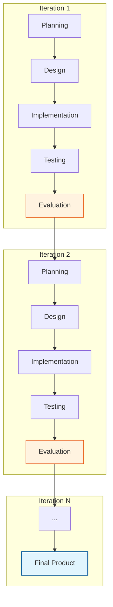

Parent: [[024.폭포수_모델(Waterfall_Model)]]

# 1. 반복적 개발 모델(Iterative Model)의 개요 및 배경

### 가. 반복적 개발 모델의 정의
- 시스템의 일부분을 먼저 개발하고, 이를 반복적으로 보완하고 확장하여 시스템의 완성도를 점진적으로 높여가는 **진화적 소프트웨어 개발 모델**임
- 요구사항 분석부터 배포까지의 과정을 작은 단위(Iteration)로 나누어 여러 번 반복 수행함으로써 시스템의 규모와 품질을 키워나가는 방식임

### 나. 등장 배경 및 필요성
- **빅뱅(Big-bang) 방식의 위험 회피**: 프로젝트 종료 시점에야 결과물을 확인할 수 있는 폭포수 모델의 리스크(동작 미흡, 요구사항 불일치)를 분산하기 위함
- **요구사항의 유연한 수용**: 초기 설계가 완벽하지 않더라도 개발 과정 중 발생하는 변경 사항을 다음 반복 주기에 즉시 반영 가능
- **조기 가치 전달**: 전체 시스템이 완성되기 전이라도 핵심 기능이 포함된 증분(Increment)을 사용자에게 조기에 전달하여 피드백 수렴

# 2. 반복적 개발 모델의 아키텍처 및 핵심 메커니즘

### 가. 반복적 개발 프로세스 개념도

### 나. 반복적 모델의 핵심 구성 요소
| 요소 | 상세 내용 | 역할 및 효과 |
| :--- | :--- | :--- |
| **반복 주기 (Iteration)** | 분석-설계-구현-테스트의 한 사이클 | 짧은 주기 내에서 동작하는 소프트웨어 생성 |
| **증분 (Increment)** | 각 주기가 끝날 때 생성되는 결과물 | 시스템의 기능이 점진적으로 확장되는 단위 |
| **피드백 루프 (Feedback)** | 매 주기가 끝날 때 사용자 평가 수행 | 요구사항의 정합성 검증 및 리스크 조기 식별 |
| **품질 점진화** | 반복을 통한 리팩토링 및 고도화 | 시스템의 비기능적 요소(성능, 보안) 강화 |

# 3. 상세 기술 및 증분형 vs 진화형 비교

### 가. 증분적(Incremental) vs 진화적(Evolutionary) 접근법
1) **증분적 모델**: 요구사항을 명확히 정의한 후, 기능별로 쪼개어 순차적으로 완성해 나가는 방식 (Vertical Slice)
2) **진화적 모델**: 전체적인 골격을 먼저 만들고, 반복을 통해 세부 기능을 점점 정교하게 다듬어 나가는 방식 (Horizontal Refinement)

### 나. 폭포수 모델 vs 반복적 모델 비교 분석
| 비교 항목 | 폭포수 모델 (Waterfall) | 반복적 모델 (Iterative) |
| :--- | :--- | :--- |
| **관리 방식** | 선형 순차적 (Linear) | 반복 및 순환적 (Cyclic) |
| **리스크 관리** | 후반부에 집중 발견 | **매 주기마다 분산 발견/제거** |
| **사용자 참여** | 초기 및 종료 시점 | **매 반복 주기 종료 시점** |
| **산출물 형태** | 문서 중심 (Documentation) | **동작하는 코드 중심 (Working SW)** |
| **적합성** | 요구사항이 고정된 사업 | **요구사항 변화가 잦은 사업** |

# 4. 기술사적 제언 및 실무 적용 방안

### 가. 실무 도입 시 고려사항 (Governance)
- **범위 관리(Scope Creep)**: 반복 주기가 거듭될수록 요구사항이 무분별하게 늘어날 수 있으므로, 각 주기의 목표를 명확히 하는 **Time-boxing** 기법 필수
- **아키텍처 부채 관리**: 매 주기마다 기능 구현에만 급급할 경우 아키텍처가 붕괴될 수 있으므로, 주기적인 **리팩토링(Refactoring)** 시간 확보 필요

### 나. 거버넌스 및 보안(Security) 통제 방안
- **지속적 보안 검증**: 각 반복 주기의 테스트 단계에 자동화된 보안 스캔(SAST/DAST)을 포함하여 보안 부채가 누적되지 않도록 관리 (DevSecOps 연계)
- **회귀 테스트(Regression Test)**: 증분이 추가될 때 기존 기능이 영향받지 않도록 **테스트 자동화** 체계 구축이 성공의 핵심 요건임

### 다. 현대적 확장 방향: Agile과 DevOps
- 반복적 모델은 현대의 **Agile(Scrum, Kanban)** 방법론의 이론적 토대가 되었으며, 이를 운영 단계까지 확장한 것이 **DevOps**의 지속적 통합/배포(CI/CD) 환경임

> [!tip] **기술사 인사이트**
> 반복적 모델의 핵심은 **"학습(Learning)"**입니다. 초기 계획의 불완전함을 인정하고, 실제 코드를 만들어가는 과정에서 얻은 지식을 다음 주기에 반영함으로써 **비즈니스 불확실성**을 공학적으로 극복하는 최선의 전략입니다.

## Related Notes
- [[024.폭포수_모델(Waterfall_Model)]]
- [[026.나선형_모델(Spiral_Model)]]
- [[005.CI_CD]]
- [[002.DevOps]]
- [[025.프로토타이핑_모델(Prototyping_Model)]]
