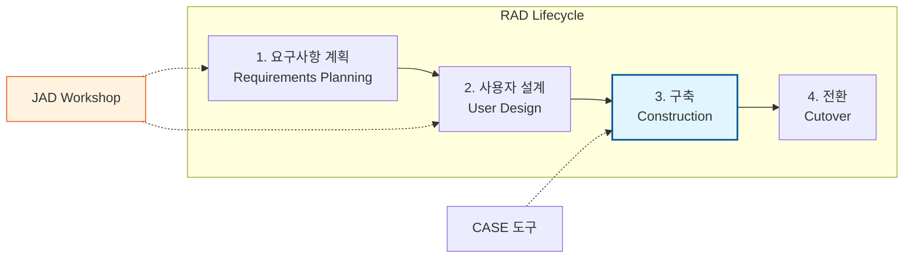

Parent: [[025.프로토타이핑_모델(Prototyping_Model)]]

# 1. RAD(Rapid Application Development) 모델의 개요 및 배경

### 가. RAD 모델의 정의
- CASE 도구와 프로토타이핑 기술을 활용하여 60~90일 사이의 **매우 짧은 주기 동안 시스템을 개발**하기 위한 고속 소프트웨어 개발 방법론임
- 제임스 마틴(James Martin)에 의해 제안되었으며, 사용자 참여를 극대화하고 강력한 소프트웨어 개발 도구를 사용하여 개발 속도를 높이는 것이 핵심임

### 나. 등장 배경 및 필요성
- **Time-to-Market 단축**: 비즈니스 환경의 급격한 변화에 대응하기 위해 전통적인 폭포수 모델보다 빠른 출시 요구 증대
- **사용자 요구사항의 정확한 반영**: 개발 전 과정에 사용자를 참여시켜 의사소통 오류로 인한 재작업 비용 최소화
- **자동화 도구의 발전**: CASE(Computer-Aided Software Engineering) 도구 및 비주얼 프로그래밍 도구의 보급으로 자동화된 코드 생성 가능

# 2. RAD 모델의 프로세스 및 핵심 메커니즘

### 가. RAD 모델의 4단계 개발 프로세스 개념도

### 나. RAD 모델의 핵심 구성 요소 및 활동
| 요소 | 명칭 | 상세 역할 및 내용 |
| :--- | :--- | :--- |
| **핵심 인력** | **SWAT 팀** | Skilled With Advanced Tools, 고도로 숙련된 전문가로 구성된 소수 정예 팀 |
| **협업 기법** | **JAD** | Joint Application Design, 사용자와 개발자가 함께 참여하는 집중 워크숍 기법 |
| **자동화 도구** | **CASE 도구** | 분석, 설계, 코딩을 자동화하는 도구(I-CASE 등)를 활용하여 생산성 극대화 |
| **개발 방식** | **Time-boxing** | 기능보다 일정을 우선하여 정해진 기간 내에 반드시 결과물을 산출하는 기법 |

# 3. RAD 모델의 상세 기술 및 비교 분석

### 가. RAD 모델의 성공 요인 (심화)
1) **사용자 가시성 확보**: 진화적 프로토타입을 통해 사용자가 개발 중인 시스템을 수시로 확인하고 피드백 제공
2) **재사용성 극대화**: 기존 컴포넌트나 라이브러리를 적극 활용하여 바닥부터 코딩하는 작업(Bottom-up) 최소화
3) **병렬 개발**: 시스템을 기능별로 분할하여 다수의 SWAT 팀이 동시에 개발 진행

### 나. 폭포수 모델 vs RAD 모델 비교 분석
| 비교 항목 | 폭포수 모델 (Waterfall) | RAD 모델 |
| :--- | :--- | :--- |
| **개발 기간** | 길다 (순차적 진행) | **매우 짧다 (60~90일)** |
| **사용자 참여** | 초기와 후기에 집중 | **전 과정에 밀착 참여 (JAD)** |
| **산출물** | 문서 중심 | **실행 가능한 프로토타입 중심** |
| **주요 도구** | 일반적인 IDE, 문서 도구 | **CASE, I-CASE, 비주얼 도구** |
| **위험 요소** | 요구사항 불일치 리스크 높음 | **기술적 숙련도 및 도구 의존성 높음** |

# 4. 기술사적 제언 및 실무 적용 방안

### 가. 실무 도입 시 고려사항 및 제약
- **기술적 위험**: 최신 CASE 도구나 기술에 대한 팀원들의 숙련도가 낮을 경우 오히려 개발 속도가 저하될 수 있음
- **적용 범위**: 시스템이 모듈화되기 어렵거나 인터페이스가 너무 복잡한 대규모 백엔드 시스템에는 적용이 곤란함

### 나. 거버넌스 및 보안(Security) 통제 방안
- **자동화된 보안 진단**: 개발 속도가 매우 빠르므로 사람이 보안 리뷰를 수행하기 어려움. CI/CD 파이프라인 내에 **SAST/DAST** 도구를 통합하여 실시간 보안 검증 수행
- **코드 품질 관리**: 자동 생성된 코드의 가독성이 낮을 수 있으므로, 표준 코딩 컨벤션 준수 여부를 자동 체크하는 거버넌스 체계 필요

### 다. 현대적 방법론으로의 발전 (Low-code/No-code)
- RAD의 정신은 현대의 **Low-code/No-code 플랫폼**으로 계승되었으며, 현업 담당자가 직접 앱을 개발하는 **Citizen Developer** 시대를 여는 핵심 사상으로 작용함

> [!tip] **기술사 인사이트**
> RAD 모델의 정수는 **"일정을 위해 범위를 희생한다(Time-boxing)"**는 실용주의 철학에 있습니다. 기술사 답안 작성 시, 단순히 빠른 개발이 아니라 **비즈니스 적시성(Business Timeliness)**을 확보하기 위한 전략적 선택임을 강조해야 합니다.

## Related Notes
- [[024.폭포수_모델(Waterfall_Model)]]
- [[025.프로토타이핑_모델(Prototyping_Model)]]
- [[027.반복적_개발_모델(Iterative_Model)]]
- [[016.이벤트_스토밍(Event_Storming)]]
