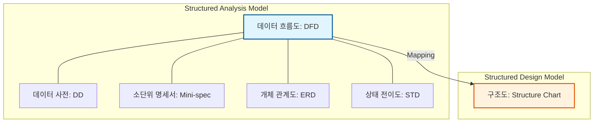

Parent: [[소프트웨어_공학_방법론]]

# 1. 구조적 개발 방법론의 개요 및 배경

### 가. 구조적 개발 방법론의 정의
- 시스템을 기능에 따라 독립적인 **프로세스(Process)**로 분할하고, 이를 계층적으로 구성하는 **하향식(Top-down) 기능 분할** 중심의 개발 방법론임
- 1970년대 에드워드 요던(Edward Yourdon) 등에 의해 제안되었으며, 복잡한 비즈니스 로직을 논리적으로 구조화하여 소프트웨어의 생산성과 품질을 높이는 기법임

### 나. 등장 배경 및 필요성
- **소프트웨어 위기 극복**: 소프트웨어의 규모와 복잡도가 증가함에 따라 체계적인 분석 및 설계 기법의 필요성 대두
- **가독성 및 유지보수성 향상**: "Go-to 문" 지양 및 정형화된 구조(순차, 선택, 반복) 사용으로 스파게티 코드 방지
- **의사소통의 도구**: DFD와 같은 도식화된 도구를 통해 개발자와 사용자 간의 분석 결과 공유 용이

# 2. 구조적 개발 방법론의 아키텍처 및 핵심 메커니즘

### 가. 구조적 분석 모델의 상호 관계도

### 나. 구조적 분석/설계의 4대 핵심 도구
| 구분 | 핵심 도구 | 상세 내용 및 역할 |
| :--- | :--- | :--- |
| **분석 도구** | **DFD (Data Flow Diagram)** | 시스템 내 데이터 흐름과 프로세스 간의 관계를 도식화한 도구 |
| | **DD (Data Dictionary)** | DFD에 나타난 데이터 흐름, 저장소 등을 정의한 데이터의 명세서 |
| | **Mini-spec (소단위 명세서)** | DFD의 최하위 프로세스가 수행하는 비즈니스 로직을 상세히 기술 |
| **설계 도구** | **Structure Chart** | 시스템의 기능 모듈 구조와 모듈 간의 제어/데이터 인터페이스 표현 |

# 3. 상세 기술 및 객체지향 방법론과의 비교 분석

### 가. 구조적 설계의 품질 원칙: 응집도와 결합도
1) **응집도(Cohesion) 극대화**: 모듈 내부 요소들이 하나의 목적을 위해 긴밀하게 협력하도록 설계 (**[두음: 우논시절통순기]** 고순위 지향)
2) **결합도(Coupling) 최소화**: 모듈 간의 의존성을 줄여 독립적인 변경이 가능하도록 설계 (**[두음: 내공외제스자]** 저순위 지향)

### 나. 구조적 방법론 vs 객체지향 방법론 비교
| 비교 항목 | 구조적 방법론 (Structured) | 객체지향 방법론 (Object-Oriented) |
| :--- | :--- | :--- |
| **핵심 관점** | **프로세스(Function) 중심** | **데이터 + 행위(Object) 중심** |
| **설계 방식** | 하향식 분할 (Top-down) | 상향식 및 하향식 혼용 |
| **데이터 처리** | 데이터와 프로세스의 분리 | 데이터와 프로세스의 캡슐화 |
| **재사용성** | 모듈 단위 재사용 (낮음) | 클래스, 상속 기반 재사용 (높음) |
| **적합 분야** | 정형화된 대규모 데이터 처리 | 복잡하고 변화가 잦은 비즈니스 앱 |

# 4. 기술사적 제언 및 실무 적용 방안

### 가. 실무 도입 시 고려사항
- **요구사항 변경 대응**: 구조적 방법론은 초기 분석 결과에 의존하므로, 요구사항 변경 시 상위 프로세스부터 재설계해야 하는 오버헤드 발생 주의
- **모듈화의 적정성**: 무분별한 분할은 결합도를 높일 수 있으므로, 단일 책임 원칙에 입각한 기능 분해 전략 수립 필요

### 나. 거버넌스 및 보안(Security) 통제 방안
- **데이터 흐름 추적성**: DFD를 통해 개인정보 및 중요 데이터의 입출력 경로를 시각화하고 보안 통제 지점(Policy Enforcement Point) 식별
- **입력 데이터 검증**: 프로세스(DFD Bubble) 입구에서 정형화된 입력 검증 로직을 Mini-spec에 반영하여 인젝션 공격 방어

### 다. 현대적 관점에서의 시사점
- **레거시 유지보수**: 현재도 많은 금융/공공의 메인프레임 및 대규모 배치 시스템이 구조적 원리에 기반하므로, 기존 시스템 분석 역량으로서의 가치 유지
- **마이크로서비스 분할**: MSA의 서비스 분할 시, 비즈니스 프로세스 흐름을 분석하는 구조적 접근법이 DDD와 병행하여 효과적으로 사용됨

> [!tip] **기술사 인사이트**
> 구조적 방법론의 본질은 **"복잡성의 정복(Divide and Conquer)"**입니다. 객체지향이 대세인 현대에도 함수형 프로그래밍의 부상과 함께 **순수 함수(Pure Function)** 중심의 구조적 설계 사상은 고품질 소프트웨어 아키텍처의 핵심 원리로 재조명받고 있습니다.

## Related Notes
- [[007.형상관리(Configuration Management)]]
- [[010.도메인_주도_설계(DDD)]]
- [[011.클린_아키텍처(Clean_Architecture)]]
- [[030.객체지향_개발방법론]]
