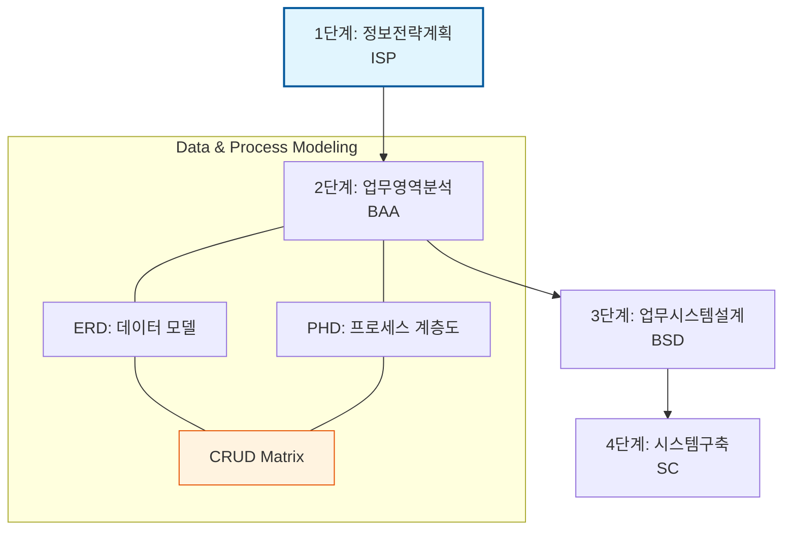

Parent: [[029.구조적_개발_방법론]]

# 1. 정보공학 방법론(Information Engineering)의 개요 및 배경

### 가. 정보공학 방법론(IE)의 정의
- 기업의 정보 시스템을 구축하기 위해 전략적 계획 수립부터 시스템 구축까지 데이터 중심으로 접근하는 **데이터 중심(Data-Driven) 전사적 소프트웨어 개발 방법론**임
- 제임스 마틴(James Martin)에 의해 체계화되었으며, "프로세스는 변해도 데이터는 변하지 않는다"는 철학 하에 전사적 데이터 모델링을 강조함

### 나. 등장 배경 및 필요성
- **프로세스 중심의 한계**: 구조적 방법론의 프로세스 중심 설계는 요구사항 변경 시 데이터 구조의 잦은 변경과 유지보수 비용 상승 초래
- **전략적 경영 정보의 필요성**: 단순 업무 자동화를 넘어 기업의 경영 전략과 IT를 일치시키는 **ISP(Information Strategy Planning)** 요구 증대
- **데이터 무결성 확보**: 전사적으로 통합된 데이터 저장소를 구축하여 중복을 제거하고 정보의 일관성 확보 필요

# 2. 정보공학 방법론의 아키텍처 및 핵심 메커니즘

### 가. 정보공학 방법론의 4단계 라이프사이클 개념도

### 나. 단계별 주요 활동 및 핵심 산출물
| 단계 | 주요 활동 (Activity) | 핵심 산출물 (Deliverables) |
| :--- | :--- | :--- |
| **1. ISP** | 경영 전략 분석, 현행 시스템 진단 | 전사 모델, 정보 아키텍처, 실행 계획 |
| **2. BAA** | 데이터 및 프로세스 분석 (업무 중심) | **ERD**, 프로세스 계층도(PHD), **CRUD Matrix** |
| **3. BSD** | 시스템 설계, 인터페이스 설계 (기술 중심) | 물리 DB 설계서, 화면/단말기 설계서 |
| **4. SC** | 코딩, 테스트, 사용자 교육 | 실행 프로그램, 데이터베이스, 운영 매뉴얼 |

# 3. 상세 기술 및 비교 분석

### 가. 핵심 기술: CRUD Matrix (Data-Process 연관 분석)
- **개념**: 데이터 엔티티와 프로세스 간의 상관관계를 생성(Create), 조회(Read), 수정(Update), 삭제(Delete)로 표현한 매트릭스
- **활용 목적**: 
    1) **누락 분석**: 모든 엔티티가 최소 한 번 이상의 C, R을 수행하는지 검증
    2) **영역 분할**: 밀집도가 높은 엔티티와 프로세스를 그룹화하여 시스템 경계 도출
    3) **영향도 평가**: 데이터 변경 시 영향을 받는 프로세스를 식별하여 정합성 유지

### 나. 구조적 방법론 vs 정보공학 방법론 비교
| 비교 항목 | 구조적 방법론 (Structured) | 정보공학 방법론 (IE) |
| :--- | :--- | :--- |
| **핵심 관점** | 프로세스(Function) 중심 | **데이터(Data) 중심** |
| **대상 범위** | 단위 시스템(Project) 중심 | **전사적(Enterprise) 중심** |
| **개발 방식** | 하향식 분할 (Top-down) | 하향식(ISP) + 상향식(BAA) |
| **데이터 처리** | 파일 시스템 위주 | **데이터베이스(DBMS) 위주** |
| **안정성** | 요구사항 변경에 취약함 | **데이터 구조 기반으로 안정적임** |

# 4. 기술사적 제언 및 실무 적용 방안

### 가. 실무 도입 시 고려사항
- **ISP의 실효성**: 단순한 요식 행위가 아닌 경영진의 강력한 의지를 바탕으로 비즈니스 전략과 IT의 연계(Alignment)가 실질적으로 이루어져야 함
- **CASE 도구 의존성**: 전사 모델링의 복잡도가 높으므로, 모델 관리 및 자동 코드 생성을 위한 강력한 CASE 도구 활용 필수

### 나. 거버넌스 및 데이터 보안 통제 방안
- **데이터 아키텍처(DA) 정립**: 전사 데이터 표준(표준 단어, 도메인)을 수립하여 데이터 거버넌스 체계 강화
- **접근 제어 설계**: BAA 단계에서 도출된 엔티티별 중요도를 기반으로 DB 접근 제어 및 암호화 정책 조기 수립

### 다. 현대적 확장 방향 (Data Mesh & Data-Driven)
- **현대적 재해석**: 정보공학의 전사적 데이터 통합 사상은 현대의 **Master Data Management(MDM)**와 **데이터 레이크(Data Lake)** 구축 전략의 근간이 됨
- **Agile과의 결합**: 무거운 SC(구축) 단계 대신, 분석된 데이터 모델을 기반으로 빠른 반복 개발을 수행하는 **하이브리드 정보공학** 기법으로 진화

> [!tip] **기술사 인사이트**
> 정보공학 방법론의 핵심은 **"데이터의 불변성"**에 기반한 시스템의 견고함입니다. 인공지능(AI)과 빅데이터가 주도하는 현대 IT 환경에서, 양질의 데이터를 체계적으로 관리하기 위한 정보공학적 분석 설계 역량은 데이터 기반 경영의 필수 기초 체력임을 강조해야 합니다.

## Related Notes
- [[029.구조적_개발_방법론]]
- [[007.형상관리(Configuration Management)]]
- [[020.폴리글랏_퍼시스턴스(Polyglot_Persistence)]]
- [[010.도메인_주도_설계(DDD)]]
