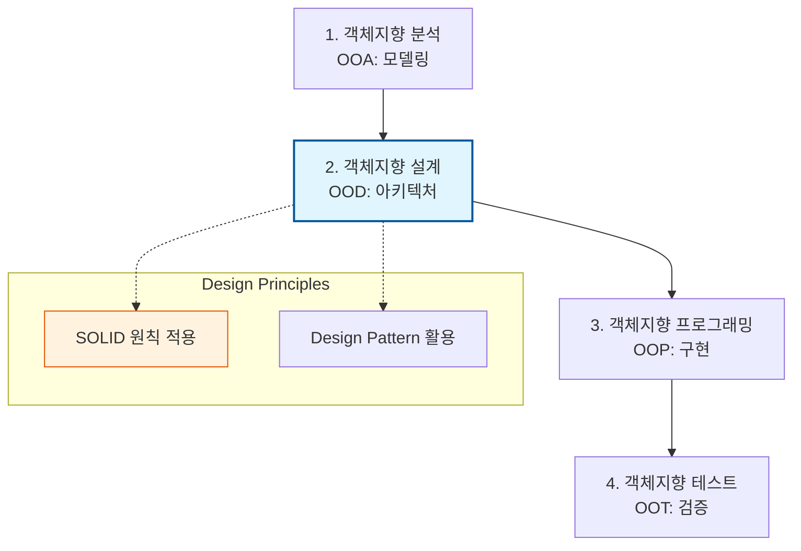

Parent: [[029.구조적_개발_방법론]]

# 1. 객체지향 개발 방법론(OO Methodology)의 개요 및 배경

### 가. 객체지향 개발 방법론의 정의
- 현실 세계의 개체를 데이터와 함수를 결합한 **객체(Object)** 단위로 정형화하고, 객체 간의 상호작용을 통해 시스템을 구축하는 **사용자 중심의 상향식(Bottom-up) 소프트웨어 개발 방법론**임
- **캡슐화**, **상속**, **다형성** 등을 핵심 원리로 하며, 소프트웨어의 **재사용성(Reusability)**과 **유지보수성(Maintainability)** 극대화를 목표로 함

### 나. 등장 배경 및 필요성
- **소프트웨어 위기 심화**: 시스템 규모 확대로 인한 구조적 방법론의 복잡성 관리 한계 노출
- **현실 세계 모사**: 비즈니스 도메인의 복잡한 로직을 개발 언어에 직관적으로 투영할 필요성 증대
- **생산성 및 품질 향상**: 한 번 검증된 클래스(Class)를 재사용함으로써 개발 기간 단축 및 오류 감소 요구

# 2. 객체지향의 핵심 원칙 및 개발 라이프사이클

### 가. 객체지향의 5대 핵심 개념 [두음: 캡상다추정]
| 개념 | 상세 내용 | 효과 |
| :--- | :--- | :--- |
| **캡슐화 (Encapsulation)** | 데이터와 기능을 하나로 묶고 상세 내용을 외부에 은닉 | 정보 은닉, 결합도 저하 |
| **상속 (Inheritance)** | 부모 클래스의 속성과 기능을 자식 클래스가 물려받음 | 재사용성 향상, 코드 중복 제거 |
| **다형성 (Polymorphism)** | 동일한 인터페이스로 서로 다른 기능을 수행하는 능력 | 유연한 설계, 오버라이딩/오버로딩 |
| **추상화 (Abstraction)** | 불필요한 부분은 생략하고 핵심적인 특징만을 강조 | 모델링 단순화, 복잡도 관리 |
| **정보 은닉 (Information Hiding)** | 자신의 정보를 숨기고 인터페이스를 통해서만 접근 허용 | 보안성 강화, 무결성 유지 |

### 나. 객체지향 개발 프로세스 구성도

# 3. 객체지향 설계 원칙(SOLID) 및 방법론 간 비교

### 가. 객체지향 설계 5대 원칙 (SOLID) [두음: 단개역인리]
1) **SRP (Single Responsibility)**: 하나의 클래스는 하나의 책임만 가져야 함 (단일 책임)
2) **OCP (Open-Closed)**: 확장에 대해서는 열려 있고, 수정에 대해서는 닫혀 있어야 함 (개방 폐쇄)
3) **LSP (Liskov Substitution)**: 자식 클래스는 언제나 부모 클래스를 대체할 수 있어야 함 (리스코프 치환)
4) **ISP (Interface Segregation)**: 사용하지 않는 인터페이스는 구현하지 않도록 분리함 (인터페이스 분리)
5) **DIP (Dependency Inversion)**: 구체화가 아닌 추상화에 의존해야 함 (의존성 역전)

### 나. 구조적 vs 정보공학 vs 객체지향 방법론 비교
| 비교 항목 | 구조적 방법론 | 정보공학 방법론 (IE) | 객체지향 방법론 (OO) |
| :--- | :--- | :--- | :--- |
| **핵심 관점** | **프로세스(함수)** | **데이터(Data)** | **객체(Data+Function)** |
| **개발 방식** | 하향식(Top-down) | 전사적(Enterprise) | **상향식(Bottom-up)** |
| **주요 도구** | DFD, DD, Structure Chart | ERD, CRUD Matrix | **UML, Use Case** |
| **재사용성** | 모듈 단위 (낮음) | 데이터 공유 중심 | **클래스 단위 (매우 높음)** |
| **유지보수** | 어려움 (파급효과 큼) | 데이터 위주 안정적 | **용이함 (독립성 보장)** |

# 4. 기술사적 제언 및 실무 적용 방안

### 가. 실무 도입 시 고려사항
- **러닝 커브(Learning Curve)**: 객체지향 원리와 설계 패턴에 대한 개발자의 깊은 이해가 전제되어야 아키텍처 붕괴 방지 가능
- **오버엔지니어링 주의**: 지나친 추상화와 상속 구조는 오히려 가독성을 해치고 시스템 성능을 저하시킬 수 있음

### 나. 거버넌스 및 보안(Security) 통제 방안
- **캡슐화 기반 데이터 보호**: 객체 내부 상태를 `private`으로 선언하고 유효성 검사(Validation)가 포함된 `Setter`를 통해서만 변경을 허용하여 데이터 무결성 확보
- **디자인 패턴 표준화**: 전사적 공통 라이브러리 제작 시 **Strategy**, **Observer** 등 검증된 디자인 패턴을 적용하여 보안 패치 및 업데이트 용이성 확보

### 다. 최신 트렌드와 연계한 발전 방향
- **도메인 주도 설계(DDD)와의 결합**: 객체지향 방법론의 정수는 현대의 **DDD**로 이어지며, 마이크로서비스(MSA)의 응집도 높은 내부 설계 표준으로 활용됨
- **클린 아키텍처 연계**: SOLID 원칙을 기반으로 비즈니스 로직을 인프라로부터 격리하는 **클린/헥사고날 아키텍처** 구현의 핵심 도구로 작용

> [!tip] **기술사 인사이트**
> 객체지향 방법론은 단순한 '코딩 스킬'이 아니라 **"현실의 복잡성을 관리 가능한 수준으로 모델링하는 철학"**입니다. 기술사 답안에서는 특히 **SOLID 원칙**을 통한 변경 유연성 확보와 **재사용성** 기반의 비즈니스 민첩성 향상을 강조하는 것이 합격의 포인트입니다.

## Related Notes
- [[029.구조적_개발_방법론]]
- [[030.정보공학_방법론(Information_Engineering)]]
- [[010.도메인_주도_설계(DDD)]]
- [[011.클린_아키텍처(Clean_Architecture)]]
- [[017.헥사고날_아키텍처(Hexagonal_Architecture)]]
