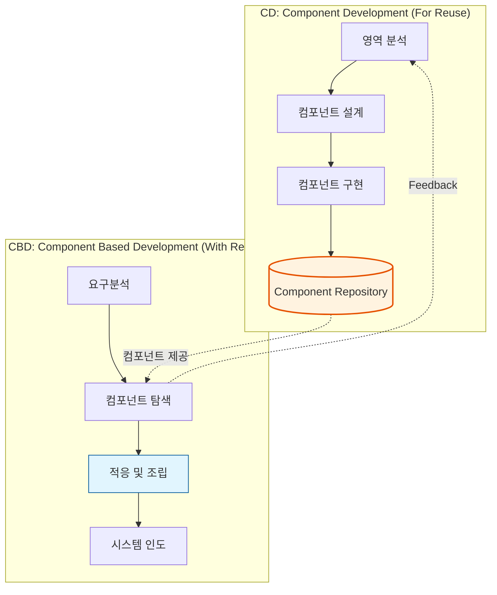

Parent: [[031.객체지향_개발방법론]]

# 1. CBD(Component Based Development) 방법론의 개요 및 배경

### 가. CBD 방법론의 정의
- 독립적인 기능을 수행하는 소프트웨어 부품인 **컴포넌트(Component)**를 제작하거나, 이미 검증된 컴포넌트들을 **조립(Assembling)**하여 전체 시스템을 구축하는 **재사용 중심의 소프트웨어 개발 방법론**임
- "Buy, Don't Build"의 철학 하에 소프트웨어 생산성 혁신과 품질 향상을 목표로 함

### 나. 등장 배경 및 필요성
- **객체지향의 한계 극복**: 클래스 단위의 재사용은 소스 코드 수준의 의존성이 높아 물리적인 부품화 및 배포에 한계 노출
- **생산성 및 품질 극대화**: 검증된 컴포넌트의 반복 사용을 통해 개발 기간을 단축하고 시스템의 안정성을 조기에 확보
- **유지보수 용이성**: 특정 기능 변경 시 해당 컴포넌트만 교체(Plug-and-Play)함으로써 전체 시스템 영향도 최소화

# 2. CBD의 아키텍처 및 핵심 메커니즘

CBD는 컴포넌트를 만드는 과정(**CD**)과 조립하는 과정(**CBD**)의 이분법적 라이프사이클을 가집니다.

### 가. CBD 개발 프로세스 및 2-Track 라이프사이클

### 나. CBD의 핵심 구성 요소
| 요소 | 상세 설명 | 비고 |
| :--- | :--- | :--- |
| **Component** | 독립적인 기능 단위, 명확한 인터페이스를 가진 실행 가능한 이진(Binary) 유닛 | Black Box |
| **Interface** | 내부 구현을 숨기고 외부와 소통하기 위한 규격 (IDL 등 활용) | 정보 은닉 |
| **Architecture** | 컴포넌트 간의 상호작용 및 연결 구조를 정의한 청사진 | 프레임워크 |
| **Repository** | 인증된 컴포넌트를 저장, 검색, 추출하기 위한 공유 저장소 | 자산 관리 |

# 3. 상세 기술 및 객체지향(OO)과의 비교 분석

### 가. 컴포넌트의 주요 특징
1) **독립성(Self-contained)**: 외부 의존성을 최소화하여 독립적으로 배포 및 실행 가능
2) **블랙박스 재사용(Black-box)**: 내부 소스 코드를 알 필요 없이 인터페이스 명세만으로 사용
3) **표준 준수**: EJB, COM+, .NET 등 특정 컴포넌트 모델 표준을 준수하여 상호운용성 확보

### 나. 객체지향(OO) vs 컴포넌트 기반(CBD) 비교 분석
| 비교 항목 | 객체지향 (Object-Oriented) | 컴포넌트 기반 (CBD) |
| :--- | :--- | :--- |
| **재사용 단위** | 클래스 (Class) | **컴포넌트 (Component)** |
| **재사용 형태** | 화이트박스 (소스 코드 공유) | **블랙박스 (이진 실행 파일)** |
| **결합도** | 상대적으로 높음 (상속, 참조) | **매우 낮음 (인터페이스 기반)** |
| **배포 단위** | 소스 또는 라이브러리 | **독립적 배포 가능 유닛** |
| **핵심 기술** | 상속, 다형성, 캡슐화 | **인터페이스, 컴포넌트 모델** |

# 4. 기술사적 제언 및 실무 적용 방안

### 가. 실무 도입 시 고려사항
- **컴포넌트 유통 생태계**: 사내 또는 시장에 충분한 양질의 컴포넌트가 확보되어야 실질적인 "조립" 위주의 개발이 가능함
- **Glue Code 최소화**: 컴포넌트 간 연결을 위한 추가 코딩(Glue Code)이 비대해질 경우 생산성이 오히려 저하될 수 있음에 유의

### 나. 거버넌스 및 보안(Security) 통제 방안
- **컴포넌트 인증제**: 외부 컴포넌트 도입 시 악성코드 포함 여부 및 취약점 점검을 거친 후 저장소(Repository)에 등록하는 승인 절차 필수
- **인터페이스 보안**: 포트와 어댑터를 통한 통제와 유사하게, 컴포넌트 경계에서의 입력값 검증 및 인증 체계 강화

### 다. 현대적 발전 방향: MSA와의 관계
- **SOA를 거쳐 MSA로**: CBD의 서비스 단위 분할 사상은 SOA(Service Oriented Architecture)를 거쳐 현대의 **마이크로서비스 아키텍처(MSA)**로 계승됨
- **컨테이너 기술 결합**: Docker와 같은 컨테이너 기술은 CBD가 지향했던 "완벽하게 독립적인 실행 부품"을 구현하는 최적의 기술적 수단이 됨

> [!tip] **기술사 인사이트**
> CBD의 정수는 **"인터페이스와 구현의 완벽한 분리"**에 있습니다. 기술사 답안에서는 CBD가 단순한 개발 기법을 넘어, 소프트웨어를 공학적인 **'산업 부품'** 수준으로 격상시켜 소프트웨어 위기를 극복하고자 한 거대한 패러다임의 변화임을 강조해야 합니다.

## Related Notes
- [[031.객체지향_개발방법론]]
- [[009.Microservices_Architecture]]
- [[017.헥사고날_아키텍처(Hexagonal_Architecture)]]
- [[007.형상관리(Configuration Management)]]
