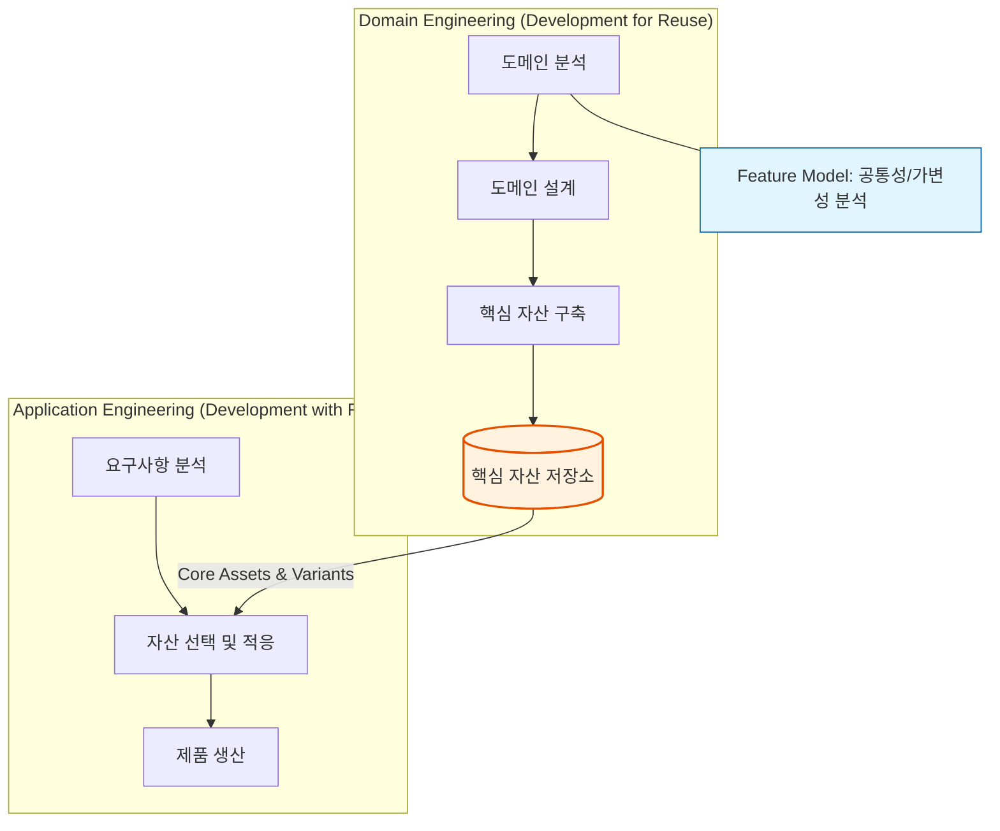

Parent: [[032.CBD_방법론]]

# 1. 제품 계열 공학(Software Product Line)의 개요 및 배경

### 가. 제품 계열 공학(SPL)의 정의
- 특정 도메인 내의 제품 군들이 공유하는 **핵심 자산(Core Assets)**을 기반으로, 공통성과 가변성을 체계적으로 관리하여 유사한 소프트웨어 제품들을 효율적으로 생산하는 **전략적 재사용 방법론**임
- 개별 제품 개발이 아닌, 연관된 제품들의 '계열(Line)' 전체를 최적화하여 개발 생산성과 품질을 혁신하는 공학적 접근법임

### 나. 등장 배경 및 필요성
- **Mass Customization 요구**: 고객별로 다양한 요구사항(Variant)을 반영하면서도 대량 생산의 효율성을 동시에 확보해야 함
- **재사용의 체계화**: 기존의 임기응변식(Ad-hoc) 재사용의 한계를 극복하고, 도메인 단위의 계획된 재사용(Planned Reuse) 필요성 증대
- **시장 적시성(Time-to-Market)**: 검증된 자산을 조합함으로써 신제품 출시 기간을 획기적으로 단축하여 경쟁 우위 확보

# 2. SPL의 아키텍처 및 핵심 메커니즘

SPL은 핵심 자산을 만드는 과정과 이를 활용해 개별 제품을 만드는 과정의 **2-Track 프로세스**로 구성됩니다.

### 가. SPL의 운영 프레임워크 및 프로세스

### 나. 핵심 구성 요소
| 요소 | 상세 설명 | 비고 |
| :--- | :--- | :--- |
| **핵심 자산 (Core Assets)** | 도메인 내 제품들이 공유하는 아키텍처, 컴포넌트, 테스트 케이스, 문서 등 | 재사용의 원천 |
| **제품 생산 계획 (Production Plan)** | 핵심 자산들을 조합하여 최종 제품을 생산하는 방법과 절차를 기술한 지침서 | 매뉴얼 |
| **공통성 (Commonality)** | 해당 제품 계열 내의 모든 제품이 공통적으로 가지는 속성이나 기능 | Standard |
| **가변성 (Variability)** | 개별 제품의 특성에 따라 달라지는 속성이나 기능 (Variation Point 관리) | Customization |

# 3. 상세 기술 및 비교 분석

### 가. 핵심 기술: 특징 모델링 (Feature Modeling)
- 도메인 내 제품들의 특징(Feature) 간의 관계를 트리 구조로 도식화하여 가변성을 관리하는 기법
- **Mandatory**(필수), **Optional**(선택), **Alternative**(배타적 선택), **Or**(하나 이상 선택) 등의 제약 조건을 통해 제품 구성을 정의함

### 나. CBD 방법론 vs SPL 방법론 비교
| 비교 항목 | CBD (Component Based) | SPL (Software Product Line) |
| :--- | :--- | :--- |
| **중점 방향** | 독립된 부품(Component) 중심 | **제품 군(Line) 및 도메인** 중심 |
| **재사용 범위** | 컴포넌트 단위 | **전 라이프사이클 자산** (분석~테스트) |
| **관점** | 수평적 재사용 (범용 부품) | **수직적 재사용** (특정 도메인 특화) |
| **경제성** | 개별 프로젝트 비용 절감 | **초기 투자비용 높으나 장기적 ROI 극대화** |
| **적합성** | 범용 시스템, 일반 웹 서비스 | **임베디드, 자동차, 패키지 소프트웨어** |

# 4. 기술사적 제언 및 실무 적용 방안

### 가. 실무 도입 시 고려사항
- **초기 투자 비용(Up-front Cost)**: 핵심 자산을 구축하는 초기 단계에 막대한 비용과 시간이 소요되므로, 경영진의 장기적 관점의 투자가 필수적임
- **적정 도메인 선정**: 제품 간 유사성이 높고 시장 수요가 지속적인 도메인(예: 스마트폰 라인업, 차량용 인포테인먼트)을 선정해야 효과가 발휘됨

### 나. 거버넌스 및 형상관리 통제 방안
- **Variation Point 관리**: 가변성이 발생하는 지점을 명확히 정의하고, 형상관리 도구와 연계하여 제품별 버전(Variant) 간의 충돌 방지
- **자산 품질 보증**: 핵심 자산의 결함은 모든 제품으로 전파되므로, 도메인 공학 단계에서의 고도화된 검증(Verification) 프로세스 운영

### 다. 최신 트렌드와 연계한 발전 방향
- **Platform Engineering과의 결합**: SPL의 철학은 현대 인프라 운영의 **플랫폼 엔지니어링**으로 확장되어, 개발자에게 표준화된 도구와 자산을 제공하는 형태로 진화
- **AI 기반 가변성 관리**: 수많은 제품 옵션 조합 중 최적의 구성을 AI가 추천하거나, 코드 생성 모델을 통해 가변 영역을 자동 코딩하는 연구 활발

> [!tip] **기술사 인사이트**
> SPL의 본질은 **"재사용을 위한 설계(Design for Reuse)"**와 **"재사용에 의한 설계(Design by Reuse)"**의 조화입니다. 단순한 기술 도입이 아니라 기업의 **비즈니스 모델** 자체를 공학적으로 구조화하는 고도의 경영 전략임을 강조하는 것이 기술사 답안의 핵심 차별화 전략입니다.

## Related Notes
- [[032.CBD_방법론]]
- [[029.구조적_개발_방법론]]
- [[007.형상관리(Configuration Management)]]
- [[034.애자일_방법론(Agile)]]
