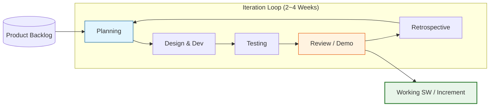

Parent: [[024.폭포수_모델(Waterfall_Model)]]

# 1. 애자일 방법론(Agile Methodology)의 개요 및 배경

### 가. 애자일 방법론의 정의
- 고정된 계획에 의존하기보다 개발 과정에서의 **상호작용**, **동작하는 소프트웨어**, **고객과의 협력**, **변화에 대한 대응**을 중시하는 반복적/점진적 소프트웨어 개발 가이드라인임
- 짧은 개발 주기(Iteration)를 반복하며 사용자 피드백을 즉각 반영하여 비즈니스 가치를 신속하게 전달하는 고객 중심 방법론임

### 나. 등장 배경 및 필요성
- **전통적 방법론(Waterfall)의 한계**: 요구사항 확정 후 후반 단계에서 발견되는 리스크와 수정 비용 폭증 문제 해결 필요
- **비즈니스 환경의 불확실성**: 급변하는 시장 요구사항에 기민하게 대응하기 위한 **Time-to-Market** 단축 요구 증대
- **가시성 확보**: 프로젝트 초기부터 실제 동작하는 결과물을 확인하여 사용자 만족도 제고 및 리스크 조기 식별

# 2. 애자일 방법론의 아키텍처 및 핵심 메커니즘

### 가. 애자일 개발 프로세스 및 반복 주기 개념도

### 나. 애자일의 4대 핵심 가치 및 구성 요소
| 구분 | 핵심 내용 | 상세 설명 |
| :--- | :--- | :--- |
| **4대 가치** | **상호작용 > 프로세스** | 도구와 절차보다 개인의 역량과 팀워크 중시 |
| | **동작하는 SW > 문서** | 방대한 문서화보다 실제 작동하는 결과물에 집중 |
| | **고객 협력 > 계약 협상** | 계약 조건보다 고객과의 지속적 소통과 협력 중시 |
| | **변화 대응 > 계획 준수** | 고정된 계획보다 상황 변화에 따른 유연한 대응 지향 |
| **핵심 활동** | **User Story** | 사용자의 관점에서 작성된 요구사항 명세 |
| | **Sprint/Iteration** | 1~4주 단위의 반복적인 개발 주기 |
| | **Daily Stand-up** | 매일 진행하는 짧은 진척 공유 및 장애 요인 식별 회의 |

# 3. 상세 기술 및 주요 방법론 비교 분석

### 가. 애자일의 주요 프레임워크 (유형별 특징)
1) **Scrum**: 역할(PO, SM, Team)과 의식(Sprint, Daily, Review) 중심의 관리 프레임워크
2) **XP (Extreme Programming)**: TDD, Pair Programming 등 개발자 프랙티스와 기술적 품질 중시
3) **Kanban**: WIP(Work In Progress) 제한을 통한 가치 흐름(Flow) 최적화 및 시각화 중심
4) **Lean**: 낭비 제거(Waste Elimination)를 통한 가치 중심의 프로세스 혁신

### 나. 폭포수(Waterfall) vs 애자일(Agile) 비교
| 비교 항목 | 폭포수 방법론 | 애자일 방법론 |
| :--- | :--- | :--- |
| **요구사항** | 초기 확정 (Frozen) | **지속적 진화 (Backlog)** |
| **산출물** | 단계별 문서 (Documentation) | **동작하는 코드 (Working SW)** |
| **품질 검증** | 후반 테스트 단계 집중 | **지속적 테스트 (CI/CD 연계)** |
| **변경 수용** | 어려움 (비용/일정 타격) | **용이함 (Backlog 정제 반영)** |
| **리스크** | 빅뱅 방식, 위험 높음 | **점진적 해결, 위험 낮음** |

# 4. 기술사적 제언 및 실무 적용 방안

### 가. 실무 도입 시 고려사항 (Governance)
- **조직 문화의 변화**: 단순히 도구(Jira 등)를 도입하는 것이 아니라, 실패를 용인하고 투명하게 공유하는 **애자일 마인드셋** 정착이 최우선임
- **전문가 확보**: Product Owner(PO)의 의사결정 역량과 Scrum Master(SM)의 퍼실리테이션 역량 확보가 성공의 임계 경로임

### 나. 거버넌스 및 보안(Security) 통제 방안
- **DevSecOps 통합**: 짧은 반복 주기 내에 보안 검토가 누락되지 않도록 **SAST/DAST**를 파이프라인에 자동화하여 내재화
- **Compliance 관리**: 문서화가 부족할 수 있으므로, 최소한의 규제 준수 산출물(Minimum Viable Documentation) 정의 및 형상관리 철저

### 다. 최신 트렌드: Scaling Agile
- **대규모 애자일**: 단일 팀을 넘어 전사 차원의 애자일을 실현하기 위한 **SAFe**(Scaled Agile Framework)나 **LeSS** 등의 거대 프레임워크 도입 확산
- **AI-driven Agile**: AI 어시스턴트를 활용하여 사용자 스토리를 생성하거나, 스프린트의 속도(Velocity)를 예측하여 계획의 정확도 향상

> [!tip] **기술사 인사이트**
> 애자일은 "빨리 만드는 법"이 아니라 **"빨리 실패하고 배우는 법"**입니다. 기술사 답안에서는 애자일을 단순한 개발 기법이 아닌, 비즈니스의 **불확실성(Uncertainty)**을 공학적 반복을 통해 **확정성(Certainty)**으로 바꾸어가는 위험 관리 전략임을 강조해야 합니다.

## Related Notes
- [[024.폭포수_모델(Waterfall_Model)]]
- [[002.DevOps]]
- [[005.CI_CD]]
- [[016.이벤트_스토밍(Event_Storming)]]
- [[035.XP(Extreme_Programming)]]
