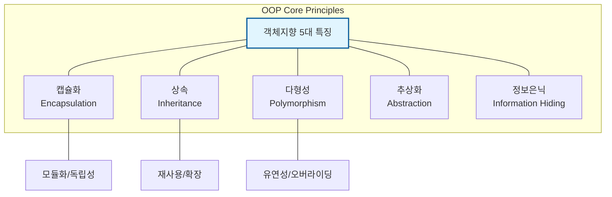

Parent: [[031.객체지향_개발방법론]]

# 1. 객체지향 프로그래밍(OOP)의 개요 및 배경

### 가. 객체지향 프로그래밍(Object-Oriented Programming)의 정의
- 현실 세계의 실체(Entity)를 데이터와 그 데이터를 처리하는 함수를 하나로 묶은 **객체(Object)** 단위로 정형화하여 시스템을 구축하는 프로그래밍 패러다임임
- 상태(State)와 행위(Behavior)를 클래스(Class)로 추상화하고, 객체 간의 **메시지(Message)** 교환을 통해 비즈니스 로직을 수행하는 방식임

### 나. 등장 배경 및 필요성
- **소프트웨어 위기 극복**: 절차적 프로그래밍의 스파게티 코드와 복잡성 관리 한계 해결 필요
- **재사용성(Reusability) 향상**: 기존에 구현된 코드를 부품처럼 사용하여 개발 생산성을 극대화하기 위함
- **유지보수 용이성**: 모듈 간의 독립성을 높여 변경 사항이 발생했을 때 영향도를 최소화(격리)함

# 2. 객체지향의 5대 핵심 특징 및 메커니즘

### 가. 객체지향의 핵심 특징 구성도

### 나. 5대 핵심 특징 상세 설명 [두음: 캡상다추정]
| 특징 | 상세 내용 및 메커니즘 | 효과 및 목적 |
| :--- | :--- | :--- |
| **캡슐화** | 데이터(속성)와 기능(메서드)을 하나의 단위(Class)로 묶음 | 결합도 저하, 응집도 향상 |
| **상속** | 부모 클래스의 속성과 기능을 자식 클래스가 그대로 물려받음 | 코드 중복 제거, 계층적 구조 |
| **다형성** | 동일한 인터페이스로 서로 다른 기능을 수행 (Overriding/Overloading) | 유연한 설계, 변경에 강함 |
| **추상화** | 복잡한 세부 사항은 생략하고 핵심적인 공통 특징만 추출 | 모델링 단순화, 복잡도 제어 |
| **정보 은닉** | 객체 내부의 상세 구현을 숨기고 외부에는 인터페이스만 노출 | 보안 강화, 무결성 유지 |

# 3. 상세 기술 및 절차적 프로그래밍과의 비교 분석

### 가. 다형성 구현의 핵심: 바인딩(Binding) 메커니즘
1) **정적 바인딩 (Static)**: 컴파일 시점에 호출될 함수가 결정됨 (예: Overloading)
2) **동적 바인딩 (Dynamic)**: 실행 시점(Runtime)에 객체 타입에 따라 함수가 결정됨 (예: Overriding, 가상 함수 호출)

### 나. 절차적 프로그래밍 vs 객체지향 프로그래밍 비교
| 비교 항목 | 절차적 프로그래밍 (Procedural) | 객체지향 프로그래밍 (OOP) |
| :--- | :--- | :--- |
| **핵심 관점** | **함수(Function)**, 프로세스 흐름 중심 | **객체(Object)**, 데이터와 행위 중심 |
| **데이터 처리** | 데이터와 함수가 분리되어 관리됨 | 데이터와 함수를 클래스로 통합 관리 |
| **설계 방식** | 하향식(Top-down) 분할 | 상향식(Bottom-up) 조립 |
| **변경 영향** | 코드 변경 시 영향도가 전체로 확산 | 캡슐화로 인해 영향도가 객체 내로 제한 |
| **주요 언어** | C, Pascal, Fortran | Java, C++, Python, C# |

# 4. 기술사적 제언 및 실무 적용 방안

### 가. 실무 도입 시 고려사항
- **객체 지향 설계 원칙(SOLID)** 준수: 단순한 클래스 활용을 넘어 변경에 유연한 구조를 위해 **SOLID** 5대 원칙을 설계 가이드라인으로 활용해야 함
- **상속보다는 합성을 권장**: 깊은 상속 계층은 오히려 결합도를 높일 수 있으므로, **Composite** 패턴 등을 활용한 객체 합성(Composition)을 우선 고려

### 나. 품질 및 보안 통제 방안
- **디자인 패턴(Design Pattern)** 적용: 검증된 객체지향 설계 기법(GoF 등)을 적용하여 코드의 안정성과 가독성 확보
- **접근 제어자 활용**: `private`, `protected` 등 접근 제어자를 엄격히 사용하여 불필요한 데이터 노출을 차단하는 보안 코딩 준수

### 다. 현대적 발전 방향 및 제언
- **함수형 프로그래밍과의 융합**: 현대 언어(Java 8+, Python)는 OOP 기반 위에 함수형 프로그래밍(Lambda, Stream)을 결합하여 상태 변화를 최소화하는 추세임
- **클라우드 네이티브 MSA**: 객체지향의 캡슐화 단위가 컨테이너 기반의 **마이크로서비스(Service)** 단위로 확장되어 시스템의 탄력성을 확보하는 핵심 사상으로 작용

> [!tip] **기술사 인사이트**
> 객체지향의 진정한 가치는 **"추상화의 벽"**을 세우는 데 있습니다. 실무에서는 구체적인 구현(Implementation)이 아닌 인터페이스(Interface)에 의존하게 함으로써, 기술의 변화(Detail)에도 비즈니스 로직(Policy)이 흔들리지 않는 견고한 아키텍처를 구축하는 것이 핵심입니다.

## Related Notes
- [[031.객체지향_개발방법론]]
- [[011.클린_아키텍처(Clean_Architecture)]]
- [[030.정보공학_방법론(Information_Engineering)]]
- [[009.Microservices_Architecture]]
