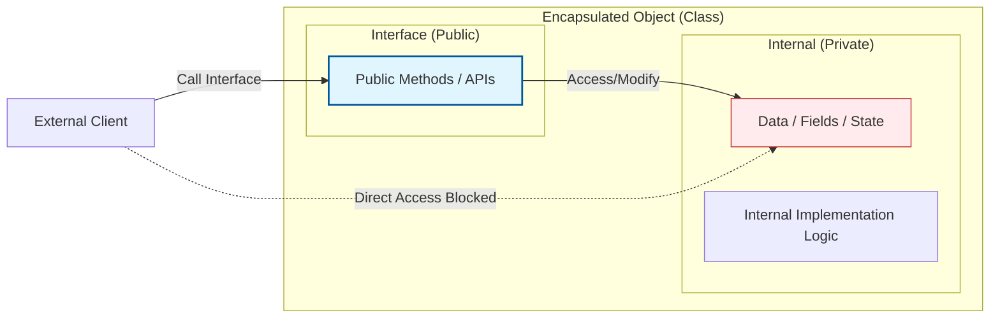

Parent: [[035.객체지향_프로그래밍_특징]]

# 1. 캡슐화(Encapsulation)의 개요 및 배경

### 가. 캡슐화의 정의
- 객체의 상태를 나타내는 **데이터(속성)**와 데이터를 처리하는 **행위(메서드)**를 하나의 논리적 단위인 클래스로 묶고, 상세 구현 내용을 외부로부터 감추는 객체지향의 핵심 원리임
- 외부에서는 객체가 제공하는 공개된 인터페이스를 통해서만 상호작용할 수 있게 하여, 데이터의 무결성을 보호하고 시스템의 복잡도를 관리하는 기법임

### 나. 등장 배경 및 필요성
- **변경의 국소화**: 특정 객체의 내부 구조가 바뀌더라도 이를 사용하는 외부 코드에는 영향을 주지 않아야 함 (유지보수성 향상)
- **데이터 무결성(Integrity) 확보**: 외부에서 객체의 데이터를 직접 수정함으로써 발생할 수 있는 비정상적인 상태 변화를 원천 차단함
- **결합도(Coupling) 저하**: 객체 간의 의존성을 인터페이스 수준으로 제한하여 시스템의 유연성을 확보함

# 2. 캡슐화의 아키텍처 및 핵심 메커니즘

### 가. 캡슐화 및 정보 은닉의 개념도

### 나. 핵심 메커니즘: 접근 제어자 (Access Modifiers)
| 제어자 | 기호 | 접근 범위 | 캡슐화 수준 |
| :--- | :---: | :--- | :--- |
| **private** | `-` | 해당 클래스 내부에서만 접근 가능 | **최상 (정보 은닉)** |
| **default** | `~` | 동일 패키지 내의 클래스들만 접근 가능 | 중간 |
| **protected** | `#` | 동일 패키지 및 상속받은 자식 클래스에서 접근 가능 | 낮음 |
| **public** | `+` | 모든 외부 클래스에서 접근 가능 | **없음 (인터페이스)** |

# 3. 상세 기술 및 효과 분석

### 가. 캡슐화와 정보 은닉(Information Hiding)의 관계
1) **캡슐화**: 데이터와 기능을 '하나로 묶는 것'에 초점 (Bundling)
2) **정보 은닉**: 캡슐화된 것 중 일부를 '외부에 감추는 것'에 초점 (Hiding)
- 즉, **캡슐화는 정보 은닉을 가능하게 하는 수단**이며, 두 개념은 상호 보완적으로 작용하여 객체의 독립성을 보장함

### 나. 캡슐화 적용의 정량적/정성적 효과
| 구분 | 주요 효과 | 상세 내용 |
| :--- | :--- | :--- |
| **구조적** | **응집도(Cohesion) 향상** | 관련된 데이터와 로직이 한곳에 모여 모듈의 목적이 명확해짐 |
| **유지보수** | **결합도(Coupling) 감소** | 인터페이스를 통한 통신으로 객체 간의 의존성이 낮아짐 |
| **품질** | **재사용성 증대** | 내부 구현에 의존하지 않으므로 부품으로서의 독립적 사용 용이 |
| **보안** | **데이터 보호** | 유효성 검사(Validation) 로직을 거쳐서만 상태 변경 허용 |

# 4. 기술사적 제언 및 실무 적용 방안

### 가. 실무 도입 시 고려사항: Getter/Setter 남용 금지
- 단순히 필드를 `private`으로 만들고 모든 필드에 대해 `public Getter/Setter`를 제공하는 것은 진정한 캡슐화가 아님
- **"Tell, Don't Ask"** 원칙에 따라, 객체의 데이터를 물어보기(Ask)보다는 객체에게 비즈니스 행위를 수행하도록 명령(Tell)하는 설계 지향

### 나. 거버넌스 및 설계 통제 방안
- **불변 객체(Immutable Object) 활용**: 상태를 변경할 수 없는 객체를 설계하여 멀티스레드 환경에서의 안정성 및 캡슐화 강화
- **인터페이스 기반 설계**: 구현체가 아닌 인터페이스에 의존하게 함으로써(DIP), 캡슐화된 내부 로직의 변경으로부터 클라이언트를 완벽히 격리

### 다. 현대적 아키텍처와의 연계
- **DDD의 애그리거트(Aggregate)**: 캡슐화의 범위를 개별 객체에서 논리적으로 연관된 **객체 그룹**으로 확장하여 데이터 정합성을 관리하는 현대적 설계의 핵심으로 진화
- **Clean Architecture**: 엔티티 계층의 캡슐화를 통해 프레임워크나 DB의 변화로부터 비즈니스 코어를 보호하는 기반 기술로 작용

> [!tip] **기술사 인사이트**
> 캡슐화의 본질은 **"알 필요 없는 것을 감추는 배려"**입니다. 이는 개발자에게는 인지 부하(Cognitive Load)를 줄여주고, 시스템에게는 **변경의 파급효과(Ripple Effect)**를 차단하는 강력한 방어막이 됩니다. 답안 작성 시 캡슐화가 **SOLID 원칙** 중 특히 **OCP**와 **DIP**를 가능케 하는 토대임을 강조하십시오.

## Related Notes
- [[035.객체지향_프로그래밍_특징]]
- [[031.객체지향_개발방법론]]
- [[011.클린_아키텍처(Clean_Architecture)]]
- [[010.도메인_주도_설계(DDD)]]
