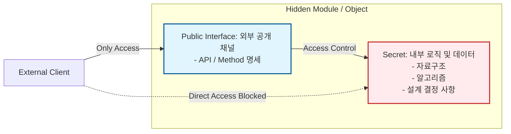

Parent: [[035.객체지향_프로그래밍_특징]]

# 1. 정보 은닉(Information Hiding)의 개요 및 배경

### 가. 정보 은닉의 정의
- 모듈이나 객체의 내부 상세 구현이나 데이터 구조를 외부에 노출하지 않고, **필요한 최소한의 인터페이스만을 공개**하여 객체 간의 의존성을 줄이는 소프트웨어 설계 원리임
- 1972년 데이비드 파나스(David Parnas)에 의해 제안되었으며, "모듈은 자신이 가진 비밀(Secret)을 외부에 알려서는 안 된다"는 원칙에 기반함

### 나. 등장 배경 및 필요성
- **변경의 파급효과(Ripple Effect) 차단**: 내부 구현이 변경되어도 인터페이스만 유지된다면 이를 사용하는 외부 코드의 수정을 방지하기 위함
- **시스템 복잡도 제어**: 다른 모듈의 상세한 내부 동작을 알 필요 없이 제공된 기능만 사용하게 함으로써 개발자의 인지 부하 감소
- **무결성 및 보안성 확보**: 외부에서 객체 내부의 민감한 데이터에 직접 접근하여 오염시키는 것을 원천적으로 차단

# 2. 정보 은닉의 아키텍처 및 핵심 메커니즘

### 가. 정보 은닉의 개념적 가드레일 구조

### 나. 핵심 구현 수단
| 수단 | 상세 내용 | 비고 |
| :--- | :--- | :--- |
| **접근 제어자** | `private`, `protected` 등을 통한 멤버 변수 및 메서드 접근 제한 | 가시성 제어 |
| **인터페이스 (Interface)** | 행위(Behavior)의 규격만을 정의하고 구현(Implementation)은 감춤 | 추상화 연계 |
| **캡슐화 (Encapsulation)** | 데이터와 행위를 하나로 묶어 내부 구현을 경계 내에 격리 | 기술적 수단 |
| **컴포넌트/모듈화** | 외부에는 헤더 파일이나 공개 API만 제공하고 바이너리는 은닉 | 물리적 격리 |

# 3. 심화 분석: 캡슐화와의 관계 및 파나스의 원칙

### 가. 캡슐화(Encapsulation) vs 정보 은닉(Information Hiding)
| 비교 항목 | 캡슐화 (Encapsulation) | 정보 은닉 (Information Hiding) |
| :--- | :--- | :--- |
| **관점** | **구현 기술적** 관점 | **설계 원리적** 관점 |
| **핵심 활동** | 데이터와 메서드를 하나로 묶음 (Bundling) | 알 필요 없는 정보를 감춤 (Hiding) |
| **목적** | 높은 응집도 및 모듈화 달성 | 결합도 저하 및 변경 유연성 확보 |
| **상호 관계** | 캡슐화는 정보 은닉을 구현하는 **방법**임 | 정보 은닉은 캡슐화를 통해 달성하는 **목표**임 |

### 나. 파나스의 모듈 분할 원칙 (Criteria for Modularity)
- 모듈화의 기준은 "데이터 흐름"이 아니라, 각 모듈이 숨기고 있는 **"설계 결정 사항(Design Decisions)"**이어야 함
- 변경 가능성이 가장 높은 설계 결정 사항을 하나의 모듈 내부에 숨기는 것이 정보 은닉의 정수임

# 4. 기술사적 제언 및 실무 적용 방안

### 가. 실무 도입 시 고려사항: 인터페이스 설계의 중요성
- 정보 은닉을 잘하기 위해서는 공개되는 인터페이스가 매우 견고해야 함
- 인터페이스가 자주 변경된다면 정보 은닉의 효과가 사라지므로, **추상화(Abstraction)**를 통해 변하지 않는 본질적인 행위만을 노출해야 함

### 나. 거버넌스 및 보안(Security) 통제 방안
- **최소 권한의 원칙 (Least Privilege)**: 기본적으로 모든 멤버는 `private`으로 설정하고, 반드시 필요한 경우에만 최소한의 가시성을 허용하는 정책 수립
- **API 거버넌스**: 외부로 노출되는 API 엔드포인트에서 내부 DB 스키마나 시스템 구조가 유추되지 않도록 **DTO(Data Transfer Object)**를 활용한 데이터 필터링 필수

### 다. 현대적 아키텍처로의 확장
- **Microservices (MSA)**: 각 서비스는 자신의 DB와 로직을 철저히 숨기고 오직 API를 통해서만 통신하는 **"거시적 정보 은닉"**의 실현체임
- **클린 아키텍처**: 내부 엔티티를 외부 프레임워크로부터 숨김으로써 기술적 종속성을 배제하고 비즈니스 로직의 순수성을 보존

> [!tip] **기술사 인사이트**
> 정보 은닉은 단순히 `private` 키워드를 쓰는 것이 아닙니다. 시스템에서 **"가장 변하기 쉬운 부분"**을 찾아내어 장벽 뒤에 가두는 전략적 판단입니다. 기술사 답안에서는 정보 은닉이 **OCP(개방 폐쇄 원칙)**를 가능케 하여 소프트웨어의 지속 가능성을 보장하는 핵심 사상임을 강조하십시오.

## Related Notes
- [[035.객체지향_프로그래밍_특징]]
- [[036.캡슐화(Encapsulation)]]
- [[037.추상화(Abstraction)]]
- [[011.클린_아키텍처(Clean_Architecture)]]
