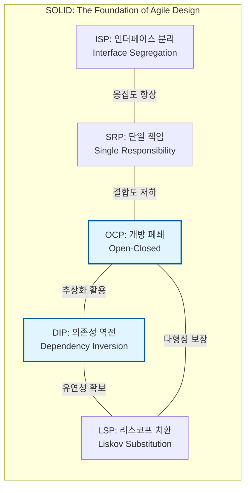

Parent: [[035.객체지향_프로그래밍_특징]]

# 1. 객체지향 설계 원칙(SOLID)의 개요 및 배경

### 가. 객체지향 설계 원칙(SOLID)의 정의
- 소프트웨어의 유지보수성과 확장성을 높이기 위해 로버트 C. 마틴(Robert C. Martin)이 정립한 5가지 핵심 설계 원칙의 머리글자를 딴 용어임
- 복잡한 객체지향 시스템을 변경에 유연하고 이해하기 쉬우며 재사용 가능한 구조로 만들기 위한 **설계 가이드라인**임

### 나. 등장 배경 및 필요성
- **변경의 파급효과 차단**: 요구사항 변경 시 기존 코드의 수정을 최소화하여 시스템의 안정성을 확보하기 위함
- **경직성 및 취약성 해소**: 강하게 결합된 모듈 간의 의존성을 분리하여 한 곳의 수정이 전체 장애로 이어지는 현상 방지
- **Clean Architecture의 토대**: 견고한 도메인 모델을 구축하고 외부 기술로부터 비즈니스 로직을 격리하기 위한 필수적 기초 역량

# 2. SOLID의 핵심 구성 요소 및 메커니즘

### 가. SOLID 원칙의 상호 관계 및 개념도

### 나. SOLID 5대 원칙 상세 설명 [두음: 단개역인리]
| 원칙 | 상세 내용 | 핵심 메커니즘 |
| :--- | :--- | :--- |
| **SRP** | 클래스는 단 하나의 변경 이유(책임)만을 가져야 함 | **응집도 향상**, 기능 분리 |
| **OCP** | 확장에 열려 있고, 수정에 닫혀 있어야 함 | **인터페이스/상속**, 다형성 |
| **LSP** | 하위 타입은 상위 타입을 언제나 대체할 수 있어야 함 | **상속의 정당성**, 규약 준수 |
| **ISP** | 자신이 사용하지 않는 메서드에 의존하지 않아야 함 | **인터페이스 세분화**, 다중 상속 |
| **DIP** | 고수준 모듈은 저수준 모듈의 구현에 의존하면 안 됨 | **추상화 의존**, 의존성 주입(DI) |

# 3. 상세 기술 및 심화 분석

### 가. OCP와 DIP의 결합: 전략 패턴(Strategy Pattern) 활용
- **상황**: 결제 시스템에서 카드, 계좌이체 등 수단이 계속 추가되는 경우
- **해결**: 결제 행위를 인터페이스(추상화)로 정의(DIP)하고, 기존 코드 수정 없이 새로운 결제 클래스를 추가(OCP)하여 다형적으로 처리함

### 나. 실무적 관점의 원칙 위반 사례 및 대응
| 원칙 | 위반 사례 (Anti-pattern) | 해결 방안 |
| :--- | :--- | :--- |
| **SRP** | 한 클래스 내에 UI, DB, 비즈니스 로직이 혼재 | 계층별로 클래스 분리 및 유스케이스 정의 |
| **LSP** | `Bird` 클래스를 상속받은 `Ostrich`가 `fly()` 호출 시 에러 발생 | 상위 타입을 `FlyingBird`와 `NonFlyingBird`로 재분할 |
| **ISP** | 거대한 `SmartPhone` 인터페이스에 `fax()` 등 불필요 기능 포함 | `Phone`, `Camera`, `Fax` 인터페이스로 쪼개어 구현 |

# 4. 기술사적 제언 및 실무 적용 방안

### 가. 실무 도입 시 고려사항: 적정 추상화의 균형
- **YAGNI 원칙**: 미래를 대비한 과도한 SOLID 적용은 코드 복잡도만 높일 수 있으므로, 실제 변경이 발생하는 시점에 리팩토링을 통해 원칙을 적용하는 실용적 접근 필요
- **개발 생산성**: 원칙 준수를 위해 파일 수가 급격히 늘어날 수 있으므로, 팀 내 합의된 아키텍처 가이드라인 수립 필수

### 나. 거버넌스 및 설계 통제 방안
- **정적 분석 도구 활용**: SonarQube, ArchUnit 등을 사용하여 순환 의존성이나 ISP 위반 사례를 자동 탐지하고 배포 파이프라인에서 차단
- **코드 리뷰 문화**: 동료 리뷰를 통해 책임 분리가 적절한지, 상속 구조가 LSP를 만족하는지 설계 관점의 피드백 강화

### 다. 현대적 아키텍처로의 확장
- **Clean Architecture 연계**: SOLID는 클린 아키텍처의 도메인 보호와 의존성 방향 제어(DIP)를 실현하는 원자적 단위 기술임
- **MSA 서비스 설계**: 서비스 간 통신에서도 ISP와 DIP의 원리를 적용하여, 서비스 인터페이스의 불필요한 결합을 방지하고 유연성을 확보

> [!tip] **기술사 인사이트**
> SOLID 원칙의 핵심은 **"변하는 것과 변하지 않는 것을 분리하는 것"**입니다. 기술사 답안에서는 단순히 5대 원칙을 나열하는 데 그치지 않고, 이 원칙들이 상호 작용하여 어떻게 **"기술적 부채"**를 줄이고 **"비즈니스 민첩성"**을 확보하는지 논리적으로 기술해야 합니다.

## Related Notes
- [[035.객체지향_프로그래밍_특징]]
- [[011.클린_아키텍처(Clean_Architecture)]]
- [[017.헥사고날_아키텍처(Hexagonal_Architecture)]]
- [[031.객체지향_개발방법론]]
