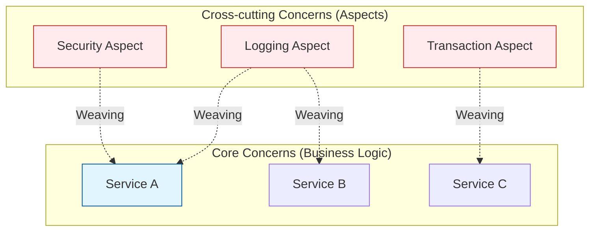

Parent: [[035.객체지향_프로그래밍_특징]]

# 1. 관점 지향 프로그래밍(AOP)의 개요 및 배경

### 가. AOP(Aspect Oriented Programming)의 정의
- 기능을 비즈니스 로직을 담당하는 **핵심 관심사(Core Concern)**와 로깅, 보안, 트랜잭션 등 여러 모듈에 공통적으로 나타나는 **횡단 관심사(Cross-cutting Concern)**로 분리하여 설계하고 개발하는 방법론임
- 각 모듈에서 반복되는 공통 코드를 별도의 관점(Aspect)으로 모듈화하여 필요한 시점에 엮어주는(**Weaving**) 프로그래밍 패러다임임

### 나. 등장 배경 및 필요성
- **OOP의 한계 극복**: 객체지향만으로는 여러 클래스에 흩어진 공통 기능(로깅 등)의 중복을 제거하기 어려우며, 코드의 가독성과 유지보수성을 저하시킴
- **관심사의 분리(SoC)**: 비즈니스 로직과 인프라 로직을 완전히 격리하여 개발자가 핵심 비즈니스 구현에만 집중할 수 있는 환경 요구
- **코드 응집도 향상**: 중복 코드를 제거하여 핵심 로직의 응집도를 높이고 모듈 간 결합도를 낮춤

# 2. AOP의 아키텍처 및 핵심 메커니즘

### 가. AOP의 관심사 분리 및 위빙(Weaving) 개념도

### 나. AOP의 핵심 용어 정의 [두음: 조포어아위]
| 용어 | 상세 설명 | 비고 |
| :--- | :--- | :--- |
| **JoinPoint** | Advice가 적용될 수 있는 실행 지점 (메서드 호출, 필드 값 변경 등) | 끼어들 위치 |
| **Pointcut** | JoinPoint 중에서 실제로 Advice를 적용할 지점을 선정한 조건식 | 필터링 |
| **Advice** | 횡단 관심사를 실제로 구현한 코드 조작 내용 (Before, After, Around) | 무엇을 할 것인가 |
| **Aspect** | Pointcut과 Advice를 하나로 묶은 모듈화된 관점 | 관점 (모듈) |
| **Weaving** | 핵심 로직 코드에 Aspect를 적용하여 연결하는 과정 (컴파일/런타임 등) | 엮기 |

# 3. 상세 기술 및 위빙(Weaving) 방식 비교

### 가. 위빙(Weaving)의 3가지 수행 시점
1) **컴파일 시점 (Compile-time)**: 소스 코드를 컴파일할 때 Aspect 코드를 삽입 (AspectJ 등, 성능 우수)
2) **클래스 로딩 시점 (Load-time)**: 클래스 파일이 JVM에 로드될 때 바이트코드를 조작하여 삽입 (Binary 조작)
3) **런타임 시점 (Run-time)**: 프록시(Proxy) 객체를 생성하여 메서드 호출 시점에 가로채어 실행 (Spring AOP 기본 방식)

### 나. OOP와 AOP의 비교 분석
| 비교 항목 | 객체지향 프로그래밍 (OOP) | 관점 지향 프로그래밍 (AOP) |
| :--- | :--- | :--- |
| **모듈화 단위** | 객체 (Object / Class) | **관점 (Aspect)** |
| **관심사 방향** | 세로 방향 (수직적, 계층적 구조) | **가로 방향 (횡단적, 공통 기능)** |
| **주요 목표** | 비즈니스 도메인의 추상화/캡슐화 | **공통 관심사의 분리 및 중복 제거** |
| **상호 관계** | 독립적 패러다임 | **OOP를 보완**하는 보조적 패러다임 |

# 4. 기술사적 제언 및 실무 적용 방안

### 가. 실무 도입 시 고려사항
- **디버깅의 복잡성**: 코드가 런타임에 동적으로 엮이므로, 장애 발생 시 스택 트레이스(Stack Trace) 분석이 어려울 수 있음에 유의
- **프록시 패턴의 한계**: Spring AOP는 프록시 기반이므로 클래스 내부에서 자기 자신의 메서드를 호출할 때는 AOP가 적용되지 않는 **Self-invocation** 문제 고려 필요

### 나. 거버넌스 및 보안(Security) 통제 방안
- **중앙 집중식 보안 통제**: 모든 서비스의 진입점에 대해 권한 검사 Aspect를 적용하여 보안 누락(Missing Authorization) 방지
- **Audit Logging 자동화**: 중요 데이터 변경 메서드를 Pointcut으로 설정하여 사용자 행위 로그를 누락 없이 강제 수집

### 다. 현대적 발전 방향 및 제언
- **클라우드 네이티브와 연계**: 서비스 메시(Istio 등) 환경에서는 AOP의 역할을 인프라 레벨의 **Sidecar Proxy**가 대신 수행하여 언어 독립성을 확보하는 추세임
- **Clean Architecture 구현**: 비즈니스 코드에 로깅/트랜잭션 어노테이션이 섞이지 않도록 격리함으로써 순수한 도메인 모델 유지 가능

> [!tip] **기술사 인사이트**
> AOP의 핵심은 **"핵심 비즈니스 로직의 순수성 보존"**입니다. 기술사 답안에서는 AOP를 단순한 기능 분리가 아니라, 소프트웨어 아키텍처의 **가독성(Readability)**과 **검증 가능성(Testability)**을 높여 기술적 부채를 해결하는 전략적 수단으로 표현해야 합니다.

## Related Notes
- [[035.객체지향_프로그래밍_특징]]
- [[031.객체지향_개발방법론]]
- [[011.클린_아키텍처(Clean_Architecture)]]
- [[019.서비스_메시(Service_Mesh)]]
