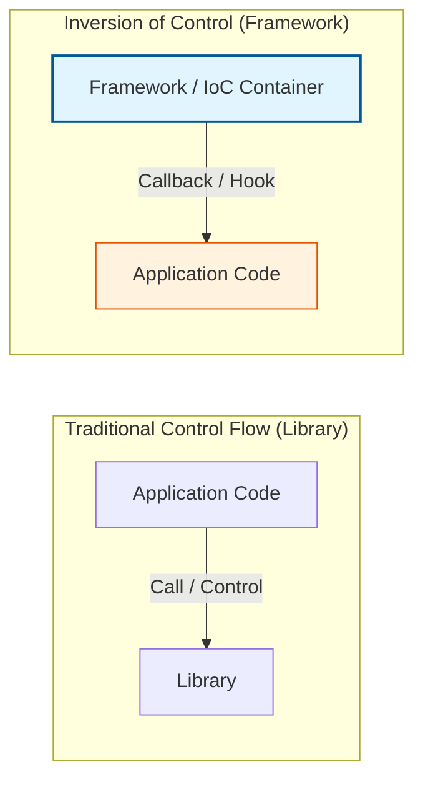

Parent: [[031.객체지향_개발방법론]]

# 1. 제어의 역전(Inversion of Control, IoC)의 개요 및 배경

### 가. IoC(Inversion of Control)의 정의
- 애플리케이션의 흐름을 개발자가 직접 제어(객체 생성, 생명주기 관리 등)하는 것이 아니라, **프레임워크나 컨테이너가 주도권을 가지고 제어**하는 객체지향 설계 원칙임
- "Don't call us, we'll call you"라는 **할리우드 원칙(Hollywood Principle)**에 기반하며, 모듈 간의 결합도를 낮추고 확장성을 높이는 핵심 기술임

### 나. 등장 배경 및 필요성
- **강결합(Tight Coupling) 문제**: 객체가 자신이 사용할 의존 객체를 직접 생성할 경우, 의존 객체의 변경이 호출자에게 직접적인 영향을 주어 유지보수가 어려움
- **중복 코드의 방지**: 객체의 생성, 설정, 소멸 등 반복적인 관리 로직을 프레임워크에 위임하여 비즈니스 로직의 순수성 유지
- **테스트 용이성 확보**: 제어권이 분리되어 있어 단위 테스트 시 가짜 객체(Mock)를 주입하기 쉬운 환경 제공

# 2. IoC의 아키텍처 및 핵심 메커니즘

### 가. 제어의 흐름 역전 개념도

### 나. IoC의 핵심 구현 수단
| 구분 | 명칭 | 상세 내용 및 역할 |
| :--- | :--- | :--- |
| **DI** | **Dependency Injection** | 의존성 주입, 사용할 객체를 외부(Container)에서 생성하여 주입해주는 방식 |
| **DL** | **Dependency Lookup** | 의존성 검색, 컨테이너가 제공하는 API를 통해 필요한 객체를 검색하여 사용하는 방식 |
| **Template** | **Template Method** | 상위 클래스에서 흐름을 정의하고 하위 클래스에서 세부 로직을 구현하도록 유도 |
| **Event** | **Event Handling** | 특정 이벤트 발생 시 리스너(Listener)를 호출하는 방식 (Observer 패턴) |

# 3. 상세 기술 및 DI(Dependency Injection)의 심화 분석

### 가. 의존성 주입(DI)의 3가지 유형
1) **생성자 주입 (Constructor Injection)**: 객체 생성 시점에 의존성 주입, 불변성 확보 및 필수 의존성 누락 방지 (권장 방식)
2) **수정자 주입 (Setter Injection)**: Setter 메서드를 통해 주입, 선택적 의존성이나 런타임 변경 시 유용
3) **인터페이스 주입 (Interface Injection)**: 주입받을 메서드를 포함한 인터페이스를 통해 주입 (복잡하여 최근 지양됨)

### 나. 라이브러리(Library) vs 프레임워크(Framework) 비교
| 비교 항목 | 라이브러리 (Library) | 프레임워크 (Framework) |
| :--- | :--- | :--- |
| **제어의 주체** | **애플리케이션(개발자)** | **프레임워크(컨테이너)** |
| **동작 방식** | 개발자가 필요할 때 호출 | 프레임워크가 정의한 흐름에 개발자가 참여 |
| **IoC 적용 여부** | 미적용 | **필수 적용** |
| **비유** | 도구 상자 (필요한 것만 꺼내 씀) | 자동차 프레임 (틀 내에서 부품 조립) |

# 4. 기술사적 제언 및 실무 적용 방안

### 가. 실무 도입 시 고려사항: Spring IoC 컨테이너 활용
- **Bean Lifecycle 관리**: 객체의 생성부터 소멸까지 컨테이너가 관리하므로, `@PostConstruct`, `@PreDestroy` 등을 활용한 초기화/정리 로직의 적절한 배치 필요
- **싱글톤(Singleton) 전략**: 기본적으로 객체를 싱글톤으로 관리하여 메모리 효율을 높이되, 상태를 가지는 객체(Stateful)의 공유 문제 주의

### 나. 거버넌스 및 설계 통제 방안
- **DIP(의존성 역전 원칙)와의 연계**: 주입 시 구체 클래스가 아닌 인터페이스에 의존하도록 강제하여 기술적 종속성(DB, 외부 API) 제거
- **Configuration 거버넌스**: XML 방식보다는 자바 기반 설정(`@Configuration`)을 선언하여 컴파일 시점의 오류 체크 및 가독성 확보

### 다. 최신 트렌드와의 연계
- **Microservices 통신**: 서비스 간 호출 시에도 직접적인 IP/Port 호출이 아닌 **Service Mesh**나 **Service Discovery**를 통한 간접 호출로 제어권 이동
- **Serverless (FaaS)**: 클라우드 제공자가 함수 실행 시점을 제어하는 극단적인 IoC 모델로 진화 중

> [!tip] **기술사 인사이트**
> IoC는 **"주도권의 양보"**입니다. 개발자가 모든 것을 통제하려는 욕심을 버리고 프레임워크의 규약에 따를 때, 비로소 **결합도는 낮아지고 변화에 대한 복원력은 높아지는** 견고한 시스템이 완성됩니다. 답안에서 IoC가 **Clean Architecture**의 핵심인 '관심사의 분리'를 실현하는 물리적 엔진임을 강조하십시오.

## Related Notes
- [[031.객체지향_개발방법론]]
- [[041.객체지향_설계_원칙(SOLID)]]
- [[011.클린_아키텍처(Clean_Architecture)]]
- [[043.AOP(Aspect_Oriented_Programming)]]
