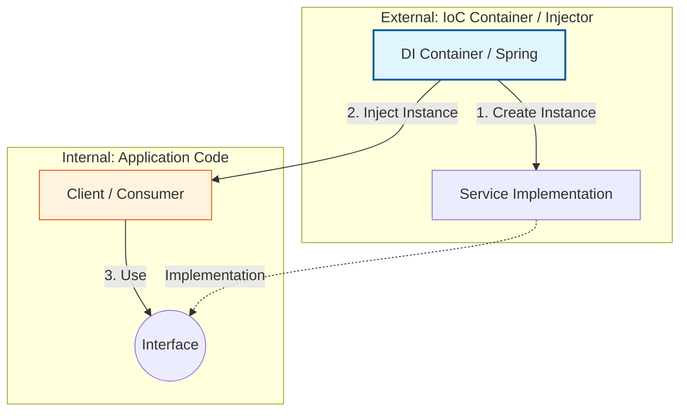

Parent: [[044.IoC(Inversion_of_Control)]]

# 1. 의존성 주입(Dependency Injection)의 개요 및 배경

### 가. 의존성 주입(Dependency Injection, DI)의 정의
- 객체가 스스로 의존하는 자원을 직접 생성하지 않고, 외부의 **제어자(Container/Injector)**가 해당 자원을 객체에 주입해주는 객체지향 설계 패턴임
- 객체 간의 결합도를 낮추고 제어의 역전(IoC)을 실현하는 구체적인 기술적 수단임

### 나. 등장 배경 및 필요성
- **강한 결합(Tight Coupling) 제거**: 객체 내부에서 구체 클래스를 직접 생성(`new`)하면, 해당 클래스가 바뀔 때마다 호출자 코드를 수정해야 하는 경직성 발생
- **유지보수성 향상**: 인터페이스 기반의 상호작용을 통해 코드 변경의 파급효과(Ripple Effect)를 최소화
- **단위 테스트(Unit Test) 지원**: 실제 객체 대신 가짜 객체(Mock Object)를 주입하기 용이하여 독립적인 비즈니스 로직 검증 가능

# 2. DI의 아키텍처 및 핵심 메커니즘

### 가. 의존성 주입의 개념적 구성도

### 나. 의존성 주입의 3가지 유형
| 유형 | 주입 시점 및 방식 | 특징 및 장단점 |
| :--- | :--- | :--- |
| **생성자 주입** | 객체 생성 시 생성자를 통해 주입 | **불변성(Immutability)** 확보, 필수 의존성 누락 방지 (가장 권장됨) |
| **수정자(Setter) 주입** | Setter 메서드를 호출하여 주입 | 선택적 의존성 주입에 유리, 런타임에 의존성 변경 가능 |
| **필드(Field) 주입** | 변수에 `@Autowired` 등으로 직접 주입 | 코드가 간결하나 외부에서 변경 불가, 단위 테스트 시 컨테이너 의존성 높음 |

# 3. 상세 기술 및 DIP(의존성 역전 원칙)와의 관계 분석

### 가. DIP(Dependency Inversion Principle) vs DI(Dependency Injection)
1) **DIP (설계 원칙)**: 고수준 모듈이 저수준 모듈의 구현에 의존하지 말고, 둘 다 **추상화(Interface)**에 의존해야 한다는 상위 수준의 전략임
2) **DI (구현 패턴)**: DIP라는 원칙을 실제 코드로 구현하기 위해 의존 객체를 외부에서 찔러넣어주는 **구체적인 전술**임
- 즉, **DI는 DIP를 실현하는 핵심 도구**로 작용하여 시스템의 유연성을 완성함

### 나. DI 프레임워크의 역할 (Container)
- **Bean 관리**: 객체의 생성부터 소멸까지 전체 생명주기(Lifecycle)를 관리
- **Wiring**: 객체 간의 관계를 설정 파일(XML, Java Config)이나 어노테이션 기반으로 자동으로 연결
- **AOP 연계**: 주입된 객체에 프록시를 적용하여 트랜잭션, 로깅 등 횡단 관심사(Cross-cutting Concern) 처리 지원

# 4. 기술사적 제언 및 실무 적용 방안

### 가. 실무 도입 시 고려사항: 생성자 주입의 우선순위
- **Null Safety**: 필드 주입이나 Setter 주입은 의존 객체 없이도 객체가 생성될 수 있어 런타임에 `NullPointerException` 위험이 있음
- **Final 필드 활용**: 생성자 주입을 통해 필드를 `final`로 선언함으로써 객체의 안정성을 극대화하고 순환 참조(Circular Dependency)를 컴파일 시점에 조기 발견

### 나. 거버넌스 및 설계 통제 방안
- **Interface Segregation**: 주입 시 필요한 최소한의 행위만을 정의한 인터페이스를 사용하도록 강제하여 불필요한 의존성 노출 방지
- **모듈별 설정 분리**: 대규모 시스템에서는 전체 설정을 하나로 관리하지 말고, 도메인/모듈별로 설정 파일(`@Configuration`)을 분리하여 관리적 확장성 확보

### 다. 현대적 아키텍처와의 확장
- **클린 아키텍처 (Clean Architecture)**: 인프라(DB, 외부 API) 계층이 핵심 도메인 계층으로 의존성 주입되는 구조를 통해 도메인의 순수성 보존
- **플랫폼 엔지니어링**: 클라우드 인프라 자원(DB 주소, API Key)을 코드에 박지 않고 환경 변수나 Secret 매니저를 통해 런타임에 주입받는 거시적 DI 체계 구축

> [!tip] **기술사 인사이트**
> DI의 본질은 **"코드의 결합을 런타임으로 미루는 것"**입니다. 이는 컴파일 시점의 의존성을 끊어내어 시스템을 레고 블록처럼 **조립 가능한(Composable) 구조**로 변모시킵니다. 기술사 답안에서는 DI가 단순한 자동 연결 기능을 넘어, **테스트 가용성**과 **변경 유연성**을 확보하는 아키텍처의 근간임을 강조하십시오.

## Related Notes
- [[044.IoC(Inversion_of_Control)]]
- [[041.객체지향_설계_원칙(SOLID)]]
- [[035.객체지향_프로그래밍_특징]]
- [[011.클린_아키텍처(Clean_Architecture)]]
