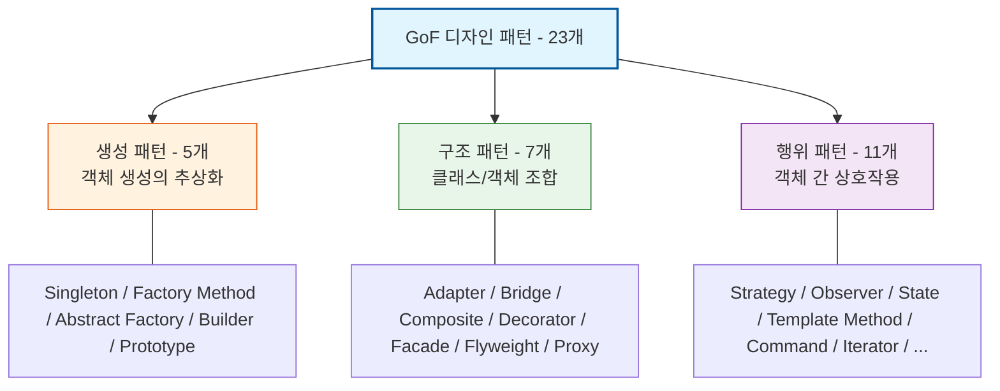

Parent: [[035.객체지향_프로그래밍_특징]]

# 1. 디자인 패턴(Design Pattern)의 개요 및 배경

### 가. 디자인 패턴의 정의
- 소프트웨어 설계 과정에서 공통적으로 발생하는 문제들에 대해 반복적으로 적용할 수 있는 **검증된 해결책(Best Practice)**을 정형화한 패턴임
- 1994년 GoF(Gang of Four)에 의해 23개의 패턴으로 집대성되었으며, 객체지향 설계의 유연성과 재사용성을 극대화하기 위한 **공통의 설계 언어**임

### 나. 등장 배경 및 필요성
- **소프트웨어 위기 극복**: 복잡한 설계 문제를 효율적으로 해결하고 개발자 간의 의사소통 비용을 획기적으로 단축 필요
- **설계 품질 상향 평준화**: 초급 개발자도 숙련된 아키텍트의 설계 노하우를 활용하여 견고한 시스템 구축 가능
- **변화에 대한 유연성**: 요구사항 변경 시 코드 수정을 최소화할 수 있는 구조적 뼈대 제공 (**SOLID 원칙**의 실체화)

# 2. 디자인 패턴의 분류 및 핵심 메커니즘

GoF 디자인 패턴은 목적에 따라 **생성**, **구조**, **행위**의 3가지 카테고리로 분류됩니다.

### 가. GoF 디자인 패턴 분류 체계도

### 나. 카테고리별 23개 패턴 요약
| 분류 | 패턴 명칭 (핵심 키워드) | 주요 역할 |
| :--- | :--- | :--- |
| **생성 (5)** | Singleton, Factory Method, Abstract Factory, Builder, Prototype | 객체의 생성 과정을 캡슐화하여 시스템과 독립적으로 유지 |
| **구조 (7)** | Adapter, Bridge, Composite, Decorator, Facade, Flyweight, Proxy | 클래스나 객체를 조합하여 더 큰 구조를 형성하고 결합도 저하 |
| **행위 (11)** | Strategy, Observer, State, Template Method, Command, Iterator, Mediator, Memento, Visitor, Chain of Responsibility, Interpreter | 객체 간의 책임 할당 및 통신 알고리즘을 정의하여 유연성 확보 |

# 3. 상세 기술 및 핵심 패턴 심층 분석

### 가. 주요 빈출 패턴의 기술적 특성
1) **Singleton**: 전역적으로 단 하나의 인스턴스만 생성 보장 (리소스 공유, 자원 낭비 방지)
2) **Strategy**: 행위(알고리즘)를 캡슐화하여 런타임에 동적으로 교체 가능 (**OCP**의 대표 사례)
3) **Observer**: 한 객체의 상태 변화를 구독 중인 다른 객체들에게 통보 (이벤트 기반 통신)
4) **Proxy**: 실제 객체에 대한 접근을 제어하거나 부가 기능(로깅, 권한)을 추가 (AOP의 기반 기술)

### 나. 패턴 활용 시 고려해야 할 설계 원칙 (SOLID 연계)
- **추상화 의존**: 구체적인 구현체보다 인터페이스나 추상 클래스에 의존하도록 설계하여 다형성 활용
- **상속보다는 합성(Composition)**: 기능을 확장할 때 상속을 통한 수직적 확장보다 객체 합성을 통한 수평적 확장 지향 (**Bridge, Decorator** 패턴 등)

# 4. 기술사적 제언 및 실무 적용 방안

### 가. 실무 도입 시 고려사항: 오버엔지니어링 주의
- **적정 설계(Good-Enough Design)**: 패턴을 위한 패턴 설계는 코드 가독성을 떨어뜨리고 불필요한 복잡성을 초래함. 실제 변경의 필요성이 감지될 때 리팩토링을 통해 도입하는 것이 바람직함
- **안티패턴 경계**: 특정 패턴(예: Singleton)의 무분별한 사용은 전역 상태를 만들어 테스트를 어렵게 하고 결합도를 높이는 부작용 발생 가능

### 나. 거버넌스 및 팀 의사소통
- **유비쿼터스 언어**: 팀 내에서 "여기엔 Strategy 패턴을 적용하자"라는 한 문장으로 수십 페이지의 설계 의도를 전달할 수 있도록 패턴 명칭을 표준 용어로 사용
- **코드 리뷰 가이드**: 설계 의도가 패턴의 목적과 일치하는지, 패턴 위반으로 인한 취약점은 없는지 상시 점검

### 다. 현대적 아키텍처로의 확장
- **클라우드 디자인 패턴**: GoF를 넘어 MSA 환경에서의 **Circuit Breaker**, **Saga**, **CQRS** 등 분산 시스템 패턴으로 사고의 확장 필요
- **함수형 프로그래밍**: 현대 언어(Java 17+, Kotlin)에서는 람다와 고차 함수를 통해 기존의 복잡한 행위 패턴(Strategy, Command 등)을 더 간결하게 대체 중

> [!tip] **기술사 인사이트**
> 디자인 패턴은 **"바퀴를 다시 발명하지 마라(Don't reinvent the wheel)"**는 격언의 산물입니다. 기술사 답안에서는 특정 패턴의 정의를 넘어, 해당 패턴이 어떤 **SOLID 원칙**을 구현하고 있으며, 비즈니스 **변경 리스크**를 어떻게 기술적으로 격리(Isolation)하는지 논리적으로 설명하는 것이 중요합니다.

## Related Notes
- [[035.객체지향_프로그래밍_특징]]
- [[041.객체지향_설계_원칙(SOLID)]]
- [[012.서킷_브레이커(Circuit_Breaker)]]
- [[015.사가_패턴(Saga_Pattern)]]
- [[023.CQRS_패턴(CQRS_Pattern)]]
