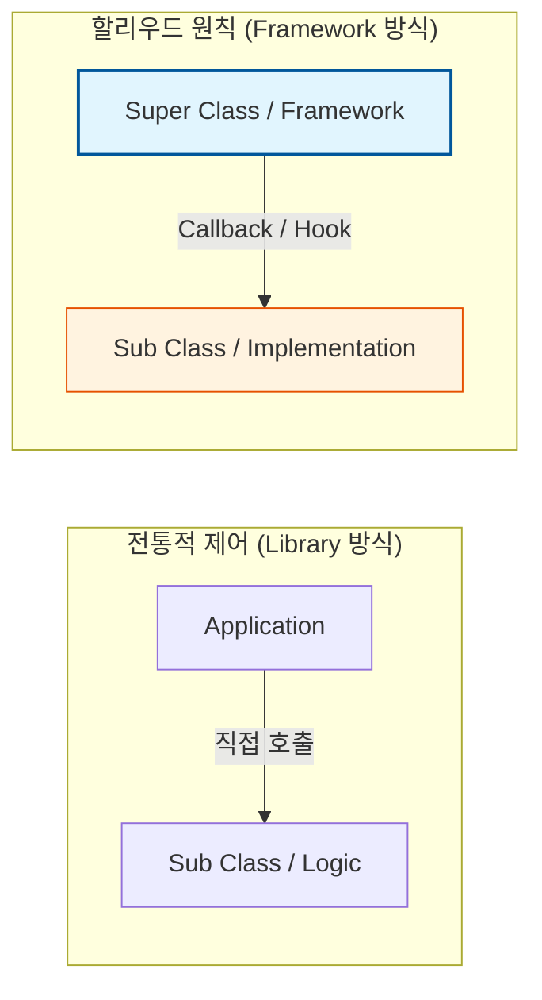

Parent: [[044.IoC(Inversion_of_Control)]]

# 1. 할리우드 원칙(Hollywood Principle)의 개요 및 배경

### 가. 할리우드 원칙의 정의
- "Don't call us, we'll call you(나를 부르지 마라, 내가 너를 부를 것이다)"라는 문장으로 요약되는 설계 원칙으로, **상위 구성 요소가 하위 구성 요소의 호출 시점을 결정**하는 제어의 역전(IoC) 원리임
- 고수준 모듈이 저수준 모듈에 의존하는 것을 방지하고, 전체적인 실행 흐름은 상위 계층에서 관리하며 하위 계층은 필요한 기능만 구현하여 제공하는 방식임

### 나. 등장 배경 및 필요성
- **의존성 부패(Dependency Rot) 방지**: 고수준 구성 요소가 저수준 구성 요소에 의존하고, 다시 그 저수준이 고수준에 의존하는 복잡한 순환 의존성 해결 필요
- **프레임워크 주도 개발**: 애플리케이션의 공통 흐름을 프레임워크가 담당하고, 개발자는 비즈니스 특화 로직만 끼워 넣는 구조적 설계 지향
- **결합도 저하 및 확장성**: 구성 요소 간의 직접적인 호출을 배제하여 시스템의 유연성 확보

# 2. 할리우드 원칙의 메커니즘 및 아키텍처

### 가. 제어 흐름의 비교 개념도

### 나. 할리우드 원칙이 적용된 주요 디자인 패턴
| 패턴 명칭 | 원칙 적용 방식 |
| :--- | :--- |
| **Template Method** | 상위 클래스에서 알고리즘의 골격을 정의하고, 하위 클래스는 호출될 세부 단계만 구현 |
| **Factory Method** | 객체 생성의 주도권을 하위 클래스에 위임하여, 필요 시점에 하위 클래스가 호출됨 |
| **Strategy** | 상위 문맥(Context)이 인터페이스를 통해 전략 객체를 호출하여 행위 수행 |
| **Observer** | 주제(Subject) 객체의 상태 변화 시 등록된 관찰자(Observer)들을 자동으로 호출 |

# 3. 상세 기술 및 유사 개념 비교 분석

### 가. 할리우드 원칙과 의존성 역전 원칙(DIP)의 관계
- **Hollywood Principle**: 저수준 구성 요소가 고수준 요소에 '언제' 호출될지 알 수 없게 하여 **제어의 흐름(Control Flow)**을 역전시키는 데 집중함
- **DIP**: 구체 클래스가 아닌 **추상화(Interface)**에 의존하게 하여 소스 코드 의존성 방향을 역전시키는 데 집중함
- 두 원칙은 서로 결합하여 시스템의 유연성과 독립성을 완성함

### 나. 프레임워크와 라이브러리의 본질적 차이
| 비교 항목 | 라이브러리 (Library) | 프레임워크 (Framework) |
| :--- | :--- | :--- |
| **제어의 주체** | 애플리케이션 (사용자) | **프레임워크 (시스템)** |
| **호출 관계** | 사용자가 필요한 기능 호출 | 시스템이 사용자의 코드를 호출 |
| **할리우드 원칙** | 미적용 (Active 사용) | **적용 (Passive 응답)** |

# 4. 기술사적 제언 및 실무 적용 방안

### 가. 실무 도입 시 고려사항
- **Callback 지옥 주의**: 지나치게 복잡한 제어 역전은 코드의 흐름을 추적하기 어렵게 만드므로, 명확한 인터페이스 명세와 문서화 병행 필수
- **Hook 메서드 활용**: 하위 클래스에서 선택적으로 오버라이딩할 수 있는 Hook 메서드를 적절히 배치하여 프레임워크의 확장성 확보

### 나. 거버넌스 및 통제 방안
- **상속의 제한**: 할리우드 원칙을 위해 무분별한 상속을 허용하기보다, 인터페이스를 통한 **합성(Composition)** 기반의 콜백 구조 권장
- **보안 검증**: 외부에서 주입되는(Injected) 하위 모듈이 시스템의 전체 흐름을 해치지 않도록 입력값 검증 및 샌드박스 정책 수립

> [!tip] **기술사 인사이트**
> 할리우드 원칙의 정수는 **"양보를 통한 조화"**입니다. 개발자가 흐름의 주도권을 프레임워크에 양보함으로써 얻어지는 **구조적 일관성**과 **재사용성**은 대규모 시스템의 복잡성을 관리하는 가장 강력한 무기가 됩니다.

## Related Notes
- [[044.IoC(Inversion_of_Control)]]
- [[045.의존성_주입(Dependency_Injection)]]
- [[041.객체지향_설계_원칙(SOLID)]]
- [[046.디자인_패턴(Design_Pattern)]]
