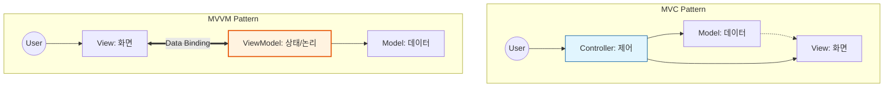

Parent: [[011.클린_아키텍처(Clean_Architecture)]]

# 1. MVC 및 MVVM 패턴의 개요 및 배경

### 가. 아키텍처 패턴의 정의
- **MVC (Model-View-Controller)**: 애플리케이션을 데이터(Model), 사용자 인터페이스(View), 흐름 제어(Controller)로 분리하여 상호 영향 없이 개발 및 유지보수가 가능하게 하는 패턴임
- **MVVM (Model-View-ViewModel)**: View와 Model 사이에 ViewModel을 두어 **데이터 바인딩(Data Binding)**을 통해 뷰의 논리적 상태를 자동으로 동기화하는 UI 아키텍처 패턴임

### 나. 등장 배경 및 필요성
- **UI 로직의 복잡성 해결**: 화면 표시 로직과 비즈니스 로직이 뒤섞이는 '스파게티 코드' 방지 필요
- **테스트 용이성 확보**: UI 없이도 비즈니스 로직(Model)을 독립적으로 검증할 수 있는 환경 요구
- **유연한 변경 대응**: 디자인(View) 변경이 서버 로직(Model)에 영향을 주지 않도록 격리하여 개발 생산성 향상

# 2. 패턴별 아키텍처 및 메커니즘

### 가. MVC vs MVVM 구조 비교 개념도

### 나. 핵심 구성 요소 및 역할
| 패턴 | 요소 | 상세 역할 |
| :--- | :--- | :--- |
| **MVC** | **Model** | 비즈니스 데이터 및 상태 관리, 핵심 로직 수행 |
| | **View** | 사용자에게 보여지는 화면(UI), 데이터의 가시화 |
| | **Controller** | 사용자 입력을 받아 Model을 갱신하고 View를 선택함 |
| **MVVM** | **ViewModel** | View를 표현하기 위한 데이터 모델, View와의 양방향 바인딩 수행 |
| | **Data Binding** | View와 ViewModel 사이의 데이터를 자동으로 동기화하는 기술 |

# 3. 상세 기술 및 비교 분석

### 가. MVVM의 핵심 기술: 데이터 바인딩 (Data Binding)
- **개념**: View의 UI 요소와 ViewModel의 속성을 연결하여, 어느 한쪽이 변경되면 다른 쪽도 즉시 반영되는 메커니즘임
- **효과**: 기존 MVC에서 Controller가 일일이 View를 업데이트하던 코드가 사라져 생산성이 획기적으로 향상됨

### 나. MVC vs MVVM 비교 분석
| 비교 항목 | MVC (Model-View-Controller) | MVVM (Model-View-ViewModel) |
| :--- | :--- | :--- |
| **의존성** | View가 Model과 연결되어 있음 | **View와 Model이 완전히 분리됨** |
| **제어 로직** | Controller가 명시적으로 제어함 | **Data Binding에 의해 자동 제어됨** |
| **유지보수** | 프로젝트 규모 커질수록 Controller 비대화 | ViewModel이 View의 논리를 담당하여 분담 |
| **적합 분야** | 웹 백엔드(Spring MVC 등), 일반 앱 | **프론트엔드 프레임워크(Vue, React, WPF)** |

# 4. 기술사적 제언 및 실무 적용 방안

### 가. 실무 도입 시 고려사항
- **Massive Controller 경계**: MVC에서 Controller가 너무 많은 역할을 하지 않도록 **Service 계층**을 두어 비즈니스 로직을 위임해야 함
- **ViewModel 비대화 주의**: MVVM에서도 ViewModel이 복잡해질 수 있으므로, 재사용 가능한 **Component** 단위로 쪼개어 관리 필수

### 나. 거버넌스 및 설계 통제 방안
- **Observer 패턴 연계**: MVVM의 데이터 바인딩은 내부적으로 **Observer 패턴**을 기반으로 하므로, 성능 저하를 막기 위해 불필요한 바인딩 구독 해제 관리 철저
- **보안 통제**: View에서 직접 Model에 접근하지 못하도록 통제하고, 모든 데이터 가공은 ViewModel이나 Controller를 거치도록 설계

### 다. 최신 트렌드와의 연계
- **MVP(Model-View-Presenter)**: View와 Model을 완벽히 분리하고 인터페이스를 통해 소통하는 안드로이드 초기 표준 패턴과의 비교 이해 필요
- **MVI (Model-View-Intent)**: 불변 상태(Immutable State)와 단방향 데이터 흐름(Unidirectional Data Flow)을 강조하는 차세대 UI 패턴으로 진화 중

> [!tip] **기술사 인사이트**
> UI 아키텍처 패턴의 진화는 **"어떻게 하면 의존성을 끊고 자동화할 것인가"**의 역사입니다. 기술사 답안에서는 MVVM이 단순한 기술이 아니라, 디자인(View)과 개발(ViewModel)의 **협업 모델**을 공학적으로 완성시킨 결과물임을 강조하십시오.

## Related Notes
- [[011.클린_아키텍처(Clean_Architecture)]]
- [[046.디자인_패턴(Design_Pattern)]]
- [[050.GoF_행위_패턴(Behavioral_Patterns)]]
- [[031.객체지향_개발방법론]]
