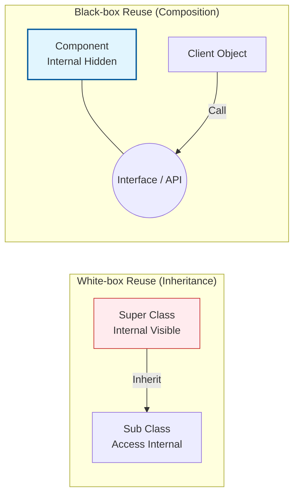

Parent: [[032.CBD_방법론]]

# 1. 소프트웨어 재사용(Software Reuse)의 개요 및 배경

### 가. 소프트웨어 재사용의 정의
- 이미 개발되어 검증된 소프트웨어 자산(소스 코드, 설계 문서, 컴포넌트 등)을 새로운 시스템 개발 시 다시 사용하여 생산성과 품질을 높이는 공학적 활동임
- 재사용 방식에 따라 내부 구현 노출 여부에 기반한 **화이트박스(White-box)**와 **블랙박스(Black-box)** 재사용으로 분류됨

### 나. 등장 배경 및 필요성
- **소프트웨어 위기 극복**: 폭증하는 소프트웨어 수요를 충족하기 위해 무에서 유를 창조하는 방식의 한계 극복 필요
- **품질 및 신뢰성 확보**: 이미 검증된 로직을 반복 사용함으로써 잠재적 결함을 줄이고 안정성 조기 확보
- **Time-to-Market 단축**: 개발 주기를 획기적으로 줄여 시장 변화에 기민하게 대응하기 위한 핵심 전략임

# 2. 블랙박스 vs 화이트박스 재사용의 핵심 메커니즘

### 가. 재사용 방식별 개념적 비교도

### 나. 방식별 상세 정의 및 특징
| 구분 | 화이트박스 재사용 (White-box) | 블랙박스 재사용 (Black-box) |
| :--- | :--- | :--- |
| **핵심 기법** | **상속 (Inheritance)**, 소스 코드 복사 | **합성 (Composition)**, 컴포넌트 조립 |
| **가시성** | 내부 로직과 자료구조가 노출됨 | 내부 구현은 은닉되고 **인터페이스**만 노출 |
| **제어 방식** | 하위 클래스에서 상위 클래스 로직 수정/확장 | 제공된 기능을 그대로 사용하거나 주입받음 |
| **장점** | 세밀한 커스터마이징 가능, 유연성 높음 | 독립성 높음, 낮은 결합도, 유지보수 용이 |
| **단점** | **캡슐화 파괴**, 강결합 발생 | 인터페이스 제약으로 커스터마이징 한계 |

# 3. 상세 기술 및 설계 원칙(SOLID)과의 관계 분석

### 가. 화이트박스 재사용의 한계와 "취약한 기반 클래스" 문제
- 상위 클래스의 작은 변경이 이를 상속받은 모든 하위 클래스에 예기치 못한 영향을 주는 **Fragile Base Class** 현상 발생
- 이는 **LSP (리스코프 치환 원칙)** 위반으로 이어져 시스템의 안정성을 해칠 수 있음

### 나. 현대적 설계의 지향점: Composition over Inheritance
- **객체 합성(Composition)**을 통한 블랙박스 재사용은 **OCP (개방 폐쇄 원칙)**와 **DIP (의존성 역전 원칙)**를 준수하기에 더 적합함
- 런타임에 의존 객체를 동적으로 교체할 수 있어 시스템의 확장성과 테스트 용이성(Testability)이 극대화됨

# 4. 기술사적 제언 및 실무 적용 방안

### 가. 실무 도입 시 고려사항
- **도메인 성숙도**: 비즈니스 로직이 정형화된 영역(예: 결제, 인증)은 블랙박스 재사용을 지향하고, 변화가 잦은 영역은 제한적으로 화이트박스 방식 적용
- **인터페이스 설계 역량**: 블랙박스 재사용의 성공은 견고한 인터페이스 정의에 달려 있으므로, 추상화 수준에 대한 아키텍트의 의사결정 중요

### 나. 거버넌스 및 자산 관리 통제 방안
- **자산 저장소(Repository) 운영**: 재사용 가능한 컴포넌트를 등록하고 인증하는 프로세스를 수립하여 "임기응변식(Ad-hoc)" 재사용 방지
- **보안 검증**: 외부 라이브러리(OSS) 도입 시 블랙박스 내부의 취약점을 탐지하기 위한 **SCA (Software Composition Analysis)** 도구 활용 필수

### 다. 최신 트렌드와의 연계
- **MSA와 API 재사용**: 마이크로서비스 간의 통신은 궁극적인 블랙박스 재사용의 형태이며, **API Gateway**를 통한 서비스 조합(Composition)으로 발전
- **Container 및 Serverless**: 실행 단위 자체를 블랙박스화하여 인프라에 구애받지 않고 재사용하는 클라우드 네이티브 환경 가속화

> [!tip] **기술사 인사이트**
> 재사용의 패러다임은 **"코드를 읽는 재사용(White-box)"**에서 **"규격을 활용하는 재사용(Black-box)"**으로 진화해 왔습니다. 기술사 답안에서는 블랙박스 재사용이 **정보 은닉**과 **캡슐화**를 보존하여 소프트웨어의 **복잡성**을 제어하는 가장 강력한 수단임을 강조하십시오.

## Related Notes
- [[032.CBD_방법론]]
- [[033.제품_계열_공학(SPL)]]
- [[040.상속성(Inheritance)]]
- [[041.객체지향_설계_원칙(SOLID)]]
- [[009.Microservices_Architecture]]
