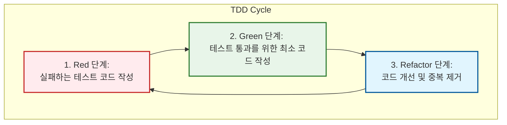

Parent: [[034.애자일_방법론(Agile)]]

# 1. 테스트 주도 개발(TDD)의 개요 및 배경

### 가. TDD(Test Driven Development)의 정의
- 실제 코드를 작성하기 전에 **테스트 케이스를 먼저 설계**하고, 그 테스트를 통과할 수 있는 최소한의 실제 코드를 나중에 개발하여 점진적으로 완성해가는 **애자일 개발 방법론**임
- **Simple Code**의 추구와 코드의 결합도를 낮추어 유지보수성을 극대화하는 것을 목적으로 하는 소프트웨어 설계 기법임

### 나. 등장 배경 및 필요성
- **전통적 개발의 한계**: 개발 후반부에 테스트가 집중되어 결함 발견 시 수정 비용이 기하급수적으로 증가하는 문제 해결 필요
- **리팩토링의 두려움 제거**: 이미 작성된 테스트 코드가 안전망 역할을 수행하여 개발자가 언제든 코드를 개선할 수 있는 환경 제공
- **요구사항의 명확화**: 테스트 케이스 작성 과정에서 개발자가 비즈니스 요구사항을 보다 정밀하게 이해하고 설계를 단순화함

# 2. TDD의 아키텍처 및 핵심 메커니즘

### 가. TDD의 핵심 사이클 (Red-Green-Refactor)

### 나. TDD의 3대 단계별 핵심 활동
| 단계 | 명칭 | 상세 활동 및 규칙 |
| :--- | :--- | :--- |
| **1단계** | **Red (Fail)** | 요구사항을 만족하는 실패하는 테스트 코드를 먼저 작성함. (컴파일 에러 포함) |
| **2단계** | **Green (Pass)** | 테스트를 통과하기 위한 **가장 빠르고 단순한 코드**를 작성함. (정답이 아니어도 됨) |
| **3단계** | **Refactor (Clean)** | 테스트 성공을 유지하면서 코드의 중복을 제거하고 가독성을 높이며 설계를 개선함. |

# 3. 상세 기술 및 전통적 개발 방식과의 비교

### 가. TDD의 성공을 위한 핵심 원칙
1) **작은 반복 (Small Increments)**: 한 번에 한 가지 기능만 테스트하고 구현하여 리스크를 분산함
2) **독립적 테스트**: 각 테스트 케이스는 서로 의존하지 않고 독립적으로 실행될 수 있어야 함 (Mocking 활용)
3) **자동화된 도구**: JUnit, PyTest 등 프레임워크와 CI/CD 파이프라인을 연계하여 상시 검증 체계 구축

### 나. 일반적 개발(Test-Last) vs 테스트 주도 개발(TDD)
| 비교 항목 | 전통적 개발 방식 (Test-Last) | 테스트 주도 개발 (TDD) |
| :--- | :--- | :--- |
| **테스트 시점** | 개발 완료 후 테스트 수행 | **코드 작성 전 테스트 설계** |
| **설계 집중도** | 초기 아키텍처 설계에 집중 | **기능 단위의 세밀한 설계** 유도 |
| **코드 복잡도** | 불필요한 코드가 포함될 가능성 높음 | **필요한 최소한의 코드**만 작성 |
| **유지보수** | 사이드 이펙트 우려로 수정이 어려움 | 테스트 자동화로 **안전한 리팩토링** 가능 |
| **생산성** | 초기 속도 빠름, 후반 품질 저하 | **초기 속도 저하, 장기적 안정성** 확보 |

# 4. 기술사적 제언 및 실무 적용 방안

### 가. 실무 도입 시 고려사항 (Hurdles)
- **높은 초기 비용**: 테스트 코드 작성으로 인해 초기 개발 시간이 약 15~30% 증가할 수 있으나, 후반 결함 수정 비용 절감으로 상쇄됨
- **개발자 마인드셋**: "테스트는 개발의 방해물"이라는 고정관념을 깨고, 테스트가 곧 **실행 가능한 명세서**임을 인지해야 함

### 나. 거버넌스 및 보안(Security) 통제 방안
- **Secure TDD**: 보안 취약점(SQL Injection 등)을 탐지하는 테스트 케이스를 설계 단계에서 포함하여 보안 코딩 생활화
- **코드 커버리지 관리**: 핵심 로직에 대해 일정한 수준(예: 80% 이상)의 커버리지를 유지하도록 품질 거버넌스 수립

### 다. 최신 IT 트렌드와의 연계
- **AI-driven TDD**: LLM(대규모 언어 모델)을 활용하여 요구사항 명세로부터 테스트 코드를 자동 생성하고, TDD 사이클을 가속화하는 지능형 개발 환경 구축
- **Cloud Native MSA**: 마이크로서비스 간의 계약 테스트(Contract Test)에 TDD 원리를 적용하여 분산 환경의 통합 정합성 확보

> [!tip] **기술사 인사이트**
> TDD는 단순한 테스트 기술이 아니라 **"설계(Design) 기술"**입니다. 테스트를 먼저 생각함으로써 결합도를 낮추고 응집도를 높이는 **SOLID 원칙**이 자연스럽게 실천되며, 이는 결과적으로 **기술 부채(Technical Debt)**를 선제적으로 관리하는 가장 효과적인 방법입니다.

## Related Notes
- [[034.애자일_방법론(Agile)]]
- [[035.XP(Extreme_Programming)]]
- [[041.객체지향_설계_원칙(SOLID)]]
- [[005.CI_CD]]
