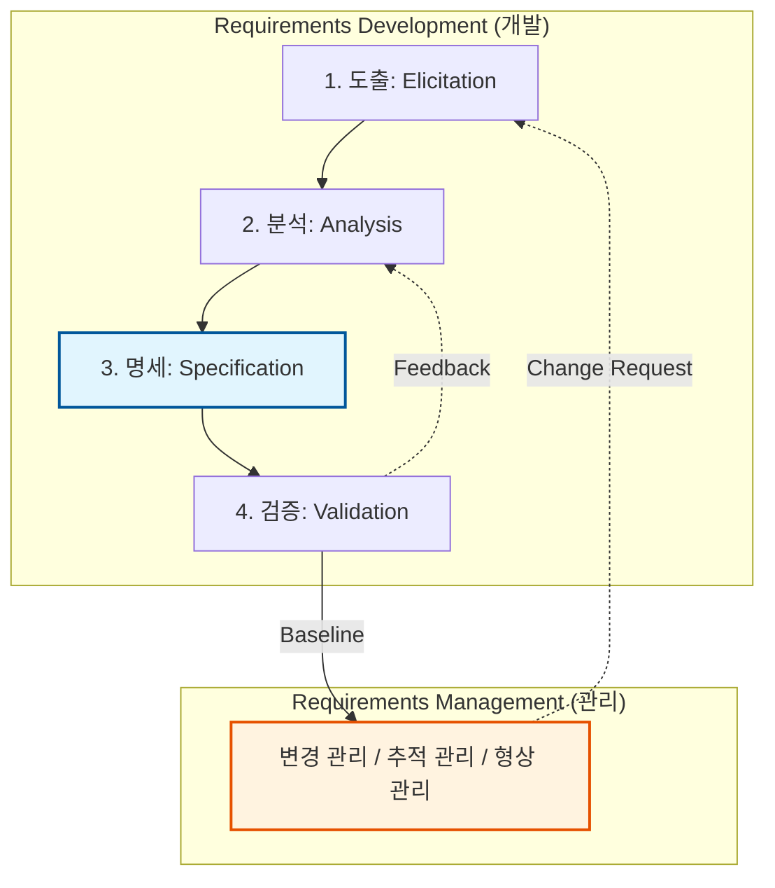

Parent: [[소프트웨어_공학_방법론]]

# 1. 요구공학(Requirements Engineering)의 개요 및 배경

### 가. 요구공학의 정의
- 사용자의 요구사항을 정확히 파악하여 시스템 개발의 기초가 되는 문서를 작성하고, 이를 체계적으로 수집, 분석, 명세, 검증, 관리하는 **시스템 공학적 접근 방법**임
- 소프트웨어 개발 생명주기(SDLC)의 최전방 단계로서, 비즈니스 가치를 기술적 사양으로 변환하는 **의사소통 조율 과정**임

### 나. 등장 배경 및 필요성
- **요구사항의 불명확성 해소**: 개발 후반부 결함의 80% 이상이 요구사항 오해에서 비롯됨에 따라 초기 단계의 정밀한 통제 필요
- **개발 비용 및 일정 최적화**: 보엠(Boehm)의 법칙에 의거, 요구사항 단계의 결함 수정 비용이 배포 후 대비 수십 배 저렴함
- **복잡성 관리**: 시스템 대형화에 따른 수많은 이해관계자(Stakeholders) 간의 이해 상충을 조정하고 일관성 유지 필요

# 2. 요구공학의 아키텍처 및 핵심 프로세스

요구공학은 크게 요구사항을 도출하고 정리하는 **개발(Development)**과 변경을 통제하는 **관리(Management)**로 구분됩니다.

### 가. 요구공학 프로세스 개념도

### 나. 단계별 주요 활동 및 기법
| 단계 | 주요 활동 | 핵심 기법 및 도구 |
| :--- | :--- | :--- |
| **도출** | 요구사항 식별, 정보 수집 | 인터뷰, 설문조사, **브레인스토밍**, **워크숍(JAD)** |
| **분석** | 중복 제거, 우선순위 부여 | **UML**, DFD, 데이터 모델링, 프로토타이핑 |
| **명세** | 요구사항 문서화 | **요구사항 정의서(SRS)**, 유스케이스 명세서 |
| **검증** | 정합성 및 무결성 확인 | **동료 검토(Review)**, 인스펙션, 워크스루 |
| **관리** | 변경 통제 및 추적성 확보 | **추적 매트릭스(RTM)**, 변경 통제 위원회(CCB) |

# 3. 상세 기술 및 심화 분석

### 가. 기능적(Functional) vs 비기능적(Non-functional) 요구사항 비교
| 비교 항목 | 기능적 요구사항 | 비기능적 요구사항 |
| :--- | :--- | :--- |
| **정의** | 시스템이 '무엇(What)'을 해야 하는가 | 시스템이 '어떻게(How)' 동작해야 하는가 |
| **대상** | 입력, 출력, 로직, 데이터 처리 | **성능, 보안, 가용성, 신뢰성, 유지보수성** |
| **측정** | 기능 구현 여부로 판단 (Yes/No) | 정량적 지표(예: 응답시간 3초 이내)로 측정 |
| **중요도** | 비즈니스 가치와 직결 | 시스템의 **품질 및 사용자 경험(UX)**과 직결 |

### 나. 요구사항 추적성(Traceability) 관리의 핵심: RTM
- **RTM(Requirement Traceability Matrix)**: 요구사항부터 설계, 코드, 테스트 케이스까지의 연결 관계를 관리하는 매트릭스
- **효과**: 요구사항 변경 시 영향도 분석(Impact Analysis) 용이, 테스트 누락 방지, Gold Plating(불필요한 기능) 억제

# 4. 기술사적 제언 및 실무 적용 방안

### 가. 실무 도입 시 고려사항
- **이해관계자 관리**: 현업 전문가(SME)뿐만 아니라 실제 운영자, 보안 담당자 등 다양한 페르소나를 도출 단계에 참여시켜 사각지대 제거
- **우선순위 선정**: 자원과 시간의 제약을 고려하여 **MoSCoW**(Must, Should, Could, Won't) 기법 등을 활용한 전략적 배분 필요

### 나. 거버넌스 및 보안(Security) 통제 방안
- **보안 요구사항 내재화**: 초기 분석 단계에서부터 **개인정보보호법**, **ISMS-P** 인증 요건을 비기능 요구사항으로 정의 (Privacy by Design)
- **명세서의 품질 관리**: 모호한 표현(예: '빨리', '충분히')을 지양하고 **SMART**(Specific, Measurable, Achievable, Relevant, Time-bound) 원칙에 따라 명세

### 다. 최신 트렌드와 연계한 발전 방향
- **Agile RE**: 고정된 SRS 대신 **User Story**와 **Backlog**를 통해 유연하게 요구사항을 관리하며 지속적인 가치 전달
- **AI-driven RE**: 생성형 AI(LLM)를 활용하여 자연어 요구사항으로부터 UML 다이어그램이나 명세서 초안을 자동 생성하여 생산성 극대화

> [!tip] **기술사 인사이트**
> 요구공학의 본질은 **"정렬(Alignment)"**입니다. 비즈니스의 언어와 개발의 언어 사이의 간극을 좁히고, 프로젝트의 **기준선(Baseline)**을 명확히 함으로써 **범위 잠식(Scope Creep)**을 방어하는 최전방 방어선임을 강조해야 합니다.

## Related Notes
- [[024.폭포수_모델(Waterfall_Model)]]
- [[025.프로토타이핑_모델(Prototyping_Model)]]
- [[034.애자일_방법론(Agile)]]
- [[016.이벤트_스토밍(Event_Storming)]]
- [[054.테스트_주도_개발(TDD)]]
