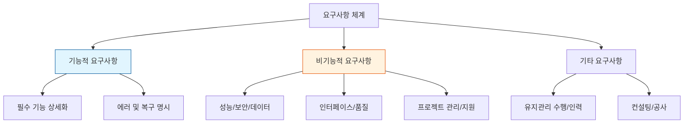

Parent: [[055.요구공학(Requirements_Engineering)]]

# 1. 요구사항(Requirements)의 개요 및 특징

### 가. 요구사항의 정의
- **요구사항**: 고객이 요구하는 시스템에서 해당 시스템이 갖추어야 할 필수적인 기능 및 제약조건의 총체임
- **기능적 요구사항(Functional)**: 목표 시스템이 **반드시 수행**해야 하거나 사용자가 반드시 수행할 수 있어야 하는 핵심 기능임
- **비기능적 요구사항(Non-functional)**: 기능을 제외한 품질, 성능, 보안 등 SW 개발 생산성과 운영 품질에 직결되는 항목임

### 나. 요구사항의 주요 특징
- **기준선 제공**: 프로젝트 범위(Scope)의 기준이 되며 일정 및 원가 산정의 기초가 됨
- **추적성(Traceability)**: 설계, 구현, 테스트 전 과정에 걸쳐 상호 연관성을 추적 가능하게 함
- **가시화**: 모호한 사용자 의도를 명세서를 통해 구체적으로 형상화함

# 2. 요구사항의 분류 체계 및 상세 항목

### 가. 요구사항 분류 체계도

### 나. 비기능 요구사항의 구성 요소 (11대 항목)
| 구분 | 상세 항목 | 주요 내용 |
| :--- | :--- | :--- |
| **시스템 운영** | 성능, 장비구성, 인터페이스 | 응답속도, 처리량, H/W 및 S/W 구성, 내/외부 연계 |
| **데이터/품질** | 데이터, 보안, 품질 | 데이터 정합성, 암호화, 가용성, 신뢰성, 유지관리성 |
| **프로젝트 관리** | 테스트, 제약사항, 관리, 지원 | 테스트 전략, 법적 제약, 진척 관리, 교육 및 기술 전수 |

# 3. 상세 명세 기술 및 보정 메커니즘 (Deep-dive)

### 가. 성능 요구사항의 필수 작성 요건 및 지표
1) **작성 요건**: 속도 및 시간(Speed & Time), 처리량(Throughput), 정적/동적 용량(Capacity), 가용성(Availability)
2) **상세 지표별 작성 항목**:
    - **처리속도**: 목표 응답시간 (Response Time) 명시
    - **처리량**: 초당 트랜잭션(TPS), **동시 접속자 수**, 동시 처리 능력
    - **자원 사용량**: **CPU/메모리 사용률** 임계치 정의 (예: Peak 시 70% 이하)

### 나. 비기능 요구사항 보정계수 [두음: 규연성운보]
소프트웨어 대가 산정 및 규모 추정 시 비기능 요구사항의 난이도를 반영하는 핵심 계수임
| 보정 항목 | 상세 내용 |
| :--- | : :--- |
| **규**모 보정 | 소프트웨어 크기에 따른 생산성 차이 반영 |
| **연**계 복잡성 | 타 시스템과의 인터페이스 수 및 복잡도 |
| **성**능 요구수준 | 응답시간, 처리량 등 성능 목표의 난이도 |
| **운**영환경 호환성 | 다양한 OS, 브라우저, 기기 지원 여부 |
| **보**안성 | 데이터 암호화, 인증 수준, 개인정보보호 요건 |

# 4. 기술사적 제언 및 실무 적용 방안

### 가. 요구 추출의 어려움(Hurdles)과 대응 전략
- **도메인 이해 부족**: 개발자의 업무 지식 결여로 인한 오해 -> **이벤트 스토밍** 및 JAD 워크숍 활용
- **변경 관리 부재**: 잦은 요구 변경으로 인한 일정 지연 -> **CCB(변경통제위원회)** 운영 및 기준선 관리 철저
- **추출 작업 과소평가**: 비기능 요구사항을 간과하여 아키텍처 재설계 발생 -> 초기 단계부터 품질 속성(QA) 명확화

### 나. 향후 발전 방향: 지능형 요구사항 관리
- **기능점수(FP) 연계**: 요구사항 명세 단계부터 기능점수를 자동 산정하여 정량적 관리 체계 구축
- **Living Spec**: 요구사항과 테스트 케이스를 동기화하여 명세와 실제 시스템 간의 간극 제거

> [!tip] **기술사 인사이트**
> 요구사항 분석의 실패는 곧 프로젝트의 실패입니다. 특히 **비기능 요구사항**은 시스템 아키텍처의 근간을 결정하므로, **"규연성운보"** 기반의 정교한 분석과 **성능 지표**의 정량적 정의를 통해 운영 단계의 리스크를 선제적으로 제거해야 합니다.

## Related Notes
- [[055.요구공학(Requirements_Engineering)]]
- [[056.요구사항_정의_및_품질_특성]]
- [[007.형상관리(Configuration Management)]]
- [[016.이벤트_스토밍(Event_Storming)]]
