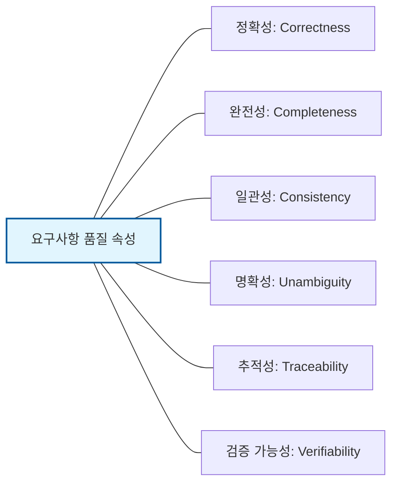

Parent: [[055.요구공학(Requirements_Engineering)]]

# 1. 요구사항(Requirements)의 정의 및 분류 체계

### 가. 요구사항의 정의
- 사용자가 직면한 문제를 해결하거나 특정 목적을 달성하기 위해 시스템이 갖추어야 하는 조건, 능력, 또는 제약사항을 명문화한 것임
- 소프트웨어 개발의 성패를 결정짓는 **계약적 기초**이자, 시스템 설계와 테스트의 기준이 되는 **단일 진실 공급원(SSOT)**임

### 나. 요구사항의 계층적 분류 체계
| 분류 기준 | 유형 | 상세 설명 |
| :--- | :--- | :--- |
| **작성 관점** | **사용자 요구사항** | 사용자의 비즈니스 목표를 자연어로 기술한 고수준 요구사항 |
| | **시스템 요구사항** | 개발자가 구현할 수 있도록 기술적으로 상세화한 요구사항 (명세서) |
| **기능 여부** | **기능 요구사항** | 시스템이 제공해야 하는 서비스, 입출력, 데이터 처리 로직 |
| | **비기능 요구사항** | 성능, 보안, 가용성, 신뢰성 등 품질 속성 및 운영 제약사항 |

# 2. 요구사항의 품질 속성 및 명세 원칙

성공적인 프로젝트를 위해서는 작성된 요구사항이 일정한 품질 기준을 만족해야 합니다.

### 가. 요구사항 명세의 품질 속성 (IEEE 830 표준)

### 나. 좋은 요구사항 작성을 위한 5대 원칙 (SMART)
| 원칙 | 상세 내용 | 비고 |
| :--- | :--- | :--- |
| **S**pecific | 요구사항이 구체적이고 상세해야 함 | 모호성 제거 |
| **M**easurable | 정량적으로 측정이 가능해야 함 | 검증 가능성 |
| **A**ttainable | 현재의 기술과 자원으로 구현 가능해야 함 | 실현 가능성 |
| **R**elevant | 비즈니스 목표와 관련이 있어야 함 | 목적 부합성 |
| **T**ime-bound | 정해진 시간 내에 완료 가능해야 함 | 기한 명시 |

# 3. 요구사항 명세 기법 및 도구 분석

### 가. 정형 명세 vs 비정형 명세 기법 비교
| 비교 항목 | 정형 명세 (Formal) | 비정형 명세 (Informal) |
| :--- | :--- | :--- |
| **표현 수단** | 수학적 기호, 논리 기반 (Z-스키마 등) | 자연어, UML, 그림, 차트 |
| **장점** | 모호성 제로, 정확한 검증 가능 | 이해가 쉬움, 의사소통 원활 |
| **단점** | 이해 및 작성 난이도 매우 높음 | 해석의 차이(모호성) 발생 가능 |
| **주요 분야** | 원자력, 항공, 의료 (Safety Critical) | 일반적인 비즈니스 소프트웨어 |

### 나. 요구사항 관리 도구 (Requirements Management Tools)
- **전용 도구**: DOORS, RequisitePro (복잡한 추적성 관리)
- **협업 도구**: Jira, Confluence (애자일 환경의 백로그 관리)
- **오픈 소스**: Redmine, Mantis (이슈 트래킹 중심)

# 4. 기술사적 제언 및 실무 적용 방안

### 가. 실무 도입 시 고려사항: 비기능 요구사항의 구체화
- 비기능 요구사항은 흔히 누락되거나 모호하게 기술되는 경향이 있음
- "시스템은 빨라야 한다" 대신 "동시 사용자 1,000명 기준 응답시간 2초 이내"와 같이 **지표 중심(Metric-driven)**으로 정의해야 함

### 나. 거버넌스 및 보안(Security) 통제 방안
- **보안 요구사항의 품질**: 보안 요건을 설계 단계에 반영하기 위해 **STRIDE** 모델 등을 활용하여 위협을 식별하고 이를 품질 속성으로 강제
- **변경 통제**: 기준선(Baseline) 확정 후의 모든 요구사항 변경은 영향도 분석을 거쳐 **CCB**의 승인을 득하도록 프로세스 엄격화

### 다. 최신 트렌드: 가상화 및 클라우드 환경의 요구사항
- 인프라 리소스 제약이 적은 클라우드 환경에서는 성능보다는 **확장성(Scalability)**과 **비용 최적화(FinOps)**에 대한 요구사항 비중 증대
- **Living Documentation**: 코드가 곧 문서가 되는 구조(TDD/BDD)를 통해 요구사항과 실제 시스템의 괴리 방지

> [!tip] **기술사 인사이트**
> 요구사항은 개발의 **"헌법"**입니다. 헌법이 흔들리면 하위 법률(설계/코드)이 무너지듯, 요구사항의 **일관성**과 **완전성**을 확보하는 것이 품질 비용을 최소화하는 가장 경제적인 소프트웨어 공학 기법입니다.

## Related Notes
- [[055.요구공학(Requirements_Engineering)]]
- [[007.형상관리(Configuration Management)]]
- [[054.테스트_주도_개발(TDD)]]
- [[008.무중단배포(Zero-Downtime_Deployment)]]
