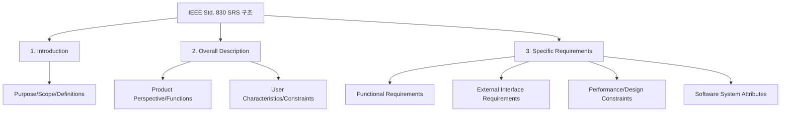

Parent: [[055.요구공학(Requirements_Engineering)]]

# 요구사항 명세서(SRS) 및 IEEE Std. 830

> [!info] **소프트웨어 요구사항 명세서(SRS)란?**
> 시스템이 수행해야 할 기능, 성능, 제약사항 등을 이해관계자가 합의할 수 있도록 명확하고 완전하게 기록한 산출물입니다. **IEEE Std. 830**은 이러한 SRS의 구성과 품질 특성을 정의한 국제 표준입니다.

---

## 1. 요구사항 명세서(SRS)의 개요
### 가. SRS(Software Requirements Specification)의 정의
- 사용자와 개발자 간의 의사소통 도구이자 프로젝트의 기준점(Baseline)으로, 시스템의 **기능(Functional)**, **비기능(Non-functional)** 요구사항을 정형화하여 기술한 문서

### 나. SRS의 필요성 및 중요성
1. **의사소통의 기준**: 이해관계자(고객, 개발자, 테스터) 간의 요구사항에 대한 공통된 이해 제공
2. **프로젝트 관리**: 개발 범위 확정, 일정 및 비용 산정의 근거(Baseline)로 활용
3. **품질 보증**: 테스트 케이스 설계의 기준이 되며, 최종 산출물의 검증(Verification) 수단
4. **유지보수 용이성**: 시스템 변경 시 영향도 분석 및 추적성을 위한 기초 자료

---

## 2. SRS의 아키텍처 및 구성 요소 (IEEE Std. 830 기준)
### 가. SRS 문서 구조 및 흐름 (Mermaid)

### 나. IEEE Std. 830에 따른 주요 구성 요소

| 구분 | 주요 내용 | 상세 항목 |
| :--- | :--- | :--- |
| **1. 서론 (Introduction)** | 문서의 목적과 범위 설정 | 목적, 범위, 용어 정의, 참조 문헌 |
| **2. 전체 설명 (Overall Description)** | 시스템의 맥락적 이해 제공 | 제품 배경, 기능 요약, 사용자 특성, 제약사항, 가정 및 의존성 |
| **3. 상세 요구사항 (Specific Requirements)** | 개발자가 구현해야 할 세부 내용 | **기능적 요구사항**, 외부 인터페이스, 성능 요구사항, 설계 제약, 품질 속성(보안성, 가용성 등) |

---

## 3. SRS의 품질 특성 및 비교 분석
### 가. 우수한 SRS의 8가지 품질 특성 (IEEE Std. 830)

| 특성 | 설명 | 비고 |
| :--- | :--- | :--- |
| **정확성 (Correct)** | 구현될 시스템이 요구사항을 모두 충족해야 함 | 고객 검토 필수 |
| **명확성 (Unambiguous)** | 모든 요구사항은 단 하나의 의미로만 해석되어야 함 | 용어 사전 활용 |
| **완전성 (Complete)** | 기능, 성능, 제약사항 등 모든 필수 요소가 포함됨 | TBD(To Be Determined) 최소화 |
| **일관성 (Consistent)** | 요구사항 간에 충돌이나 모순이 없어야 함 | 용어 및 단위 통일 |
| **수정 용이성 (Modifiable)** | 구조적이고 중복 없이 작성되어 변경이 쉬워야 함 | 색인 및 상호 참조 |
| **추적 가능성 (Traceable)** | 요구사항의 기원(Origin)과 하위 산출물 간 연결 가능 | RTM(요구사항 추적표) 활용 |
| **검증 가능성 (Verifiable)** | 객체적으로 테스트나 확인이 가능한 수준이어야 함 | 수치화된 메트릭 사용 |
| **순위화 (Ranked)** | 중요도 및 시급성에 따라 우선순위가 부여됨 | 필수/선택 구분 |

### 나. 전통적 SRS vs 애자일 사용자 스토리(User Story) 비교

| 비교 항목 | 전통적 SRS (IEEE 830) | 애자일 사용자 스토리 |
| :--- | :--- | :--- |
| **형식** | 정형화된 문서 (문장 중심) | 카드 형식 (Who/What/Why) |
| **시점** | 프로젝트 초기 상세 정의 | 반복 주기(Iteration)별 정의 |
| **상세도** | 매우 높음 (기술 중심) | 적정 수준 (비즈니스 중심) |
| **변경 관리** | 공식적인 변경 통제 절차(CCB) | 지속적인 대화와 피드백 |
| **주요 용도** | 계약 및 대규모 프로젝트 기준 | 빠른 가치 전달 및 협업 |

---

## 4. 기술사적 제언 및 실무 적용 방안
### 가. SRS 작성 및 관리 시 고려사항
1. **요구사항 추적표(RTM) 연계**: 분석-설계-구현-테스트 전 단계에 걸쳐 요구사항이 누락되지 않도록 **Vertical Traceability**를 확보해야 함
2. **비기능 요구사항 구체화**: 성능, 보안, 가용성 등 비기능 요소는 시스템 장애의 주원인이 되므로, **ISO/IEC 25010** 등을 참고하여 정량적으로 명세

### 나. 거버넌스 및 보안 통제 방안
- **변경 관리(Change Management)**: SRS는 형상관리 대상이므로, 승인된 변경 요청에 의해서만 갱신되도록 엄격한 베이스라인 관리가 필요함
- **보안 요구사항 명세**: 설계 단계부터 보안이 고려될 수 있도록 **Security by Design** 관점에서 개인정보 보호, 인증/인가 요구사항을 SRS에 명시

### 다. 향후 발전 방향 및 인사이트
- 최근에는 AI 및 LLM을 활용하여 자연어 요구사항을 SRS 형식으로 자동 변환하거나, 요구사항 간의 모순을 탐지하는 **AI-based Requirements Engineering** 도입이 가속화되고 있음
- 복잡해지는 현대 시스템에서는 정적인 SRS를 넘어, 실행 가능한 모델 기반의 **MBSE(Model-Based Systems Engineering)**와 연계하여 요구사항의 검증 가능성을 극대화해야 함

---

## Related Notes
- [[055.요구공학(Requirements_Engineering)]]
- [[056.요구사항_분석_및_품질_명세]]
- [[007.형상관리(Configuration_Management)]]
