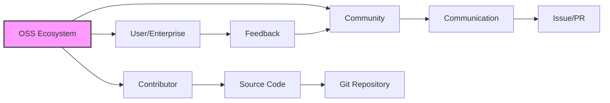

Parent: [[055.요구공학(Requirements_Engineering)]] (유관 도메인)

# 오픈소스 소프트웨어(OSS)

> [!info] **오픈소스 소프트웨어(OSS)란?**
> 소스 코드가 공개되어 누구나 자유롭게 수정, 복제, 배포할 수 있는 소프트웨어입니다. 단순히 '무료'라는 개념을 넘어, **OSI(Open Source Initiative)**의 **OSD(Open Source Definition)** 10대 원칙을 준수해야 합니다.

---

## 1. 오픈소스 소프트웨어(OSS)의 개요
### 가. OSS의 정의
- 소스 코드의 공개와 함께 자유로운 사용, 복제, 배포, 수정이 허용되는 소프트웨어

### 나. 등장 배경 및 필요성
1. **비용 절감**: 상용 소프트웨어 대비 초기 도입 및 유지보수 비용(TCO) 절감
2. **기술 종속성(Vendor Lock-in) 탈피**: 특정 벤더에 의존하지 않고 독립적인 기술 확보 가능
3. **신속한 개발**: 이미 검증된 오픈소스 컴포넌트 활용으로 제품 출시 기간(Time-to-Market) 단축
4. **품질 및 보안**: 전 세계 커뮤니티의 집단지성을 통한 빠른 버그 수정 및 보안 취약점 보완

---

## 2. OSS의 특징 및 에코시스템
### 가. OSS 개념도 (Mermaid)

### 나. OSD(Open Source Definition) 주요 원칙

| 원칙 | 내용 |
| :--- | :--- |
| **자유로운 배포** | 복제 및 배포에 대해 어떠한 로열티나 비용도 요구하지 않음 |
| **소스 코드 공개** | 소스 코드를 반드시 포함하거나 누구나 쉽게 얻을 수 있어야 함 |
| **2차적 저작물 허용** | 원본의 수정이나 파생 소프트웨어 제작 및 배포를 허용함 |
| **차별 금지** | 특정 개인, 단체, 분야(상업적 목적 포함)에 대해 사용을 제한하지 않음 |

---

## 3. OSS vs 상용(Proprietary) 소프트웨어 비교 분석
### 가. 비교 분석표

| 구분 | 오픈소스 소프트웨어 (OSS) | 상용 소프트웨어 (Proprietary) |
| :--- | :--- | :--- |
| **권리** | 사용자에게 복제, 수정, 배포권 부여 | 제조사가 소유권 독점, 사용권(License)만 부여 |
| **비용** | 라이선스 비용 무료 (기술지원 비용 발생) | 초기 라이선스 및 연간 유지보수료 발생 |
| **보안** | 집단지성에 의한 빠른 패치 (투명성) | 제조사의 패치 일정에 의존 (불투명성) |
| **책임** | 원칙적 면책 (보증 없음) | 제조사가 품질 및 결과에 대해 책임 |
| **관리** | 기업 자체의 거버넌스 역량 중요 | 벤더의 서비스 수준 협약(SLA) 의존 |

---

## 4. 기술사적 제언 및 실무 적용 방안
### 가. OSS 도입 시 고려사항
1. **보안 취약점 관리**: 오픈소스는 공급망 보안(Supply Chain Security)의 핵심이므로, **CVE** 취약점 모니터링이 필수적임
2. **라이선스 컴플라이언스**: 라이선스 의무사항 미준수 시 법적 분쟁 리스크가 존재하므로 철저한 관리가 필요함

### 나. 거버넌스 및 보안 통제 방안
- **SBOM(Software Bill of Materials) 도입**: 소프트웨어 구성 명세서를 관리하여 포함된 모든 오픈소스 리스트와 버전을 투명하게 관리
- **OSPO(Open Source Program Office)**: 조직 내 오픈소스 사용 전략과 가이드라인을 수립하는 전담 조직 운영

### 다. 최신 트렌드와의 연계
- 클라우드 네이티브 환경(K8s, Docker)과 AI(PyTorch, TensorFlow) 등 핵심 기술이 모두 오픈소스로 주도되고 있어, OSS 역량은 기업의 생존과 직결됨

---

## Related Notes
- [[059.오픈소스_라이선스(OSS_License)]]
- [[061.OSS_거버넌스(OSS_Governance)]]
