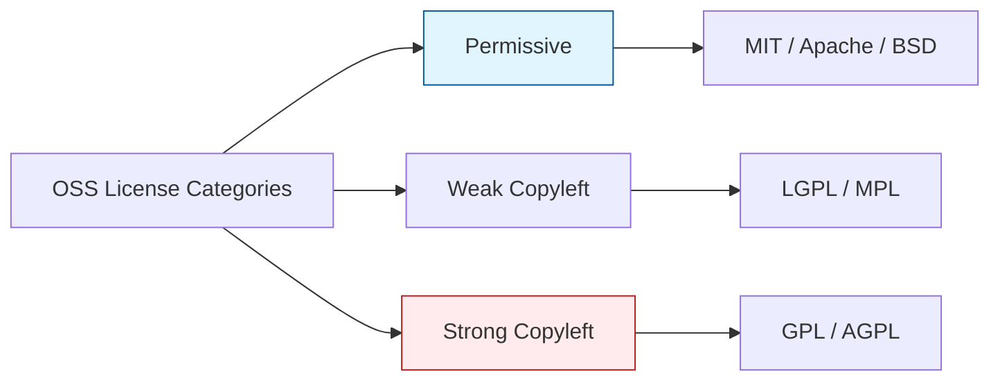

Parent: [[058.오픈소스_소프트웨어(OSS)]]

# 오픈소스 라이선스(OSS License)

> [!info] **오픈소스 라이선스란?**
> 오픈소스 소프트웨어의 개발자와 사용자 간에 맺어지는 **이용 허락 계약**입니다. 소스 코드를 사용할 때 지켜야 할 의무사항(고지 의무, 소스 공개 의무 등)과 권리 범위를 규정합니다.

---

## 1. 오픈소스 라이선스의 개요
### 가. 라이선스의 정의
- 저작권자가 사용자에게 일정한 조건 하에 소프트웨어를 사용할 수 있도록 권한을 부여하는 법적 계약

### 나. 라이선스의 주요 의무사항
1. **저작권 고지**: 원저작자 및 라이선스 정보를 소프트웨어 내에 명시
2. **소스 코드 공개**: 라이선스 종류에 따라 수정된 코드 또는 전체 코드를 공개할 의무
3. **고지 의무**: 수정 사항이 있을 경우 이를 명시하는 의무
4. **특허 보복 조항**: 특허 소송 시 라이선스 권한을 박탈하는 조항 포함 가능

---

## 2. 라이선스 유형 및 분류
### 가. 의무사항 강도에 따른 분류 (Mermaid)

### 나. 주요 라이선스 비교 분석

| 라이선스 | 소스 공개 의무 | 범위 | 특징 |
| :--- | :--- | :--- | :--- |
| **MIT** | X | - | 가장 자유로움. 저작권 고지만 하면 됨 |
| **Apache 2.0** | X | - | 특허권 부여 조항 포함. 기업에서 선호 |
| **BSD** | X | - | MIT와 유사. 재배포 시 조건 부여 |
| **GPL (v2, v3)** | **O** | 파생 저작물 전체 | 강력한 **Copyleft**. 결합된 코드 전체 공개 |
| **LGPL** | **O** | 수정된 라이브러리 | 라이브러리 링크 시에는 공개 의무 없음 |
| **MPL** | **O** | 수정된 파일 단위 | 파일 단위 공개 의무. 상업용 소프트웨어 결합 용이 |

---

## 3. 라이선스 위반 리스크 및 대응
### 가. 법적/비즈니스 리스크
- **저작권 침해 소송**: 라이선스 의무 위반 시 배포 금지 가처분 및 손해배상 청구
- **영업비밀 노출**: GPL 등 소스 공개 의무로 인해 기업의 핵심 알고리즘이 강제로 공개될 위험
- **브랜드 이미지 훼손**: 컴플라이언스 미준수 기업으로 낙인

### 나. 라이선스 준수(Compliance) 프로세스

| 단계 | 활동 내용 |
| :--- | :--- |
| **1. 식별 (Identification)** | 사용된 오픈소스 리스트 및 라이선스 종류 파악 (Scanning Tool 활용) |
| **2. 분석 (Analysis)** | 라이선스 의무사항 및 양립성(Compatibility) 검토 |
| **3. 검증 (Validation)** | 배포 방식(SaaS vs Package)에 따른 의무 이행 여부 확인 |
| **4. 배포 (Distribution)** | 라이선스 고지문 작성 및 소스 코드 공개 사이트 운영 |

---

## 4. 기술사적 제언 및 실무 적용 방안
### 가. 기업의 라이선스 전략
1. **상업용 SW 개발 시**: 가급적 **Permissive(MIT, Apache)** 라이선스를 선택하고, **Copyleft(GPL)** 계열은 신중하게 검토
2. **SaaS 서비스 시**: 네트워크 배포를 소스 공개 조건으로 삼는 **AGPL** 라이선스에 유의해야 함

### 나. 거버넌스 및 보안 통제
- **블랙리스트/화이트리스트 관리**: 조직 내에서 사용 가능한 라이선스와 금지된 라이선스를 명확히 정의
- **FOSSID, Black Duck**: 자동화된 스캐닝 툴을 빌드 파이프라인(CI/CD)에 통합하여 실시간 점검 수행

---

## Related Notes
- [[058.오픈소스_소프트웨어(OSS)]]
- [[060.오픈소스_라이선스_양립성(Compatibility)]]
- [[061.OSS_거버넌스(OSS_Governance)]]
