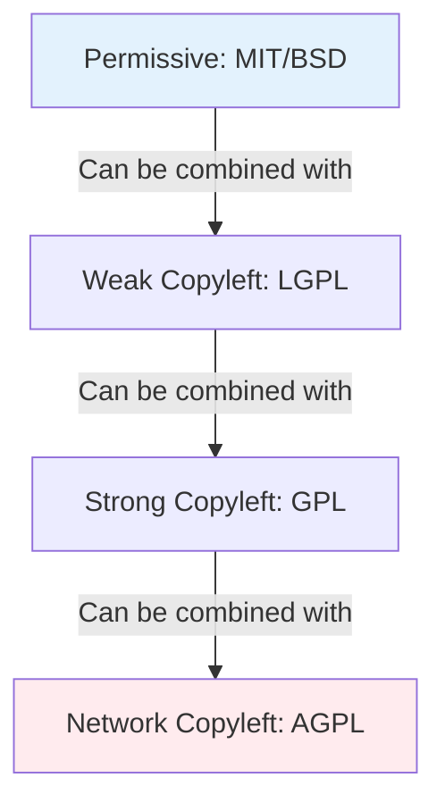

Parent: [[059.오픈소스_라이선스(OSS_License)]]

# 오픈소스 라이선스 양립성(Compatibility)

> [!info] **라이선스 양립성이란?**
> 서로 다른 라이선스를 가진 오픈소스 소프트웨어들을 결합하여 하나의 새로운 소프트웨어를 만들 때, 각 라이선스의 의무사항이 서로 충돌하지 않고 동시에 준수될 수 있는 상태를 의미합니다.

---

## 1. 라이선스 양립성의 개요
### 가. 양립성(Compatibility)의 정의
- 두 개 이상의 오픈소스 라이선스 조건이 서로 모순되지 않아, 결합된 소프트웨어 배포 시 모든 라이선스 조건을 충족할 수 있는 성질

### 나. 양립성 문제가 발생하는 이유
1. **소스 공개 범위의 차이**: 소스 코드를 전체 공개해야 하는 라이선스(GPL)와 그렇지 않은 라이선스(Apache)의 결합
2. **추가 제약 조건**: "수정 사항을 반드시 알려야 함" vs "수정 사항을 알릴 필요 없음"과 같은 조건의 충돌
3. **라이선스 버전 간 차이**: 동일 라이선스라도 버전(GPL v2 vs v3)에 따라 양립이 불가능할 수 있음

---

## 2. 라이선스 양립성 메커니즘
### 가. 양립성 방향성 (Mermaid)

> [!tip] 일반적으로 제약이 적은 라이선스(Permissive)는 제약이 많은 라이선스(Copyleft) 안으로 포함(Absorption)될 수 있습니다.

### 나. 라이선스 결합 가능 여부 (Matrix)

| 원본 라이선스 | 결합 대상: GPL v2 | 결합 대상: GPL v3 | 결합 대상: Apache 2.0 |
| :--- | :---: | :---: | :---: |
| **MIT / BSD** | **가능** | **가능** | **가능** |
| **Apache 2.0** | **불가능** (특허조항 충돌) | **가능** | - |
| **GPL v2** | - | **불가능** | **불가능** |
| **LGPL v2.1** | **가능** | **가능** | **불가능** |

---

## 3. 상세 분석 및 이슈
### 가. GPL v2와 Apache 2.0의 불양립성
- **이유**: Apache 2.0에는 '특허 종결(Patent Termination)' 조항이 있으나, GPL v2는 라이선스에 나열된 조건 외의 추가적인 제약을 금지함
- **해결**: GPL v3가 출시되면서 Apache 2.0과 양립할 수 있도록 설계됨

### 나. 파생 저작물(Derivative Work) 판단
- 라이선스 양립성은 소프트웨어가 '파생 저작물'로 판단될 때 결정적인 문제가 됨
- 단순히 별개의 실행 파일을 호출하는 수준이면 양립성 문제에서 자유로울 수 있으나, 정적 링크(Static Link) 시에는 강력한 결합으로 간주됨

---

## 4. 기술사적 제언 및 실무 적용 방안
### 가. 양립성 리스크 대응 전략
1. **사전 검토**: 개발 초기 단계에서 사용할 오픈소스 라이선스 조합이 양립 가능한지 체크리스트를 통해 확인
2. **라이선스 격리**: 양립이 불가능한 오픈소스가 반드시 필요할 경우, API나 동적 링크, 마이크로서비스(MSA) 형태로 분리하여 법적 전염(Viral Effect) 차단

### 나. 거버넌스 및 관리 방안
- **OSS Compliance 가이드라인**: "A 라이선스와 B 라이선스는 결합 금지"와 같은 명확한 정책을 수립
- **전문가 자문**: 라이선스 양립성 판단은 법적 해석이 포함되므로, 법무팀 또는 외부 전문 기관(저작권위원회 등)의 검토 병행

### 다. 기술사적 인사이트
- 최근 클라우드 네이티브 환경에서는 컨테이너 이미지 단위로 배포되므로, 이미지 내에 포함된 수많은 라이선스의 양립성을 한꺼번에 검증할 수 있는 **SBOM 기반 분석**이 핵심 역량임

---

## Related Notes
- [[059.오픈소스_라이선스(OSS_License)]]
- [[061.OSS_거버넌스(OSS_Governance)]]
