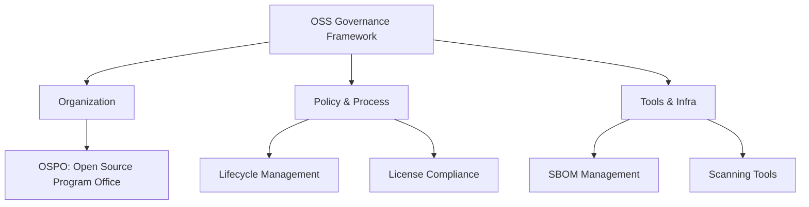

Parent: [[058.오픈소스_오픈소스_소프트웨어(OSS)]]

# OSS 거버넌스(OSS Governance)

> [!info] **OSS 거버넌스란?**
> 기업이나 조직이 오픈소스 소프트웨어를 안전하고 효율적으로 활용하기 위해 수립한 **전략, 조직, 프로세스, 도구**의 체계입니다. 라이선스 리스크를 최소화하고 보안을 강화하며 오픈소스 기여를 통한 기술 리더십 확보를 목적으로 합니다.

---

## 1. OSS 거버넌스의 개요
### 가. OSS 거버넌스의 정의
- 오픈소스의 도입, 사용, 기여, 배포 전 과정에 대한 의사결정 체계 및 관리 절차

### 나. 필요성 (왜 거버넌스인가?)
1. **Compliance**: 라이선스 의무사항 미준수로 인한 법적 분쟁 방지
2. **Security**: 오픈소스 내 포함된 보안 취약점(Supply Chain Attack) 선제적 대응
3. **Efficiency**: 검증되지 않은 오픈소스 사용으로 인한 기술 부채 감소 및 중복 도입 방지
4. **Strategy**: 오픈소스 생태계 기여를 통한 기업 브랜드 가치 및 인재 확보

---

## 2. OSS 거버넌스 프레임워크 및 구성 요소
### 가. 거버넌스 아키텍처 (Mermaid)

### 나. 주요 구성 요소별 세부 내용

| 구분 | 주요 내용 | 비고 |
| :--- | :--- | :--- |
| **조직 (Organization)** | 전담 조직(OSPO) 운영, 법무/보안/개발팀 협의체 구성 | **OSPO** 필수 |
| **정책 (Policy)** | 사용 가능한 라이선스 가이드라인, 기여 및 배포 정책 수립 | 블랙/화이트리스트 |
| **프로세스 (Process)** | 도입 요청 → 심사 → 승인 → 모니터링 → 폐기 절차 | Lifecycle 관리 |
| **도구 (Tools)** | 오픈소스 스캐닝 툴(SCA), SBOM 자동 생성 도구 | Black Duck, WhiteSource |

---

## 3. OSS 거버넌스의 핵심: SBOM (Software Bill of Materials)
### 가. SBOM의 개념
- 소프트웨어에 포함된 모든 오픈소스 컴포넌트, 버전, 라이선스, 의존성 관계를 명시한 **목록 리스트**

### 나. SBOM 주요 표준 형식

| 표준 | 주관 | 특징 |
| :--- | :--- | :--- |
| **SPDX** | Linux Foundation | 라이선스 정보 기술에 특화, ISO 국제 표준 |
| **CycloneDX** | OWASP | 보안 분석 및 공급망 관리에 최적화 (XML/JSON 지원) |
| **SWID Tag** | NIST/ISO | 설치된 소프트웨어 식별 정보 중심 |

---

## 4. 기술사적 제언 및 실무 적용 방안
### 가. OSS 거버넌스 성숙도 단계별 대응
1. **Ad-hoc (1단계)**: 개발자가 임의로 사용. 관리 부재 (위험 높음)
2. **Regulated (2단계)**: 기본적인 정책 수립 및 수동 리스트 관리
3. **Automated (3단계)**: CI/CD 파이프라인에 SCA 도구를 통합하여 자동 검증
4. **Strategic (4단계)**: OSPO를 통한 전사적 전략 수립 및 커뮤니티 기여 주도

### 나. 보안 및 보안 통제 방안 (Supply Chain Security)
- **Zero Trust 관점**: 오픈소스는 '이미 검증된 것'이 아니라 '항상 의심해야 할 것'으로 간주하여 지속적인 취약점 스캐닝 수행
- **VEX(Vulnerability Exploitability eXchange)**: SBOM과 연계하여 특정 취약점이 실제 우리 시스템에서 실행 가능한지 정보 공유

### 다. 기술사적 인사이트
- 현대의 거버넌스는 단순히 '통제'하는 것이 아니라 개발자가 쉽고 안전하게 오픈소스를 사용할 수 있도록 돕는 **Enabler** 역할을 수행해야 함
- 미국 행정명령(EO 14028) 등 국제적인 규제 강화에 따라 SBOM 제출이 의무화되고 있어, 국가적 차원의 거버넌스 체계 구축이 시급함

---

## Related Notes
- [[058.오픈소스_소프트웨어(OSS)]]
- [[059.오픈소스_라이선스(OSS_License)]]
- [[060.오픈소스_라이선스_양립성(Compatibility)]]
- [[007.형상관리(Configuration_Management)]]
