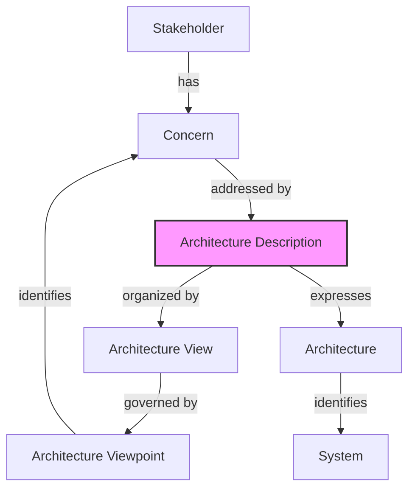

Parent: [[062.소프트웨어_아키텍처(Software_Architecture)]]

# ISO/IEC/IEEE 42010 (구 IEEE 1471)

> [!info] **ISO/IEC/IEEE 42010이란?**
> 시스템 및 소프트웨어 아키텍처를 명세화(Architecture Description)하는 방식에 관한 **국제 표준**입니다. 아키텍처 자체를 정의하기보다는, 아키텍처를 어떻게 문서화하고 표현해야 하는지에 대한 프레임워크와 개념적 모델을 제공합니다.

---

## 1. ISO/IEC/IEEE 42010의 개요
### 가. 등장 배경 및 필요성
1. **표준화된 명세**: 다양한 이해관계자 간의 아키텍처 이해 차이를 줄이기 위한 통일된 용어와 구조 필요
2. **관심사의 분리(SoC)**: 복잡한 시스템의 다양한 측면(Concerns)을 효과적으로 관리하기 위한 관점(Viewpoint) 기반 접근
3. **상호운용성**: 서로 다른 조직이나 프로젝트 간 아키텍처 설계 정보의 공유 및 재사용성 향상

### 나. IEEE 1471에서 ISO 42010으로의 진화
- **IEEE 1471:2000**: 소프트웨어 집약 시스템(Software-intensive Systems) 중심의 아키텍처 권고안
- **ISO/IEC/IEEE 42010:2011**: 시스템 오브 시스템즈(System of Systems), 전사적 아키텍처(EA)까지 확장된 국제 표준

---

## 2. ISO/IEC/IEEE 42010의 개념적 모델 (Conceptual Model)
### 가. 아키텍처 명세 구성 요소 간 관계 (Mermaid)

### 나. 핵심 용어 정의 및 메커니즘

| 핵심 용어 | 정의 및 역할 | 상세 설명 |
| :--- | :--- | :--- |
| **Stakeholder** | 시스템에 이해관계가 있는 개인 또는 집단 | 고객, 사용자, 개발자, 운영자, 규제 기관 등 |
| **Concern** | 이해관계자가 중요하게 여기는 관심사 | 성능, 보안성, 비용, 안정성, 출시 시기 등 |
| **Viewpoint** | 특정 관심사를 바라보는 방법론(Template) | 뷰를 작성하기 위한 규칙, 언어, 모델링 기법 정의 |
| **View** | Viewpoint를 적용하여 작성한 실제 결과물 | 특정 관점에서 시스템을 표현한 아키텍처 산출물 |
| **AD (Architecture Description)** | 이해관계자의 관심사를 반영한 명세서 집합 | 시스템 아키텍처를 공식적으로 기록한 문서 |

---

## 3. 주요 요구사항 및 메커니즘
### 가. 아키텍처 명세서(AD)의 필수 요건
1. **시스템 식별 정보**: 대상 시스템에 대한 명확한 정의 및 범위
2. **이해관계자 및 관심사 식별**: 모든 주요 Stakeholder와 그들의 Concern 나열
3. **Viewpoint 및 View**: 정의된 관점에 따른 아키텍처 뷰 포함
4. **일관성(Consistency)**: 각 뷰 간의 모순이 없음을 증명하는 일치성(Correspondence) 관리

### 나. 일치성(Correspondence)과 규칙
- **Correspondence**: 서로 다른 뷰에 나타난 요소들 간의 관계를 정의 (예: 논리 뷰의 클래스가 물리 뷰의 노드에 배치됨)
- **Correspondence Rules**: 아키텍처 명세 전체의 정합성을 검증하기 위한 규칙

---

## 4. 기술사적 제언 및 실무 적용 방안
### 가. 실무 적용 시 고려사항 (Governance)
1. **Viewpoint 선별**: 모든 Viewpoint를 다 작성하는 것은 비효율적이므로, 프로젝트의 복잡도와 위험 요소에 따라 핵심 Viewpoint를 선별(Tailoring)해야 함
2. **도구 활용 (CASE Tools)**: MagicDraw, Enterprise Architect 등 표준을 지원하는 모델링 도구를 사용하여 뷰 간의 추적성을 자동화해야 함

### 나. 기술사적 인사이트 및 향후 전망
- **MBSE(Model-Based Systems Engineering)**와의 연계: 정적인 문서를 넘어 실행 가능한 모델 중심의 아키텍처 명세가 강조되고 있음
- **Digital Twin**: 실제 운영 중인 시스템과 아키텍처 명세(AD)를 동기화하여 실시간 영향도 분석 및 장애 대응에 활용하는 방향으로 진화 중
- 아키텍처 표준 준수는 단순히 문서를 만드는 것이 아니라, **복잡한 시스템의 리스크를 가시화하고 통제**하는 강력한 거버넌스 도구임을 인식해야 함

---

## Related Notes
- [[062.소프트웨어_아키텍처(Software_Architecture)]]
- [[051.MVC_및_MVVM_패턴]]
- [[011.클린_아키텍처(Clean_Architecture)]]
