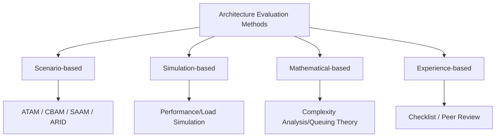

Parent: [[062.소프트웨어_아키텍처(Software_Architecture)]]

# 소프트웨어 아키텍처 평가(Software Architecture Evaluation)

> [!info] **소프트웨어 아키텍처 평가란?**
> 설계된 아키텍처가 비즈니스 목표와 품질 요구사항(성능, 보안, 가용성 등)을 충족하는지 분석하고, 설계상의 잠재적 위험(Risk)과 절충점(Trade-off)을 식별하여 의사결정을 지원하는 프로세스입니다.

---

## 1. 소프트웨어 아키텍처 평가의 개요
### 가. 아키텍처 평가의 정의
- 아키텍처 설계 산출물을 대상으로 품질 속성 시나리오를 활용하여 목표 달성 여부를 검증하고 구조적 적합성을 판단하는 활동

### 나. 아키텍처 평가의 필요성 (Why)
1. **조기 리스크 식별**: 구현 전 설계 단계에서 결함을 발견하여 수정 비용 최소화
2. **품질 보증**: 성능, 보안, 가용성 등 핵심 비기능 요구사항 충족 확인
3. **이해관계자 합의**: 다양한 Stakeholder 간의 상충하는 요구사항 조율 및 우선순위 확정
4. **의사결정 근거**: 아키텍처 설계의 타당성을 입증하고 향후 변경에 대한 기준 제공

---

## 2. 아키텍처 평가의 유형 및 프로세스 (What & How)
### 가. 평가 기법의 분류 (Mermaid)

### 나. 아키텍처 평가의 주요 절차

| 단계 | 활동 내용 | 주요 산출물 |
| :--- | :--- | :--- |
| **1. 준비 (Preparation)** | 평가 범위 확정, 이해관계자 식별, 평가팀 구성 | 평가 계획서 |
| **2. 요구사항 분석** | 비즈니스 목표 및 품질 속성 시나리오 도출 | 품질 속성 유틸리티 트리 |
| **3. 아키텍처 설명** | 설계된 아키텍처를 뷰(View) 중심으로 설명 | 아키텍처 명세서(AD) |
| **4. 분석 및 평가** | 시나리오별 아키텍처 매핑 및 리스크 분석 | 리스크/비리스크 리포트 |
| **5. 보고 (Reporting)** | 평가 결과 정리 및 향후 개선 방향 제언 | 최종 평가 보고서 |

---

## 3. 주요 아키텍처 평가 방법론 비교 분석
### 가. 방법론별 특징 및 비교

| 방법론 | 대상/목적 | 핵심 특징 |
| :--- | :--- | :--- |
| **SAAM** | 수정 용이성 중심 | 최초의 시나리오 기반 평가 방법론 |
| **ATAM** | 다중 품질 속성 | **Trade-off** 분석, 민감도 포인트 식별 (가장 보편적) |
| **CBAM** | 경제적 의사결정 | 아키텍처의 **ROI(Return on Investment)** 및 비용 분석 |
| **ARID** | 중간 설계 평가 | 시나리오를 이용한 부분적/상세 설계의 적합성 검토 |

---

## 4. 기술사적 제언 및 실무 적용 방안
### 가. 아키텍처 평가 시 고려사항
1. **중립적 평가팀 구성**: 개발팀과 독립된 전문가로 평가팀을 구성하여 객관성을 확보해야 함
2. **시나리오의 구체화**: "성능이 좋아야 함"과 같은 모호한 요구사항 대신, 수치화된 **품질 속성 시나리오**를 사용하여 측정 가능성을 높여야 함

### 나. 거버넌스 및 전략적 인사이트
- **Continuous Evaluation**: 일회성 평가에 그치지 않고, DevOps 파이프라인과 연계하여 아키텍처의 품질을 지속적으로 모니터링하는 체계가 필요함
- **Architecture Decision Record (ADR)**: 평가 과정에서 결정된 사항과 그 근거를 기록으로 남겨, 나중에 아키텍처가 변경될 때 역사적 맥락(Context)을 이해할 수 있도록 관리해야 함

---

## Related Notes
- [[065.ATAM]]
- [[066.CBAM]]
- [[067.ARID]]
- [[068.품질_속성_시나리오]]
