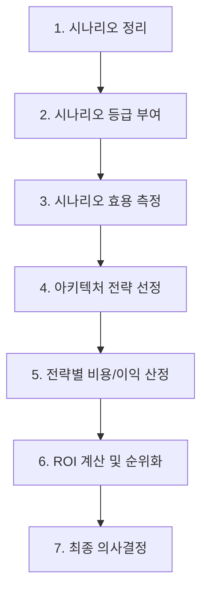

Parent: [[065.ATAM]]

# CBAM(Cost Benefit Analysis Method)

> [!info] **CBAM이란?**
> 아키텍처 전략에 따른 **비용(Cost)**, **이익(Benefit)**, **위험(Risk)**을 분석하여 경제적 가치가 가장 높은 아키텍처 대안을 선택하도록 지원하는 의사결정 모델입니다. **ATAM의 후속 단계**로 주로 수행됩니다.

---

## 1. CBAM의 개요
### 가. CBAM의 정의
- 아키텍처 설계 결정이 비즈니스 수익에 미치는 경제적 영향을 정량적으로 분석하여 투입 비용 대비 효용이 가장 높은 전략을 선정하는 기법

### 나. 등장 배경 (Why)
- ATAM은 기술적/품질적 타당성은 분석하지만, '어떤 대안이 가장 경제적인가?'에 대한 답은 주지 못함
- 한정된 리소스(예산, 인력) 내에서 최대의 비즈니스 가치를 창출하기 위한 우선순위 결정 필요

---

## 2. CBAM의 프로세스 및 메커니즘 (What & How)
### 가. CBAM 수행 단계 (Mermaid)

### 나. 핵심 평가 지표

| 지표 | 의미 | 계산 방식/설명 |
| :--- | :--- | :--- |
| **이익 (Benefit)** | 해당 아키텍처 전략이 제공하는 가치 | 이해관계자가 부여한 점수의 합산 |
| **비용 (Cost)** | 전략 구현에 필요한 총 자원 | 인건비, 인프라 비용, 시간 등 |
| **효용 (Utility)** | 특정 품질 속성 수준에 따른 만족도 | 효용 곡선(Utility Curve) 활용 |
| **ROI** | 투자 대비 수익률 | (Total Benefit / Total Cost) |

---

## 3. ATAM과 CBAM의 관계 및 비교
### 가. ATAM과 CBAM의 연계 (Relationship)
- **ATAM**: "이 아키텍처가 기술적으로 가능한가? 리스크는 무엇인가?" (Technical Perspective)
- **CBAM**: "이 아키텍처에 투자할 가치가 있는가? 어떤 것이 가장 이득인가?" (Economic Perspective)

### 나. 두 방법론 비교 분석

| 비교 항목 | ATAM | CBAM |
| :--- | :--- | :--- |
| **주요 목적** | 품질 속성 간 Trade-off 및 리스크 식별 | 경제적 타당성 기반 아키텍처 전략 선정 |
| **평가 기준** | 품질 속성 시나리오 | 비용, 이익, ROI, 효용(Utility) |
| **수행 시점** | 아키텍처 설계 단계 | ATAM 이후 또는 전략적 선택 단계 |
| **핵심 도구** | 유틸리티 트리, 시나리오 매핑 | ROI 산정 모델, 효용 곡선 |

---

## 4. 기술사적 제언 및 실무 적용 방안
### 가. CBAM 적용 시 고려사항
1. **정량적 데이터 확보의 어려움**: 소프트웨어 이익이나 비용을 정확히 수치화하기 어려우므로, 전문가 델파이 기법 등을 통해 신뢰도 높은 추정치 도출이 필요함
2. **비즈니스 가치 우선순위**: 단순 비용 절감보다는 비즈니스의 지속 가능성과 사용자 만족도 증대라는 관점에서 이익(Benefit)을 정의해야 함

### 나. 기술사적 인사이트
- **Architecture as an Investment**: 아키텍처는 비용이 아니라 '투자'라는 인식이 필요함. CBAM은 기술적 결정이 비즈니스 성과로 어떻게 연결되는지를 보여주는 가교 역할을 수행함
- **클라우드 도입 의사결정**: On-premise 유지 vs Cloud 전환 아키텍처를 고민할 때, CBAM을 통해 인프라 비용과 민첩성(Agility) 향상에 따른 이익을 분석하여 최적의 경로를 선택할 수 있음

---

## Related Notes
- [[065.ATAM]]
- [[064.SW_아키텍처_평가]]
- [[068.품질_속성_시나리오]]
