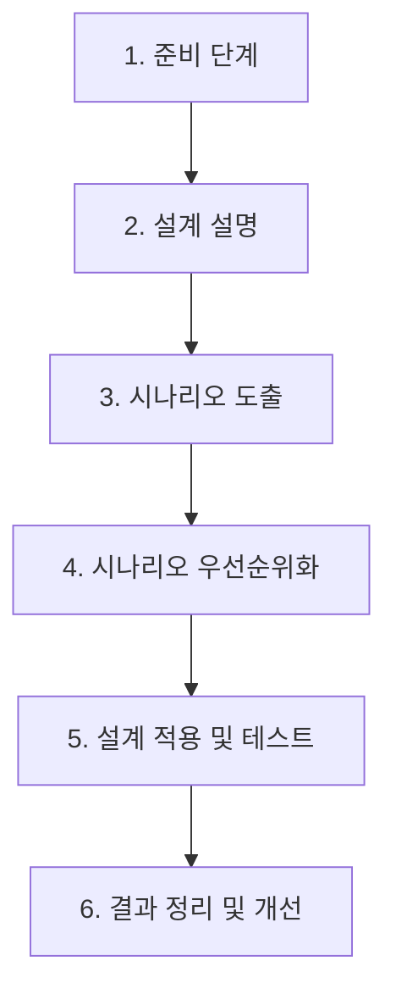

Parent: [[064.SW_아키텍처_평가]]

# ARID(Active Reviews for Intermediate Designs)

> [!info] **ARID란?**
> 아키텍처 설계의 **중간 단계(Intermediate Design)**에서 특정 컴포넌트나 부분적인 설계가 품질 요구사항과 인터페이스 명세를 제대로 충족하는지 **시나리오**를 통해 검증하는 활성 검토(Active Review) 기법입니다.

---

## 1. ARID의 개요
### 가. ARID의 정의
- 전체 아키텍처가 아닌 특정 부분(모듈, 컴포넌트)의 설계를 대상으로, 해당 설계를 사용할 개발자들이 직접 시나리오를 해결해 보게 함으로써 설계의 적합성과 사용성을 평가하는 기법

### 나. 등장 배경 및 필요성 (Why)
1. **부분적 검증**: 전체 아키텍처가 완성되기 전이라도 핵심 컴포넌트의 설계 오류를 조기 발견하기 위함
2. **개발자 관점 반영**: 아키텍처를 실제로 구현할 개발자들이 해당 설계를 이해하고 사용할 수 있는지(Usability) 확인 필요
3. **인터페이스 명확화**: 컴포넌트 간의 상호작용 및 API 정의의 타당성 검토

---

## 2. ARID의 프로세스 및 방법론 (What & How)
### 가. ARID 수행 단계 (Mermaid)

### 나. 주요 활동 및 역할

| 활동 | 상세 내용 | 비고 |
| :--- | :--- | :--- |
| **설계 설명** | 아키텍트가 검토 대상인 부분 설계를 설명 | 코드 수준이 아닌 추상화된 모델 중심 |
| **시나리오 도출** | 해당 설계를 통해 해결해야 할 구체적인 작업(Task) 정의 | 예: 특정 API를 호출하여 데이터를 조회하는 시나리오 |
| **설계 적용(Test)** | 검토자(개발자)들이 설계를 사용하여 시나리오를 해결할 수 있는지 시뮬레이션 | 아키텍트의 도움 없이 개발자 스스로 수행 |

---

## 3. ARID와 타 평가 방법론 비교
### 가. ATAM vs ARID 비교 분석

| 비교 항목 | ATAM | ARID |
| :--- | :---: | :---: |
| **평가 시점** | 아키텍처 설계 완료 단계 | 아키텍처 설계 중간 단계 (부분 설계) |
| **평가 대상** | 시스템 전체 아키텍처 구조 | 특정 컴포넌트, 서비스, 모듈 설계 |
| **주요 목적** | 품질 속성 간 Trade-off 분석 | 설계의 사용성 및 구현 가능성 검증 |
| **참여자** | 모든 주요 이해관계자 | 주로 설계를 사용할 구현 개발자 |

---

## 4. 기술사적 제언 및 실무 적용 방안
### 가. ARID의 실무적 효용성
- **API 디자인 검토**: 마이크로서비스 환경에서 서비스 간 API 명세가 확정되기 전, ARID를 통해 연동 개발자가 해당 API로 요구사항을 처리할 수 있는지 미리 검증 가능함
- **기술 부채 예방**: 설계 오류가 코드로 옮겨지기 전에 발견하므로 재작업(Rework) 비용을 획기적으로 줄일 수 있음

### 나. 기술사적 인사이트
- **Active Review의 의미**: 단순히 문서를 읽고 피드백을 주는 'Passive Review'와 달리, 검토자가 설계를 '직접 사용하여' 문제를 해결해 보는 과정에서 설계의 깊은 결함이 발견됨
- **Agile 환경과의 조화**: 대규모 ATAM이 부담스러운 애자일 프로젝트에서는 스프린트 중간중간 핵심 모듈에 대해 ARID를 수행함으로써 아키텍처의 정합성을 지속적으로 유지할 수 있음

---

## Related Notes
- [[064.SW_아키텍처_평가]]
- [[065.ATAM]]
- [[068.품질_속성_시나리오]]
