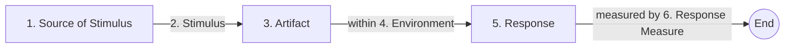

Parent: [[062.소프트웨어_아키텍처(Software_Architecture)]]

# 품질 속성 시나리오(Quality Attribute Scenario)

> [!info] **품질 속성 시나리오란?**
> 시스템의 품질 요구사항(성능, 가용성, 수정 용이성 등)을 모호한 단어가 아닌, 구체적인 상황과 그에 대한 시스템의 반응으로 기술하여 **측정 가능(Measurable)**하고 **검증 가능(Verifiable)**하게 표현하는 방법입니다.

---

## 1. 품질 속성 시나리오의 개요
### 가. 시나리오의 정의
- 특정 자극(Stimulus)이 발생했을 때 시스템이 어떻게 반응(Response)해야 하는지를 명시한 구체적인 사례

### 나. 필요성 (Why)
1. **모호성 제거**: "성능이 좋아야 함" → "사용자 1,000명 동시 접속 시 응답 시간 2초 이내"로 구체화
2. **평가의 기준**: ATAM, CBAM 등 아키텍처 평가 시 객관적인 검증 기준으로 활용
3. **설계 목표 제시**: 아키텍트에게 달성해야 할 구체적인 기술적 목표 제공
4. **추적성 확보**: 요구사항에서 아키텍처 설계, 테스트 케이스까지의 일관된 연결 고리 역할

---

## 2. 품질 속성 시나리오의 6가지 구성 요소 (What & How)
### 가. 시나리오 구조도 (Mermaid)

### 나. 구성 요소별 상세 설명

| 번호 | 구성 요소 | 설명 | 예시 (성능 관점) |
| :--- | :--- | :--- | :--- |
| **1** | **자극원 (Source)** | 자극을 생성하는 주체 | 외부 사용자, 관리 시스템, 해커 |
| **2** | **자극 (Stimulus)** | 시스템에 도착한 이벤트나 조건 | HTTP 요청 발송, 비정상 패킷 유입 |
| **3** | **대상 (Artifact)** | 자극의 영향을 받는 시스템 부위 | 전체 시스템, 특정 DB, API 서버 |
| **4** | **환경 (Environment)** | 자극 발생 시의 시스템 상태 | 정상 운영 중, 과부하 상태, 장애 복구 중 |
| **5** | **응답 (Response)** | 자극에 대한 시스템의 동작 | 결과 리턴, 오류 로그 기록, 트래픽 차단 |
| **6** | **응답 측정 (Measure)** | 응답에 대한 정량적 측정 기준 | 응답 시간 1초 이내, 가동률 99.9% |

---

## 3. 주요 품질 속성별 시나리오 예시
### 가. 가용성(Availability) 시나리오
- **상황**: "운영 중(환경) 외부 시스템의 통신 장애(자극)가 발생했을 때, 시스템은 1분 이내에 백업 경로로 전환(응답)하여 서비스를 무중단 유지해야 함(측정)"

### 나. 수정 용이성(Modifiability) 시나리오
- **상황**: "개발자가(자극원) 새로운 결제 수단을 추가(자극)할 때, 기존 코드의 변경 없이 설정 파일 수정만으로(응답) 1일 이내에 적용 가능해야 함(측정)"

---

## 4. 기술사적 제언 및 실무 적용 방안
### 가. 유틸리티 트리(Utility Tree)와의 연계
- 도출된 수많은 시나리오를 **중요도(Business Value)**와 **난이도(Technical Risk)**를 기준으로 우선순위화하여 '유틸리티 트리'를 구성함으로써 핵심 아키텍처 결정에 집중해야 함

### 나. 기술사적 인사이트
- **SMART 원칙의 적용**: 시나리오는 구체적(Specific), 측정 가능(Measurable), 달성 가능(Achievable), 관련성(Relevant), 시간 제한(Time-bound)이 있어야 함
- **테스트 케이스의 기초**: 잘 작성된 품질 속성 시나리오는 그대로 인수 테스트(Acceptance Test)의 시나리오가 되어, 설계와 검증의 간극을 메우는 핵심 자산이 됨

---

## Related Notes
- [[064.SW_아키텍처_평가]]
- [[065.ATAM]]
- [[062.소프트웨어_아키텍처(Software_Architecture)]]
