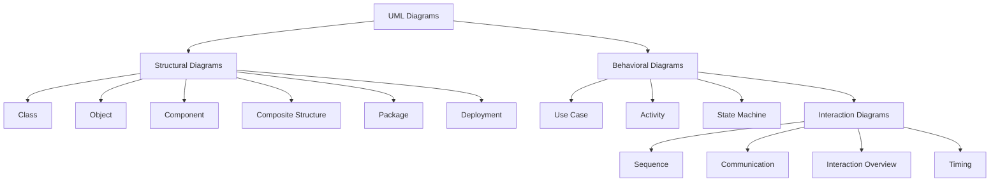

Parent: [[031.객체지향_개발방법론]]

# UML 및 UML 2.x

> [!info] **UML(Unified Modeling Language)이란?**
> 소프트웨어 집약적인 시스템의 산출물을 가시화, 명세화, 구축, 문서화하기 위한 **표준 객체지향 모델링 언어**입니다. UML 2.x는 복잡한 시스템 설계와 모델 기반 개발(MDA)을 지원하기 위해 구조와 시맨틱을 대폭 강화한 최신 표준입니다.

---

## 1. UML의 개요 및 진화
### 가. UML의 정의
- 객체지향 분석 및 설계를 위한 산업 표준 모델링 언어로, 그래픽 기법을 사용하여 시스템의 정적 구조와 동적 행위를 표현

### 나. UML 2.x 등장 배경 (Why)
1. **복잡도 증가 대응**: 대규모 분산 시스템 및 임베디드 시스템의 정교한 모델링 필요성 대두
2. **MDA(Model Driven Architecture) 지원**: 모델 간의 자동 변환 및 코드 생성을 위한 엄격한 메타모델 정의 필요
3. **컴포넌트 기반 개발(CBD)**: 컴포넌트 내부 구조와 포트(Port), 커넥터(Connector) 표현 강화 필요

---

## 2. UML 2.x의 다이어그램 분류 (What & How)
### 가. UML 다이어그램 체계도 (Mermaid)

### 나. 주요 다이어그램별 역할

| 분류 | 다이어그램 명칭 | 핵심 설명 |
| :--- | :--- | :--- |
| **구조 (Structural)** | **Class** | 시스템의 정적 구조와 클래스 간의 관계 정의 |
| | **Component** | 물리적인 구현 단위인 컴포넌트 간의 관계 및 의존성 |
| | **Deployment** | 노드와 아티팩트 간의 물리적 배치 구조 |
| **행위 (Behavioral)** | **Use Case** | 사용자 관점에서의 시스템 기능 및 범위 정의 |
| | **Sequence** | 객체 간의 시간 순서에 따른 메시지 흐름 표현 |
| | **Activity** | 시스템 내부의 로직이나 프로세스의 작업 흐름 표현 |

---

## 3. UML 2.x의 주요 특징 및 변경 사항
### 가. UML 1.x 대비 UML 2.x의 주요 변화

| 구분 | UML 1.x | UML 2.x |
| :--- | :--- | :--- |
| **다이어그램 수** | 9개 | 13~14개 (버전에 따라 상이) |
| **메타모델 구조** | 평면적 구조 | Infrastructure/Superstructure 계층화 |
| **컴포넌트 모델링** | 단순한 박스 형태 | 포트(Port), 인터페이스, 커넥터 상세 명세 가능 |
| **행위 표현력** | 단순 메시지 흐름 | 루프(Loop), 조건문(Alt) 등 제어 구조 강화 |
| **새로운 다이어그램** | - | Composite Structure, Timing, Interaction Overview 등 추가 |

### 나. UML 2.x의 핵심 메커니즘
1. **캡슐화된 클래스(Encapsulated Classifier)**: 포트와 커넥터를 통해 컴포넌트 내부 구조를 은닉하고 외부와 통신
2. **시퀀스 다이어그램 강화**: 'Interaction Fragments' 도입으로 루프, 분기 등 복잡한 로직을 시각화
3. **프로파일(Profile) 확장**: 특정 도메인(예: 임베디드, 실시간 시스템)에 맞게 UML 요소를 확장 가능

---

## 4. 기술사적 제언 및 실무 적용 방안
### 가. UML 모델링 시 유의사항
1. **모델의 적정 수준 유지**: 모든 것을 UML로 그리려 하기보다, 시스템의 핵심 로직과 구조를 설명하기 위한 목적으로 **Selective Modeling** 수행
2. **일관성(Consistency) 확보**: Use Case에서 도출된 기능이 Sequence와 Class 다이어그램에 일관되게 반영되도록 **Horizontal Traceability** 관리

### 나. 기술사적 인사이트 및 향후 전망
- **Low-Code/No-Code와의 연계**: UML 기반의 모델링 지식은 시각적 개발 환경(Low-Code)에서 비즈니스 로직을 설계하는 기초 역량이 됨
- **AI-Assisted Modeling**: 자연어 요구사항을 UML 다이어그램으로 자동 생성하거나, 다이어그램 간의 모순을 AI가 탐지하는 방향으로 발전 중
- 결론적으로 UML은 단순한 '그림'이 아니라, **복잡한 비즈니스 지식을 소프트웨어 구조로 변환하는 설계 언어**임을 명심해야 함

---

## Related Notes
- [[031.객체지향_개발방법론]]
- [[070.UML_관계(Relationship)]]
- [[055.요구공학(Requirements_Engineering)]]
