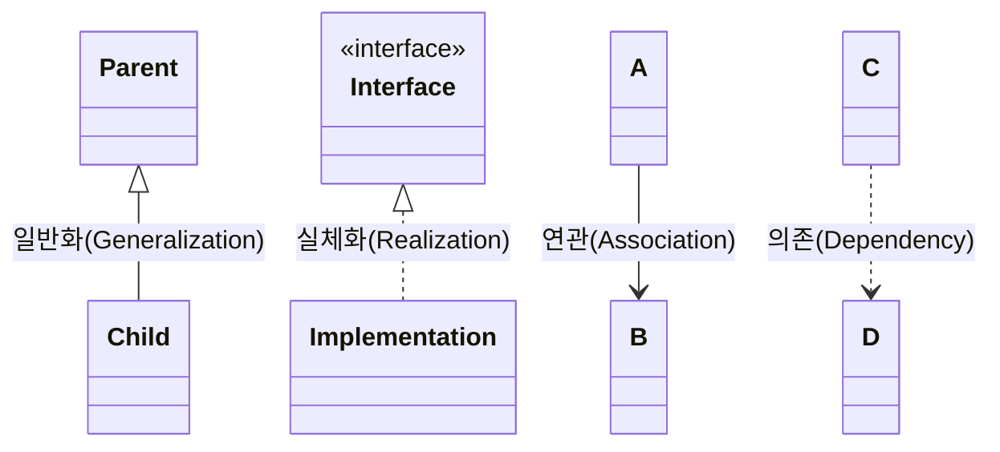

Parent: [[069.UML_및_UML2.x]]

# UML 관계(Relationship)

> [!info] **UML 관계란?**
> 모델 요소(클래스, 객체, 컴포넌트 등)들 사이에 존재하는 의미 있는 연결을 의미합니다. 시스템의 정적인 구조와 동적인 상호작용을 정의하며, 객체지향 설계의 핵심인 **응집도(Cohesion)**와 **결합도(Coupling)**를 결정하는 핵심 요소입니다.

---

## 1. UML 관계의 개요
### 가. UML 관계의 정의
- 클래스나 객체 간의 논리적, 물리적인 연결을 나타내는 메커니즘

### 나. 관계 설정의 중요성 (Why)
1. **구조 명확화**: 객체 간의 책임과 역할 분담을 시각적으로 정의
2. **재사용성 향상**: 상속(일반화) 및 인터페이스(실체화)를 통한 다형성 구현
3. **변경 영향 분석**: 의존성 파악을 통해 시스템 변경 시 영향 범위를 사전에 예측

---

## 2. 주요 UML 관계의 유형 및 표기법 (What & How)
### 가. 관계의 종류 및 시각화 (Mermaid)

### 나. 관계별 세부 특징 및 표기법

| 관계 유형 | 설명 | 표기법 (화살표) | 코드 매핑 예시 |
| :--- | :--- | :--- | :--- |
| **일반화 (Generalization)** | 상위 클래스와 하위 클래스 간의 상속 관계 (IS-A) | 실선 + 빈 삼각형 | `extends` |
| **실체화 (Realization)** | 인터페이스를 실제 기능으로 구현하는 관계 | 점선 + 빈 삼각형 | `implements` |
| **의존 (Dependency)** | 한 클래스가 다른 클래스를 일시적으로 사용하는 관계 | 점선 + 화살표 | 파라미터, 지역변수 사용 |
| **연관 (Association)** | 객체 간의 지속적인 연결 관계 (Has-A) | 실선 + 화살표 | 멤버 변수(Field)로 보유 |

---

## 3. 심화 관계: 집합과 합성과 다중성
### 가. 집합(Aggregation) vs 합성(Composition) 비교 분석

| 구분 | 집합 (Aggregation) | 합성 (Composition) |
| :--- | :--- | :--- |
| **정의** | 전체와 부분의 관계 (느슨한 결합) | 전체와 부분의 강한 생명주기 공유 |
| **생명주기** | 독립적 (전체 소멸 시 부분 유지 가능) | 종속적 (전체 소멸 시 부분도 소멸) |
| **표기법** | 실선 + 빈 마름모 | 실선 + 채워진 마름모 |
| **예시** | 동아리-학생, 컴퓨터-마우스 | 집-방, 사람-심장 |

### 나. 다중성(Multiplicity) 및 방향성(Navigability)
- **다중성**: `1`, `0..1`, `1..*`, `*` 등을 통해 객체 간 참여 개수 표현
- **방향성**: 화살표의 유무를 통해 메시지 송수신 방향(참조 가능성)을 정의

---

## 4. 기술사적 제언 및 실무 적용 방안
### 가. 설계 시 관계 설정 원칙
1. **상속보다는 구성(Composition over Inheritance)**: 상속은 결합도가 매우 높으므로, 유연한 설계를 위해 가급적 합성이나 인터페이스 기반의 연관 관계를 우선 고려해야 함
2. **의존성 역전 원칙(DIP) 적용**: 구체적인 클래스에 의존(Dependency)하기보다 인터페이스(Realization)에 의존하게 하여 시스템의 확정성을 높여야 함

### 나. 기술사적 인사이트
- **순환 참조(Circular Dependency) 방지**: 클래스 간 서로를 참조하는 구조는 유지보수와 테스트를 어렵게 하므로, 중재자(Mediator) 패턴 등을 통해 단방향으로 관계를 정돈해야 함
- **추적성(Traceability) 관리**: 분석 단계의 Use Case 관계가 설계 단계의 Class 관계 및 구현 코드로 어떻게 변환되는지 추적 관리함으로써 설계 품질을 보증해야 함

---

## Related Notes
- [[069.UML_및_UML2.x]]
- [[041.객체지향_설계_원칙(SOLID)]]
- [[046.디자인_패턴(Design_Pattern)]]
