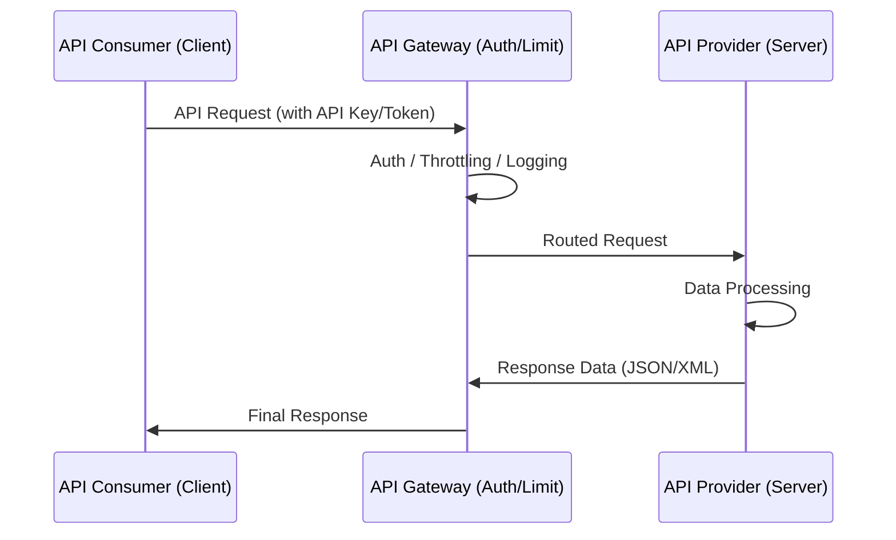

Parent: [[014.API_게이트웨이(API_Gateway)]]

# API 및 Open API

> [!info] **API(Application Programming Interface)란?**
> 응용 프로그램에서 사용할 수 있도록 운영체제나 프로그래밍 언어가 제공하는 기능을 제어할 수 있게 만든 인터페이스입니다. **Open API**는 기업이나 기관이 보유한 데이터를 외부 개발자가 자유롭게 활용할 수 있도록 공개한 인터페이스를 의미합니다.

---

## 1. API 및 Open API의 개요
### 가. API의 정의
- 프로그램 간의 데이터 통신 및 기능 호출을 위한 규격이자 상호작용의 매개체

### 나. Open API의 등장 배경 및 필요성 (Why)
1. **에코시스템 확장**: 자사 서비스를 플랫폼화하여 외부 개발자 참여 유도 및 가치 증대
2. **데이터 민주화**: 공공데이터나 기업의 데이터를 공유하여 새로운 비즈니스 모델 창출
3. **개발 효율성**: 이미 구현된 기능(지도, 결제, 인증 등)을 호출하여 개발 기간 단축
4. **상호운용성**: 서로 다른 시스템 간의 표준화된 연결 방식 제공

---

## 2. API의 아키텍처 및 유형 (What & How)
### 가. API 호출 메커니즘 (Mermaid)

### 나. Open API의 주요 구성 요소

| 요소 | 설명 | 비고 |
| :--- | :--- | :--- |
| **Endpoint** | API가 서버에서 자원에 접근할 수 있는 URL | 예: `/v1/users` |
| **Method** | 자원에 수행할 작업의 종류 | GET, POST, PUT, DELETE 등 |
| **API Key / Token** | 호출자의 신원을 확인하고 사용량을 제어하는 인증 수단 | OAuth 2.0, JWT 등 |
| **Documentation** | API 사용 방법, 매개변수, 응답 형식을 정의한 문서 | Swagger, OpenAPI Spec |

---

## 3. API 보안 및 관리 기술
### 가. API 보안 위협 및 대응 방안
- **인증/인가 (Auth)**: **OAuth 2.0**을 통한 권한 위임 및 **JWT** 기반의 무상태(Stateless) 인증
- **트래픽 제어 (Throttling)**: **Rate Limiting**을 적용하여 특정 호출자의 과도한 요청 차단 (DoS 방지)
- **입력값 검증**: SQL Injection, XSS 공격 방지를 위한 파라미터 유효성 검사

### 나. OpenAPI Specification (OAS)
- RESTful API의 설계를 기술하기 위한 표준 규격 (구 Swagger)
- 기계 가독형(JSON/YAML)으로 작성되어 API 문서 자동화 및 클라이언트 코드 생성이 용이함

---

## 4. 기술사적 제언 및 실무 적용 방안
### 가. API 거버넌스 수립
1. **표준화**: 전사적으로 통일된 명명 규칙(Naming Convention)과 에러 코드 체계 수립 필요
2. **생명주기 관리**: API의 설계, 개발, 배포, 폐기(Deprecation) 과정을 관리하여 파급 효과 최소화

### 나. 기술사적 인사이트
- **API First Design**: 구현 전 API 설계를 우선하여 협업 효율을 극대화하고, 모킹(Mocking)을 통한 병렬 개발 환경 구축이 핵심임
- **마이데이터(MyData) 시대**: 금융, 공공 등 다양한 분야에서 Open API를 통한 데이터 결합이 가속화되고 있어, **보안(Privacy)**과 **성능(Scalability)**이 차별화된 경쟁력이 될 것임

---

## Related Notes
- [[072.SOAP(Simple_Object_Access_Protocol)]]
- [[073.RESTful_API]]
- [[074.GraphQL]]
- [[014.API_게이트웨이(API_Gateway)]]
