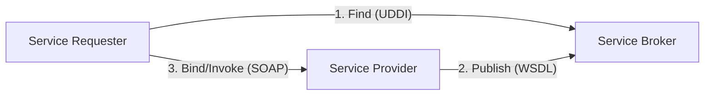

Parent: [[071.API_및_Open_API]]

# SOAP(Simple Object Access Protocol)

> [!info] **SOAP이란?**
> 웹 서비스에서 정보 교환을 위해 **XML**을 기본 포맷으로 사용하는 메시지 프로토콜입니다. HTTP, SMTP 등을 통해 전달되며, 분산 환경에서 객체 간의 호출(RPC)을 원활하게 하기 위해 설계된 강력한 규약입니다.

---

## 1. SOAP의 개요
### 가. SOAP의 정의
- 구조화된 정보를 교환하기 위한 XML 기반의 가벼운 프로토콜로, 플랫폼과 언어에 독립적인 웹 서비스 구현 기술

### 나. 등장 배경 및 특징 (Why)
1. **이질적 환경 통합**: 서로 다른 OS 및 프로그래밍 언어 간의 원격 프로시저 호출(RPC) 필요성
2. **신뢰성 및 보안**: 기업용 시스템(Enterprise)에서 요구되는 강력한 보안(WS-Security)과 트랜잭션 보장
3. **표준화**: WSDL, UDDI와 함께 웹 서비스의 3대 핵심 표준으로 자리매김

---

## 2. SOAP 아키텍처 및 메시지 구조 (What & How)
### 가. SOAP 웹 서비스 에코시스템 (Mermaid)

### 나. SOAP 메시지 구조

| 구성 요소 | 설명 | 비고 |
| :--- | :--- | :--- |
| **Envelope** | XML 문서의 시작과 끝을 정의하며, 전체 메시지의 루트 요소 | 필수 |
| **Header** | 인증 정보, 트랜잭션 관리 등 부가적인 제어 정보 포함 | 선택 |
| **Body** | 실제 호출할 메서드 이름과 매개변수 등 핵심 데이터 포함 | 필수 |
| **Fault** | 메시지 처리 중 발생한 오류 정보를 담는 요소 | 오류 발생 시 |

---

## 3. SOAP 관련 핵심 기술 및 비교
### 가. SOAP 3대 표준 기술
- **WSDL (Web Services Description Language)**: 웹 서비스의 상세 기능(인터페이스)을 설명하는 XML 문서
- **UDDI (Universal Description, Discovery, and Integration)**: 웹 서비스를 등록하고 검색하는 저장소(Directory)
- **SOAP**: 실제로 메시지를 주고받는 전송 규약

### 나. SOAP vs REST 비교 분석

| 비교 항목 | SOAP | REST |
| :--- | :--- | :--- |
| **프로토콜 종류** | 프로토콜 (Strict) | 아키텍처 스타일 (Flexible) |
| **데이터 포맷** | XML 전용 | JSON, XML, Text 등 다양함 |
| **상태 관리** | Stateful 지원 가능 | Stateless 지향 |
| **보안** | WS-Security (매우 강력) | HTTPS (전송 계층 보안) |
| **성능** | 메시지가 무겁고 오버헤드 큼 | 가볍고 빠름 |

---

## 4. 기술사적 제언 및 실무 적용 방안
### 가. SOAP의 활용 분야
- **금융 및 엔터프라이즈**: 데이터 정합성과 보안이 극도로 중요한 뱅킹 시스템, 전사적 자원 관리(ERP) 간 연동
- **Legacy 시스템**: 이미 구축된 대규모 SOA(Service Oriented Architecture) 환경 유지보수

### 나. 기술사적 인사이트
- **REST의 득세와 SOAP의 입지**: 웹 서비스의 주류가 REST로 넘어갔음에도 불구하고, SOAP은 **강력한 규약(Contract)**과 **자동화된 툴링 지원** 덕분에 복잡한 비즈니스 로직 연동 시 여전히 유효함
- **상호운용성(Interoperability)**: 표준 규약을 철저히 준수하므로, 서로 다른 벤더의 솔루션을 통합할 때 REST보다 모호성이 적다는 장점이 있음

---

## Related Notes
- [[073.RESTful_API]]
- [[071.API_및_Open_API]]
