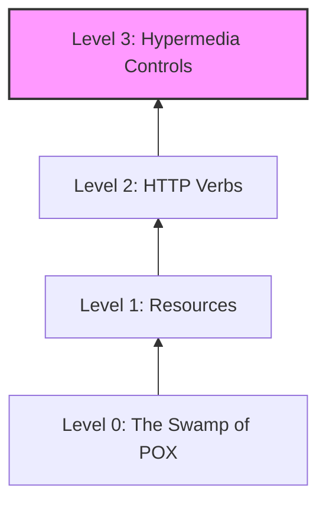

Parent: [[071.API_및_Open_API]]

# RESTful API

> [!info] **REST(Representational State Transfer)란?**
> 웹의 장점을 최대한 활용하기 위해 제안된 소프트웨어 아키텍처 스타일입니다. **자원(Resource)**을 이름으로 구분하여 해당 자원의 **상태(State)**를 주고받는 방식을 의미하며, HTTP 표준을 그대로 따르는 것이 핵심입니다.

---

## 1. RESTful API의 개요
### 가. REST의 정의
- HTTP URI를 통해 자원을 명시하고, HTTP Method(GET, POST, PUT, DELETE)를 통해 해당 자원에 대한 CRUD 연산을 수행하는 방식

### 나. REST의 6가지 설계 원칙 (Constraints)
1. **Client-Server**: 관심사의 분리를 통해 클라이언트와 서버의 독립적 진화 지원
2. **Stateless (무상태성)**: 각 요청은 서버에 필요한 모든 정보를 포함해야 하며, 서버는 세션 상태를 저장하지 않음
3. **Cacheable (캐시 가능성)**: HTTP 표준 캐싱 기능을 활용하여 성능 향상
4. **Uniform Interface (일관된 인터페이스)**: 자원 식별, 메시지를 통한 자원 조작 등 일관된 접근 방식 (가장 중요)
5. **Layered System (계층화 시스템)**: 게이트웨이, 로드밸런서 등 중간 매개체를 통한 계층 구조 지원
6. **Code on Demand (Option)**: 서버에서 실행 가능한 코드를 클라이언트로 전송

---

## 2. REST의 구성 요소 및 설계 가이드 (What & How)
### 가. REST의 3요소 (Concept)

| 요소 | 설명 | 비고 |
| :--- | :--- | :--- |
| **Resource (자원)** | 모든 자원은 고유한 **URI**로 식별됨 | `/users/123` |
| **Verb (행위)** | HTTP **Method**를 통해 행위 정의 | GET, POST, PUT, DELETE |
| **Representation (표현)** | 자원의 상태를 특정 포맷으로 전송 | JSON, XML (주로 JSON 사용) |

### 나. REST API 설계 규칙 (Best Practice)
- **명사 사용**: URI는 행위(Verb)가 아닌 명사(Noun)를 사용 (예: `/delete-user` (X) → `DELETE /users/1` (O))
- **소문자 사용**: 가독성을 위해 URI에는 소문자만 사용하고 하이픈(`-`)을 사용하여 가독성 높임
- **복수형 권장**: 일관성을 위해 컬렉션은 복수형 사용 (예: `/users`)

---

## 3. Richardson 성숙도 모델 (RMM) 및 HATEOAS
### 가. REST 성숙도 모델 (Mermaid)

| 레벨 | 핵심 개념 | 상세 설명 |
| :--- | :--- | :--- |
| **Level 0** | HTTP 전송로 사용 | 하나의 엔드포인트에서 모든 요청 처리 (SOAP 스타일) |
| **Level 1** | 자원(Resource) 도입 | 개별 자원마다 고유 URI 부여 |
| **Level 2** | HTTP Method 도입 | GET, POST 등 표준 메서드 활용 및 상태 코드 응답 |
| **Level 3** | **HATEOAS** | 응답 메시지에 다음 행위를 위한 링크 정보 포함 (진정한 REST) |

---

## 4. 기술사적 제언 및 실무 적용 방안
### 가. RESTful API의 한계와 극복
- **Over-fetching / Under-fetching**: 필요 이상의 데이터를 받거나, 데이터가 부족해 여러 번 호출하는 문제 발생 → 이를 해결하기 위해 **GraphQL** 등장
- **실시간 통신**: REST는 Request-Response 구조이므로 실시간성 부족 → **WebSocket**이나 **gRPC**와 병행 사용

### 나. 기술사적 인사이트
- **Self-descriptive Message**: REST의 본질은 메시지만 보고도 내용을 이해할 수 있어야 함. 이를 위해 적절한 **Media Type** 정의와 문서화가 필수임
- **MSA의 근간**: 서비스 간 느슨한 결합(Loose Coupling)을 실현하는 핵심 기술이며, API 게이트웨이와의 조합을 통해 보안과 모니터링 체계를 구축해야 함

---

## Related Notes
- [[071.API_및_Open_API]]
- [[074.GraphQL]]
- [[014.API_게이트웨이(API_Gateway)]]
