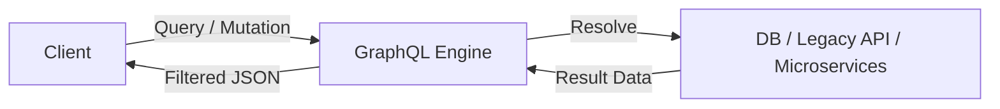

Parent: [[071.API_및_Open_API]]

# GraphQL

> [!info] **GraphQL이란?**
> 페이스북에서 개발한 **API를 위한 쿼리 언어**이자, 해당 쿼리를 실행하기 위한 서버 측 런타임입니다. 클라이언트가 필요한 데이터의 구조를 직접 정의하여 요청할 수 있어, REST의 고질적인 문제인 Over-fetching과 Under-fetching을 해결합니다.

---

## 1. GraphQL의 개요
### 가. GraphQL의 정의
- 클라이언트가 필요한 데이터만 정확히 요청할 수 있도록 하는 강력한 데이터 질의 언어 및 런타임

### 나. 등장 배경 및 필요성 (Why)
1. **REST의 비효율성 해결**: 불필요한 필드까지 받는 **Over-fetching**과 여러 번 호출해야 하는 **Under-fetching** 해결
2. **모바일 환경 최적화**: 네트워크 대역폭이 제한적인 환경에서 필요한 데이터만 최소한으로 전송
3. **유연한 프론트엔드 개발**: 서버 측 API 수정 없이 클라이언트 요구에 맞는 데이터 구조 변경 가능

---

## 2. GraphQL의 아키텍처 및 핵심 요소 (What & How)
### 가. GraphQL 작동 메커니즘 (Mermaid)

### 나. 주요 구성 요소

| 요소 | 설명 | 비고 |
| :--- | :--- | :--- |
| **Schema** | API에서 사용할 수 있는 데이터 타입과 관계 정의 | 강한 타입 시스템 |
| **Query** | 데이터를 읽기 위한 요청 (R) | REST의 GET에 해당 |
| **Mutation** | 데이터를 변경하기 위한 요청 (C, U, D) | REST의 POST, PUT, DELETE |
| **Resolver** | 특정 필드에 대한 데이터를 가져오는 실질적인 처리 로직 | 데이터 소스 연결 |
| **Subscription** | 실시간 데이터 업데이트를 위한 구독 기능 | WebSocket 기반 |

---

## 3. GraphQL vs REST 비교 분석
### 가. 비교 분석표

| 비교 항목 | REST | GraphQL |
| :--- | :--- | :--- |
| **엔드포인트** | 자원별 다수의 URL | 단일 엔드포인트 (`/graphql`) |
| **데이터 구조** | 서버가 결정 (Fixed) | 클라이언트가 결정 (Flexible) |
| **데이터 크기** | Over-fetching 발생 가능 | 필요한 데이터만 수신 (Minimal) |
| **버전 관리** | URI 버저닝 필요 (`/v1`, `/v2`) | 필드 추가/삭제로 버전 관리 불필요 |
| **학습 곡선** | 낮음 (HTTP 표준) | 높음 (스키마, 타입 설계 필요) |

---

## 4. 기술사적 제언 및 실무 적용 방안
### 가. GraphQL 도입 시 고려사항
1. **보안 리스크**: 복잡한 중첩 쿼리로 인한 서버 부하(DoS) 위험 → **Query Depth Limit**이나 **Cost Analysis** 적용 필요
2. **캐싱 전략**: HTTP 캐싱(Level 2)을 사용하기 어려움 → **Apollo Client** 등 클라이언트 측 캐시 라이브러리 활용
3. **N+1 문제**: 연관 데이터 조회 시 성능 저하 발생 → **DataLoader**를 통한 배치(Batch) 처리 필수

### 나. 기술사적 인사이트
- **BFF(Backend for Frontend)**: 다양한 프론트엔드 요구사항을 단일 GraphQL 서버로 통합하여 개발 생산성을 극대화할 수 있음
- **Federation**: 여러 마이크로서비스의 GraphQL 스키마를 하나로 통합하는 **Apollo Federation** 기술을 통해 분산 환경에서도 단일 API 진입점 제공 가능
- 결론적으로 GraphQL은 클라이언트 주도권(Client-driven)을 강조하는 최신 API 트렌드이며, 데이터 관계가 복잡한 서비스에서 큰 위력을 발휘함

---

## Related Notes
- [[073.RESTful_API]]
- [[071.API_및_Open_API]]
- [[009.Microservices_Architecture]]
