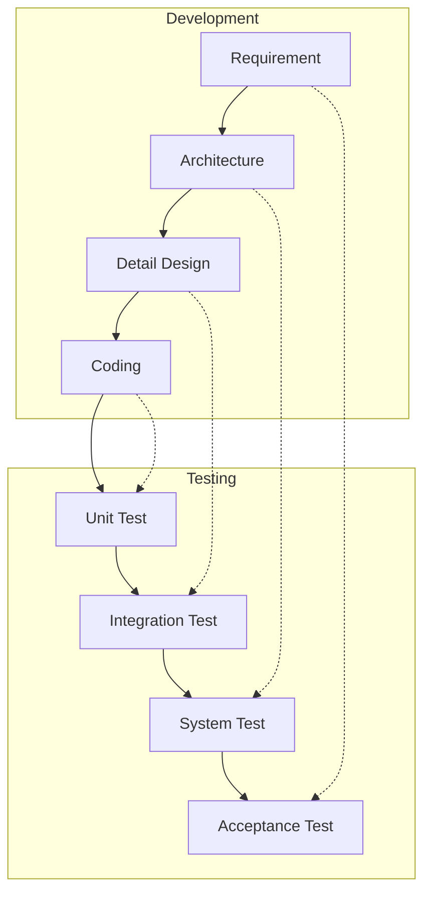

Parent: [[054.테스트_주도_개발(TDD)]]

# 소프트웨어 테스트 일반

> [!info] **소프트웨어 테스트란?**
> 노출되지 않은 결함을 찾기 위해 소프트웨어를 실행하여 요구사항과 일치하는지 확인하고, 설계된 대로 동작하는지 검증(Verification) 및 확인(Validation)하는 활동입니다. 국제 표준인 **ISO/IEC/IEEE 29119**에서 테스트 프로세스와 산출물을 정의하고 있습니다.

---

## 1. 소프트웨어 테스트의 개요
### 가. 테스트의 정의 및 목적
- **정의**: 소프트웨어의 결함을 식별하고 품질을 평가하기 위해 프로그램을 실행하는 과정
- **목적**: 결함 발견, 품질 수준 평가, 의사결정 지원, 결함 예방

### 나. 테스트의 필요성 (Why)
1. **신뢰성 확보**: 잠재적 결함을 제거하여 시스템의 안정적인 운영 보장
2. **비용 절감**: 개발 초기 단계에서 결함을 발견하여 수정 비용(Rework Cost) 최소화
3. **리스크 완화**: 배포 후 발생할 수 있는 치명적 장애 리스크를 사전에 식별 및 통제
4. **품질 보증**: 요구사항 충족 여부를 객관적으로 입증하여 사용자 만족도 제고

---

## 2. 테스트의 핵심 메커니즘: V-모델 (What & How)
### 가. 개발 단계와 테스트 단계의 매핑 (Mermaid)

### 나. 검증(Verification) vs 확인(Validation) 비교

| 구분 | 검증 (Verification) | 확인 (Validation) |
| :--- | :--- | :--- |
| **관점** | 개발자 관점 (Are we building the product right?) | 사용자 관점 (Are we building the right product?) |
| **목표** | 명세서(Spec)대로 설계 및 구현되었는가? | 사용자의 요구사항을 충족하는가? |
| **활동** | 리뷰, 인스펙션, 워크스루, 단위 테스트 | 시스템 테스트, 인수 테스트 |
| **산출물** | 설계도, 소스 코드 등 중간 산출물 | 최종 소프트웨어 제품 |

---

## 3. 테스트의 경제성 및 성숙도
### 가. 결함 수정 비용 곡선
- 개발 초기(요구분석)에 발견된 결함 대비 유지보수 단계에서 발견된 결함 수정 비용은 **기하급수적으로 증가**함 (Boehm의 법칙)

### 나. 테스트 성숙도 모델 (TMMi)
- **1단계(Initial)**: 혼란스럽고 비조직적인 테스트
- **2단계(Managed)**: 테스트 전략 및 계획 수립
- **3단계(Defined)**: 조직 차원의 표준 테스트 프로세스 정립
- **4단계(Measured)**: 테스트 활동의 정량적 측정 및 관리
- **5단계(Optimization)**: 지속적인 프로세스 개선 및 결함 예방

---

## 4. 기술사적 제언 및 실무 적용 방안
### 가. 테스팅 거버넌스 강화
- 테스트는 개발의 종속된 활동이 아니라 독립적인 **QA(Quality Assurance)** 조직에 의해 수행되어야 객관성을 유지할 수 있음

### 나. 기술사적 인사이트
- **Shift-Left Testing**: 테스트 활동을 개발 초기 단계로 전진 배치하여 품질을 조기에 확보하는 전략이 중요함
- **Test Automation**: 반복적인 회귀 테스트(Regression Test)는 자동화하고, 고부하/복잡 시나리오는 전문 테스터의 탐색적 테스팅을 병행하여 효율을 극대화해야 함

---

## Related Notes
- [[076.소프트웨어_테스트_7대_원리]]
- [[078.테스트_프로세스(Test_Process)]]
- [[082.SW_테스트_유형]]
