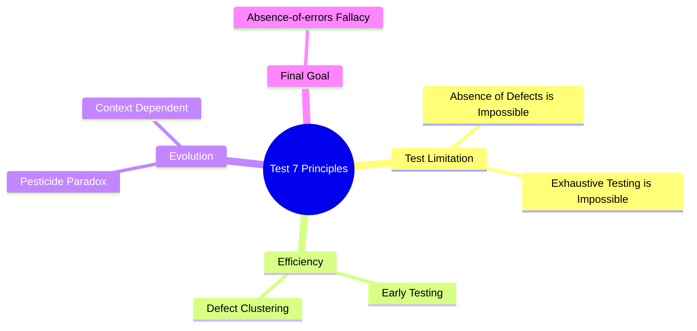

Parent: [[075.SW_테스트_일반]]

# 소프트웨어 테스트 7대 원리

> [!info] **테스트 7대 원리란?**
> 지난 수십 년간의 테스팅 경험을 바탕으로 정립된 **ISTQB**의 핵심 원칙입니다. 테스터가 가져야 할 사고방식과 테스트의 한계점을 명확히 정의하여 효과적인 테스트 전략 수립의 기초가 됩니다.

---

## 1. 테스트 7대 원리의 개요
### 가. 테스트 원리의 정의
- 소프트웨어 테스트를 수행함에 있어 반드시 인지하고 따라야 할 7가지 보편적인 법칙

### 나. 테스트 원리의 필요성 (Why)
1. **테스트 한계 인정**: 완벽한 테스트는 불가능함을 인지하고 효율적인 리소스 배분 유도
2. **전략적 접근**: 결함이 발생하기 쉬운 곳에 집중하여 테스트 효과성 극대화
3. **오류 방지**: 동일한 테스트 반복으로 인한 내성 발생(살충제 패러독스) 경계

---

## 2. 소프트웨어 테스트 7대 원리 상세 (What & How)
### 가. 7대 원리 요약표

| 번호 | 원리 (Principle) | 핵심 내용 |
| :--- | :--- | :--- |
| **1** | **테스팅은 결함이 있음을 보여주는 것** | 결함이 없음을 증명할 수는 없으며, 단지 결함이 있음을 보여줄 뿐임 |
| **2** | **완벽한 테스팅은 불가능** | 모든 입력값과 조건의 조합을 테스트하는 것은 현실적으로 불가능 (무한성) |
| **3** | **조기 테스팅 (Early Testing)** | 개발 초기에 테스트를 시작하여 결함 수정 비용을 최소화해야 함 |
| **4** | **결함 집중 (Defect Clustering)** | 대부분의 결함은 특정 소수의 모듈에 집중되어 발생함 (파레토 법칙) |
| **5** | **살충제 패러독스** | 동일한 테스트를 반복하면 더 이상 새로운 결함을 찾을 수 없음 (시나리오 개선 필요) |
| **6** | **테스팅은 정황에 의존** | 비즈니스 도메인(e-커머스 vs 의료기기)에 따라 테스트 방식과 수준이 달라야 함 |
| **7** | **오류-부재의 궤변** | 결함을 모두 제거해도 사용자의 요구를 충족하지 못하면 무용지물임 |

### 나. 원리 간의 상관관계 (Mermaid)

---

## 3. 주요 원리에 대한 심화 분석
### 가. 결함 집중 (Defect Clustering)
- **파레토 법칙(80/20 규칙)** 적용: 전체 결함의 80%는 20%의 핵심 모듈에서 발견됨
- **활용**: 리스크가 높은 모듈을 우선적으로 식별하여 테스트 자원을 집중 배치

### 나. 살충제 패러독스 (Pesticide Paradox)
- **현상**: 테스트 케이스가 고착화되면 새로운 유형의 결함 발견율이 저하됨
- **대응**: 정기적으로 테스트 케이스를 리뷰하고, **탐색적 테스팅(Exploratory Testing)**을 병행하여 시나리오를 다변화해야 함

---

## 4. 기술사적 제언 및 실무 적용 방안
### 가. 리스크 기반 테스팅(RBT)과의 연계
- '완벽한 테스팅은 불가능'하므로, 비즈니스 영향도와 장애 발생 가능성을 분석하여 **우선순위**에 따라 테스트를 수행하는 RBT 전략이 필수적임

### 나. 기술사적 인사이트
- **Context-Driven Testing**: 모든 프로젝트에 동일한 체크리스트를 적용하는 것은 위험함. 도메인의 특성(보안성 중시 vs 편의성 중시)을 먼저 파악해야 함
- **사용자 중심 품질**: '오류-부재의 궤변'을 막기 위해 개발 초기부터 사용자 시나리오 기반의 **인수 테스트(Acceptance Test)**를 설계하여 비즈니스 가치와 정렬해야 함

---

## Related Notes
- [[075.SW_테스트_일반]]
- [[079.테스트_차터(Test_Charter)]]
- [[068.품질_속성_시나리오]]
