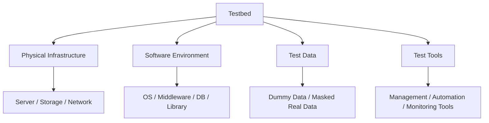

Parent: [[075.SW_테스트_일반]]

# 테스트베드(Testbed)

> [!info] **테스트베드란?**
> 소프트웨어 테스트를 수행하기 위해 필요한 **하드웨어, 소프트웨어, 네트워크, 데이터, 도구** 등으로 구성된 통합적인 테스트 환경입니다. 실제 운영 환경과 유사하게 구축하여 테스트 결과의 신뢰성을 확보하는 것이 핵심입니다.

---

## 1. 테스트베드의 개요
### 가. 테스트베드의 정의
- 테스트 대상 소프트웨어를 실행하고 검증하기 위해 준비된 물리적/논리적 기반 시설

### 나. 구축 목적 및 필요성 (Why)
1. **재현성 보장**: 동일한 조건에서 테스트를 반복 수행하여 결함의 발생 원인을 명확히 규명
2. **독립성 확보**: 개발 환경이나 운영 환경에 영향을 주지 않고 자유로운 테스트 수행 가능
3. **신뢰도 향상**: 운영 환경과 유사한(Mirroring) 환경을 제공하여 배포 후 발생할 장애 리스크 최소화
4. **효율적 자원 관리**: 테스트 데이터 및 도구를 중앙 집중화하여 관리 비용 절감

---

## 2. 테스트베드의 구성 요소 및 계층 (What & How)
### 가. 테스트베드 구성 요소 (Mermaid)

### 나. 단계별 테스트 환경 분류

| 환경 구분 | 역할 및 목적 | 특징 |
| :--- | :--- | :--- |
| **개발 환경 (DEV)** | 개발자가 코드를 작성하고 단위 테스트 수행 | 자유로운 변경 가능, 최소 사양 |
| **테스트 환경 (QA)** | 테스터가 요구사항 충족 및 결함 발견 수행 | 표준화된 구성, 테스트 도구 포함 |
| **스테이징 환경 (STG)** | 운영 환경과 동일한 조건에서 최종 검증 | **운영 환경과 1:1 Mirroring**, 성능 테스트 수행 |
| **운영 환경 (PROD)** | 실제 사용자가 서비스를 사용하는 환경 | 변경 극도로 제한, 보안 및 안정성 최우선 |

---

## 3. 테스트베드 구축 및 관리 핵심 기술
### 가. 환경 구축 기술
- **가상화 및 컨테이너 (Docker/K8s)**: 환경 구축 시간을 단축하고 일관된 테스트베드 제공
- **IaC (Infrastructure as Code)**: 스크립트를 통해 테스트 환경을 자동으로 배포 및 폐기 (Immutable Infrastructure)
- **데이터 익명화 (Masking)**: 운영 데이터를 테스트베드에 반입할 때 개인정보를 보호하기 위한 필수 기술

### 나. 테스트 데이터 관리 (TDM)
- **Gold Copy**: 깨끗한 초기 상태의 데이터 세트를 보관하여 테스트 반복 시 초기화에 활용
- **데이터 서브세팅**: 거대한 운영 데이터 중 테스트에 필요한 일부만 추출하여 효율성 제고

---

## 4. 기술사적 제언 및 실무 적용 방안
### 가. 테스트베드 운영 시 고려사항
1. **환경 격리**: 테스트베드 간의 네트워크 및 데이터 간섭을 차단하여 테스트 결과의 오염 방지
2. **동기화**: 운영 환경의 패치나 설정 변경 사항이 테스트베드에도 적시에 반영되어야 함 (Configuration Drift 방지)

### 나. 기술사적 인사이트
- **Shift-Left 환경**: 개발 초기부터 고품질의 테스트베드를 제공하여 개발자의 셀프 테스팅 역량을 강화해야 함
- **Cloud-Native Testbed**: 클라우드의 탄력성(Elasticity)을 활용하여 대규모 부하 테스트 시에만 자원을 확장하고, 평상시에는 비용을 절감하는 전략적 운영이 필요함

---

## Related Notes
- [[003.IaC(Infrastructure_as_Code)]]
- [[078.테스트_프로세스(Test_Process)]]
- [[081.테스트_결과_보고서]]
