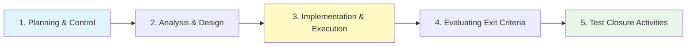

Parent: [[075.SW_테스트_일반]]

# 소프트웨어 테스트 프로세스

> [!info] **테스트 프로세스란?**
> 테스트를 효과적이고 효율적으로 수행하기 위해 수립된 **계획, 분석, 설계, 실행, 마감**에 이르는 일련의 활동 체계입니다. **ISO/IEC/IEEE 29119-2**에서 표준 프로세스를 정의하고 있습니다.

---

## 1. 소프트웨어 테스트 프로세스의 개요
### 가. 테스트 프로세스의 정의
- 품질 목표 달성을 위해 테스트 활동을 구조화하고 단계별 산출물을 정의한 표준 절차

### 나. 프로세스 정립의 필요성 (Why)
1. **일관성 확보**: 테스터의 역량에 의존하지 않고 조직 차원의 균일한 테스트 품질 유지
2. **추적성(Traceability) 관리**: 요구사항부터 테스트 결과까지의 연결 고리 확보
3. **가시성 제공**: 테스트 진행 상황을 정량적으로 파악하여 프로젝트 리스크 관리 지원
4. **지속적 개선**: 테스트 마감 후 회고를 통해 다음 프로젝트의 테스트 효율성 향상

---

## 2. 5단계 테스트 프로세스 상세 (What & How)
### 가. 테스트 프로세스 흐름도 (Mermaid)

### 나. 단계별 주요 활동 및 산출물

| 단계 | 주요 활동 | 주요 산출물 |
| :--- | :--- | :--- |
| **1. 계획 및 제어** | 범위/목적 정의, 리스크 분석, 자원 할당, 일정 수립 | **테스트 계획서** |
| **2. 분석 및 설계** | 테스트 기본 설계, 우선순위 결정, 시나리오 도출 | **테스트 설계서**, 유틸리티 트리 |
| **3. 구현 및 실행** | 테스트 케이스/스크립트 작성, 테스트베드 구축, 실행 | **테스트 케이스**, 결함 보고서 |
| **4. 평가 및 리포팅** | 종료 조건(Exit Criteria) 확인, 결과 요약 | **테스트 결과 보고서** |
| **5. 마감 활동** | 산출물 정리, 결함 최종 상태 확인, 회고 | **테스트 완료 보고서** |

---

## 3. 테스트 프로세스 제어 및 종료 조건
### 가. 테스트 제어 (Test Control)
- 계획 대비 진행 상황을 모니터링하고, 지연 발생 시 자원 추가 투입이나 범위 조정 등의 시정 조치 수행

### 나. 테스트 종료 조건 (Exit Criteria)
- **품질 기준**: 모든 핵심 요구사항에 대한 테스트 완료, 미해결 결함(Critical) 0건
- **커버리지 기준**: 코드 커버리지 80% 이상, 요구사항 커버리지 100% 달성
- **리스크 기준**: 식별된 고위험 시나리오에 대한 테스트 통과

---

## 4. 기술사적 제언 및 실무 적용 방안
### 가. 애자일 환경에서의 테스트 프로세스 변환
- 폭포수 모델의 선형적 프로세스에서 벗어나, 스프린트 내에서 **Continuous Testing**이 이루어지도록 프로세스를 경량화(Lightweight)해야 함

### 나. 기술사적 인사이트
- **Risk-Based Testing (RBT)**: 모든 것을 테스트할 수 없으므로, 계획 단계(1단계)에서 철저한 리스크 분석을 통해 테스트 강도를 차등화하는 것이 프로세스의 핵심임
- **Test Automation Integration**: 실행 단계(3단계)에서 CI/CD 파이프라인과 테스트 자동화 도구를 연계하여 **Regression Test**의 오버헤드를 줄여야 함

---

## Related Notes
- [[075.SW_테스트_일반]]
- [[080.테스트_케이스(Test_Case)]]
- [[081.테스트_결과_보고서]]
