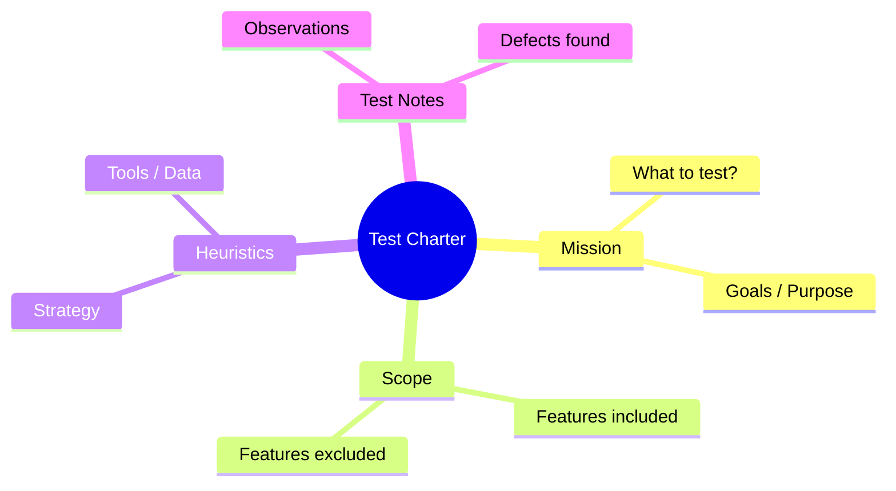

Parent: [[078.테스트_프로세스(Test_Process)]]

# 테스트 차터(Test Charter)

> [!info] **테스트 차터란?**
> **탐색적 테스팅(Exploratory Testing)**의 핵심 도구로, 정해진 테스트 케이스 없이 테스터의 직관과 경험을 바탕으로 수행하는 테스트의 **목표, 범위, 방법**을 명시한 가이드라인입니다. 테스트의 자유도를 보장하면서도 최소한의 체계(Governance)를 제공합니다.

---

## 1. 테스트 차터의 개요
### 가. 테스트 차터의 정의
- 특정 세션(Session) 동안 수행할 테스트의 임무(Mission)를 서술한 문서

### 나. 필요성 및 장점 (Why)
1. **결함 발견율 향상**: 정형화된 테스트 케이스가 놓치기 쉬운 경계값이나 비정상 시나리오 발굴
2. **민첩성(Agility)**: 테스트 케이스 작성 시간을 단축하고, 변경이 잦은 환경에 빠르게 대응
3. **테스터 역량 활용**: 테스터의 비즈니스 지식과 창의성을 극대화하여 품질 검증
4. **효율적 시간 관리**: **타임박싱(Time-boxing)**을 통해 정해진 시간 내 집중적인 테스트 수행

---

## 2. 테스트 차터의 구성 요소 및 작성법 (What & How)
### 가. 테스트 차터의 표준 구조 (Mermaid)

### 나. 주요 구성 요소 상세

| 항목 | 설명 | 예시 |
| :--- | :--- | :--- |
| **대상 (Target)** | 테스트할 기능이나 모듈 | "장바구니 결제 로직" |
| **임무 (Mission)** | 무엇을 확인하고 어떤 가치를 찾을 것인가? | "네트워크 지연 시 결제 중복 발생 여부 확인" |
| **방법 (Strategy)** | 어떤 도구나 기법을 사용할 것인가? | "Charles Proxy를 이용한 Throttling 적용" |
| **타임박스 (Time-box)** | 테스트를 수행할 제한 시간 | "90분 (Short Session)" |

---

## 3. 탐색적 테스팅과 테스트 차터의 운영
### 가. 세션 기반 테스팅 (SBTM)
- 테스트 차터를 기반으로 중단 없이 집중적으로 테스트를 수행하는 단위인 '세션'을 관리하는 기법

### 나. 테스트 케이스(TC) 기반 테스팅 vs 탐색적 테스팅(ET) 비교

| 비교 항목 | TC 기반 테스팅 (Scripted) | 탐색적 테스팅 (ET with Charter) |
| :--- | :--- | :--- |
| **사전 계획** | 상세한 TC 설계 필수 | 테스트 차터 수준의 최소 가이드 |
| **수행 방식** | 설계된 절차에 따른 실행 | 실행과 동시에 학습 및 설계 병행 |
| **주요 목적** | 요구사항 준수 확인 (Confirmatory) | 숨겨진 결함 및 리스크 발견 (Investigative) |
| **적합한 상황** | 안정된 시스템, 회귀 테스트 | 신규 기능, 복잡한 로직, 시간 촉박 |

---

## 4. 기술사적 제언 및 실무 적용 방안
### 가. 테스트 차터 작성 시 유의사항
- **너무 구체적이지 않게**: 테스터의 상상력을 제한하지 않도록 적절한 추상화 유지
- **너무 막연하지 않게**: 무엇을 테스트해야 할지 방향을 잃지 않도록 핵심 임무 명시

### 나. 기술사적 인사이트
- **하이브리드 전략**: 기존의 리그레션 테스트는 자동화로 해결하고, 신규 기능이나 변경이 큰 부분은 **테스트 차터**를 활용한 탐색적 테스팅을 통해 품질의 밀도를 높여야 함
- **테스트 결과의 자산화**: 세션 종료 후 작성된 'Test Notes'를 분석하여 향후 정식 테스트 케이스로 승격시키거나, 개발 설계 가이드로 피드백하는 선순환 구조 구축 필요

---

## Related Notes
- [[076.소프트웨어_테스트_7대_원리]]
- [[080.테스트_케이스(Test_Case)]]
- [[082.SW_테스트_유형]]
