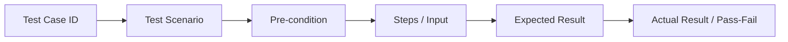

Parent: [[078.테스트_프로세스(Test_Process)]]

# 테스트 케이스(Test Case)

> [!info] **테스트 케이스란?**
> 특정 요구사항을 준수하는지 확인하기 위해 설계된 **입력값, 실행 조건, 기대 결과**의 집합입니다. 테스트의 가장 작은 실행 단위이자, 테스트 결과의 합격/불합격을 판단하는 명확한 기준이 됩니다.

---

## 1. 테스트 케이스의 개요
### 가. 테스트 케이스의 정의
- 소프트웨어가 특정 시나리오에서 올바르게 동작하는지 검증하기 위한 상세 시험 항목

### 나. 필요성 및 목적 (Why)
1. **객관적 검증**: 개인의 주관을 배제하고 표준화된 절차에 따라 품질 확인
2. **재현성 확보**: 결함 발견 시 동일한 절차를 반복하여 문제 원인 규명 용이
3. **커버리지 측정**: 요구사항 대비 테스트 수행 범위를 정량적으로 파악 (RTM 연계)
4. **지식 자산화**: 시스템의 기능을 명세화하여 신규 인력이나 운영 단계의 참고 자료로 활용

---

## 2. 테스트 케이스의 구성 요소 및 작성 절차 (What & How)
### 가. 테스트 케이스의 표준 구성 (Mermaid)

### 나. 핵심 구성 요소 상세표

| 구성 요소 | 설명 | 예시 |
| :--- | :--- | :--- |
| **ID / Scenario** | 고유 식별자 및 테스트의 목적 요약 | `TC-LOG-01` / 로그인 성공 확인 |
| **사전 조건** | 테스트를 시작하기 위한 전제 상태 | "회원가입이 완료된 상태일 것" |
| **테스트 절차** | 테스터가 수행해야 할 상세 단계 | 1. ID 입력, 2. PW 입력, 3. 버튼 클릭 |
| **기대 결과** | 정상 동작 시 나타나야 할 시스템 반응 | "메인 페이지로 이동할 것" |
| **중요도** | 테스트의 우선순위 (Critical/High/Low) | `High` |

---

## 3. 테스트 케이스의 품질 및 관리
### 가. 좋은 테스트 케이스의 조건
- **명확성**: 누구나 읽어도 동일하게 실행할 수 있어야 함 (Ambiguity 제거)
- **독립성**: 다른 테스트 케이스의 결과에 영향을 받지 않아야 함
- **추적성**: 어떤 요구사항을 검증하기 위한 것인지 명확해야 함 (Mapping)
- **유효성**: 최신 기능 및 설계 변경 사항을 즉시 반영하고 있어야 함

### 나. 요구사항 추적표(RTM)와의 관계
- **RTM (Requirements Traceability Matrix)**: 요구사항 ID와 테스트 케이스 ID를 매핑하여, 누락된 테스트가 없는지 전수 확인하는 도구

---

## 4. 기술사적 제언 및 실무 적용 방안
### 가. 테스트 케이스의 적정 수준 (Granularity)
- 너무 상세하면 작성/유지보수 비용이 과다하고, 너무 간략하면 테스트 결과의 일관성이 떨어짐. 프로젝트의 성격과 테스터의 숙련도에 맞게 **Granularity**를 조정해야 함

### 나. 기술사적 인사이트
- **Test Automation Ready**: 수동 테스트용 TC 작성 시부터 자동화 도구가 인식할 수 있는 구조(Data-driven 등)로 설계하여 자동화 전환 비용을 낮춰야 함
- **시나리오 기반 설계**: 단일 기능을 확인하는 TC를 넘어, 실제 사용자의 업무 흐름을 반영한 **End-to-End 시나리오** 중심의 테스트 케이스 구성을 통해 실질적 품질을 확보해야 함

---

## Related Notes
- [[078.테스트_프로세스(Test_Process)]]
- [[081.테스트_결과_보고서]]
- [[055.요구공학(Requirements_Engineering)]]
